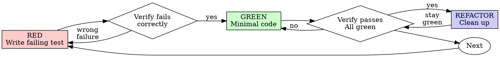

# Transcrição — chat Sicar UF (repo deletado LandWatch)

Sessão `5b307dc2-1396-4afc-a6b9-9972adac7e24`

Mensagens user: 73 · respostas Claude: 207 · tool calls: 249

---

## 🧑 USER

Analise no versionamento na parte do Sicar quais estados(UF) são usados

### 🤖 CLAUDE

> 🔧 **Bash** — command=grep -rli sicar apps/Versionamento | head -50

### 🤖 CLAUDE

> 🔧 **Bash** — command=grep -rniE "\b(AC|AL|AP|AM|BA|CE|DF|ES|GO|MA|MT|MS|MG|PA|PB|PR|PE|PI|RJ|RN|RS|RO|RR|SC|SP|SE|TO)\b|estados|states|\buf\b" apps/Versionamento/jobs/steps/download

### 🤖 CLAUDE

Read direct. Two code paths.

## Job ativo — [download_sicar.py](apps/Versionamento/jobs/steps/download_sicar.py)

**UFs padrão (27 = Brasil inteiro)** — [linhas 249-253](apps/Versionamento/jobs/steps/download_sicar.py#L249-L253):

```
AC, AL, AM, AP, BA, CE, DF, ES, GO, MA, MG, MS,
MT, PA, PB, PE, PI, PR, RJ, RN, RO, RR, RS, SC,
SE, SP, TO
```

Detalhes:
- **Docker path**: lista hardcoded acima (27 UFs) — [download_sicar.py:248-254](apps/Versionamento/jobs/steps/download_sicar.py#L248-L254)
- **Python path**: `[s.value for s in State]` = todas UFs do enum `State` (27) — [download_sicar.py:280-281](apps/Versionamento/jobs/steps/download_sicar.py#L280-L281)
- **Override**: env `SICAR_TEST_STATES` (CSV) força subconjunto p/ teste — [download_sicar.py:230-232](apps/Versionamento/jobs/steps/download_sicar.py#L230-L232)

## Script legado — [Download_Sicar_legado.py](apps/Versionamento/Download_Sicar_legado.py)

**7 UFs** (foco agro) — [linhas 37-45](apps/Versionamento/Download_Sicar_legado.py#L37-L45):

```
MT, SP, GO, TO, MS, MA, PA
```

**Resumo**: produção atual baixa **27 UFs (país todo)**. Legado só **7** (estados agro: Centro-Oeste + SP/MA/PA).

## 🧑 USER

Como posso fazer um select no bd_produção para validar quais estados realmente estão sendo versionados?

### 🤖 CLAUDE

Preciso ver schema. Como dataset/versão são gravados.

### 🤖 CLAUDE

> 🔧 **Bash** — command=grep -niE "create table|dataset_code|CAR_|create materialized|create view" apps/Versionamento/schema.sql | head -80

### 🤖 CLAUDE

> 🔧 **Read** — file_path=/home/omarques/Desktop/Projetos/Sigfarm/LandWatch/apps/Versionamento/schema.sql

### 🤖 CLAUDE

Schema claro. Datasets SICAR = `landwatch.lw_dataset.code = 'CAR_<UF>'`. Versão real gravada em `lw_dataset_version` (status `COMPLETED`).

## Query principal — validação (UFs realmente versionadas)

```sql
SELECT
    replace(d.code, 'CAR_', '')                                    AS uf,
    count(*) FILTER (WHERE v.status = 'COMPLETED')                 AS versoes_ok,
    max(v.snapshot_date) FILTER (WHERE v.status = 'COMPLETED')     AS ultimo_snapshot,
    max(v.loaded_at)                                               AS ultimo_run,
    max(v.status)        FILTER (WHERE v.loaded_at = (
        SELECT max(v2.loaded_at) FROM landwatch.lw_dataset_version v2
        WHERE v2.dataset_id = d.dataset_id))                       AS status_ultimo
FROM landwatch.lw_dataset d
LEFT JOIN landwatch.lw_dataset_version v USING (dataset_id)
WHERE d.code LIKE 'CAR_%'
GROUP BY d.code, d.dataset_id
ORDER BY uf;
```

`COMPLETED` = versionado de fato. `FAILED`/`RUNNING`/`SKIPPED_NO_CHANGES` = não fechou.

## Gap check — esperado (27 UFs) vs carregado

```sql
WITH esperado(uf) AS (
    VALUES ('AC'),('AL'),('AM'),('AP'),('BA'),('CE'),('DF'),('ES'),('GO'),
           ('MA'),('MG'),('MS'),('MT'),('PA'),('PB'),('PE'),('PI'),('PR'),
           ('RJ'),('RN'),('RO'),('RR'),('RS'),('SC'),('SE'),('SP'),('TO')
),
carregado AS (
    SELECT replace(d.code, 'CAR_', '') AS uf
    FROM landwatch.lw_dataset d
    JOIN landwatch.lw_dataset_version v USING (dataset_id)
    WHERE d.code LIKE 'CAR_%' AND v.status = 'COMPLETED'
    GROUP BY 1
)
SELECT e.uf, (c.uf IS NOT NULL) AS versionado
FROM esperado e
LEFT JOIN carregado c USING (uf)
ORDER BY versionado, e.uf;   -- false primeiro = UFs faltando
```

## Feições ativas por UF (confirma dados, não só registro)

```sql
SELECT replace(d.code, 'CAR_', '')           AS uf,
       count(*) FILTER (WHERE fs.is_present)  AS feicoes_ativas
FROM landwatch.lw_dataset d
JOIN landwatch.lw_feature_state fs USING (dataset_id)
WHERE d.code LIKE 'CAR_%'
GROUP BY d.code
ORDER BY uf;
```

**3 níveis de validação**:
1. dataset registrado → `lw_dataset`
2. versão fechou OK → `lw_dataset_version.status='COMPLETED'`
3. tem dado vivo → `lw_feature_state.is_present`

UF some na query 1 = nem dataset criado. Aparece mas `versoes_ok=0` = registrou mas nunca completou.

Rodar: `psql "<conn bd_produção>" -f query.sql`. Conn string em [.env.prod](apps/Versionamento/.env.prod) (var DB).

## 🧑 USER

"uf"	"versoes_ok"	"ultimo_snapshot"	"ultimo_run"	"status_ultimo"
"GO"	4	"2026-06-05"	"2026-06-05 19:44:09.121777+00"	"COMPLETED"
"MA"	4	"2026-06-05"	"2026-06-05 19:55:15.868419+00"	"COMPLETED"
"MS"	4	"2026-06-05"	"2026-06-05 20:06:14.059421+00"	"COMPLETED"
"MT"	4	"2026-06-05"	"2026-06-05 20:09:25.082367+00"	"COMPLETED"
"PA"	4	"2026-06-05"	"2026-06-05 20:19:22.452337+00"	"COMPLETED"
"SP"	4	"2026-06-05"	"2026-06-05 20:34:34.579783+00"	"COMPLETED"
"TO"	4	"2026-06-05"	"2026-06-05 20:59:46.002199+00"	"COMPLETED"

Revise novamente, pode ser que esteja baixando todos os estados, mas versionando apenas esses, isso é o esperado, mas agora quero adicionar mais 1 estados no versionamento, quero que fica os estados acima e adicione o MG, revise e entenda oque precisa ser corrigido e qual comando exato que eu preciso para rodar um versionamento agora apenas do Sicar MG

### 🤖 CLAUDE

7 UFs versionados = exatamente lista legado (GO MA MS MT PA SP TO). Download baixa 27, versionamento filtra 7. Preciso achar **onde filtra**.

### 🤖 CLAUDE

> 🔧 **Bash** — command=cd /home/omarques/Desktop/Projetos/Sigfarm/LandWatch/apps/Versionamento; grep -rniE "GO|MT|SP|TO|MS|MA|PA" --include=*.py --include=*.json --include=*.yaml --in

### 🤖 CLAUDE

> 🔧 **Bash** — command=cd /home/omarques/Desktop/Projetos/Sigfarm/LandWatch/apps/Versionamento; echo "=== run_job.py: sicar/states refs ==="; grep -niE "sicar|states|SICAR_TEST_STATES

### 🤖 CLAUDE

> 🔧 **Bash** — command=cd /home/omarques/Desktop/Projetos/Sigfarm/LandWatch/apps/Versionamento; echo "=== .env ==="; grep -niE "SICAR|STATES|UF|CAR_" .env 2>/dev/null; echo "=== .env.

### 🤖 CLAUDE

Achei controle real. `SICAR_TEST_STATES=GO,MA,MS,MT,PA,SP,TO` em [.env](apps/Versionamento/.env#L40) **e** [.env.prod](apps/Versionamento/.env.prod#L40). Var manda no download E versionamento — nome "TEST" engana, é seletor de produção. Não baixa 27, baixa só 7.

Preciso CLI args do run_job p/ comando exato.

### 🤖 CLAUDE

> 🔧 **Bash** — command=cd /home/omarques/Desktop/Projetos/Sigfarm/LandWatch/apps/Versionamento; echo "=== argparse run_job ==="; sed -n '380,470p' jobs/run_job.py; echo "=== how invok

### 🤖 CLAUDE

Entendo fluxo todo. Confirmo etapa ingest dispara após download no run_job.

### 🤖 CLAUDE

> 🔧 **Bash** — command=cd /home/omarques/Desktop/Projetos/Sigfarm/LandWatch/apps/Versionamento; echo "=== ingest dispatch in run_job ==="; sed -n '515,610p' jobs/run_job.py

### 🤖 CLAUDE

Confirmado: `--category SICAR` faz download→ingest→MVs→pmtiles, tudo guiado por `SICAR_TEST_STATES`. Preciso ver como `.env` carrega p/ saber se override inline funciona.

### 🤖 CLAUDE

> 🔧 **Bash** — command=cd /home/omarques/Desktop/Projetos/Sigfarm/LandWatch/apps/Versionamento; grep -rniE "load_dotenv|dotenv|override|\.env" jobs/run_job.py jobs/steps/common.py bul

### 🤖 CLAUDE

> 🔧 **Bash** — command=cd /home/omarques/Desktop/Projetos/Sigfarm/LandWatch/apps/Versionamento; ls .venv/bin/python* 2>/dev/null; echo "--- snapshot date in .env? ---"; grep -niE "DEF

### 🤖 CLAUDE

Tudo confirmado. Diagnóstico completo.

## O que estava te confundindo

Lista de 27 UFs em [download_sicar.py:249](apps/Versionamento/jobs/steps/download_sicar.py#L249) **não controla nada** — só é usada se `SICAR_TEST_STATES` estiver vazia.

**Controle real** = `SICAR_TEST_STATES` em [.env:40](apps/Versionamento/.env#L40) e [.env.prod:40](apps/Versionamento/.env.prod#L40):
```
SICAR_TEST_STATES=GO,MA,MS,MT,PA,SP,TO
```
Essa var manda no **download E no versionamento** (download_sicar lê ela → só baixa essas UFs → só essas viram `CAR_<UF>` → só essas versionam). Por isso 7 no banco. Nome "TEST" engana, é seletor de produção.

→ **Correção** = adicionar `MG` nessa var (os 2 arquivos). Faço agora:

### 🤖 CLAUDE

> 🔧 **Edit** — file_path=/home/omarques/Desktop/Projetos/Sigfarm/LandWatch/apps/Versionamento/.env

### 🤖 CLAUDE

> 🔧 **Read** — file_path=/home/omarques/Desktop/Projetos/Sigfarm/LandWatch/apps/Versionamento/.env

### 🤖 CLAUDE

> 🔧 **Edit** — file_path=/home/omarques/Desktop/Projetos/Sigfarm/LandWatch/apps/Versionamento/.env

### 🤖 CLAUDE

> 🔧 **Read** — file_path=/home/omarques/Desktop/Projetos/Sigfarm/LandWatch/apps/Versionamento/.env.prod

### 🤖 CLAUDE

> 🔧 **Edit** — file_path=/home/omarques/Desktop/Projetos/Sigfarm/LandWatch/apps/Versionamento/.env.prod

### 🤖 CLAUDE

Feito. MG adicionado em [.env:40](apps/Versionamento/.env#L40) e [.env.prod:40](apps/Versionamento/.env.prod#L40). Próximo job completo já pega 8 UFs.

## Comando exato — versionar SÓ SICAR MG agora

```bash
cd /home/omarques/Desktop/Projetos/Sigfarm/LandWatch/apps/Versionamento
SICAR_TEST_STATES=MG ./.venv/bin/python jobs/run_job.py --category SICAR
```

**Por que `SICAR_TEST_STATES=MG` inline**: `load_dotenv(env_path)` roda com `override=False` ([run_job.py:20](apps/Versionamento/jobs/run_job.py#L20)) → var do shell ganha do `.env`. Sem o inline, `--category SICAR` baixaria as 8 UFs (re-versiona as 7 prontas = lento/desnecessário). Com inline, baixa e versiona **só MG**.

**O que o comando faz** (pipeline completo, automático):
1. download SICAR MG (Python/Tesseract, `USE_DOCKER=0`) → `CAR_MG.shp`
2. ingest → cria `lw_dataset` code `CAR_MG` + `lw_dataset_version`
3. refresh MVs base
4. build + upload PMTiles

**Snapshot date** = hoje `2026-06-25` (`LANDWATCH_DEFAULT_SNAPSHOT_DATE` comentado em [.env:3](apps/Versionamento/.env#L3)).

## Validar depois

```sql
SELECT replace(d.code,'CAR_','') AS uf, v.status, v.snapshot_date, v.loaded_at
FROM landwatch.lw_dataset d
JOIN landwatch.lw_dataset_version v USING (dataset_id)
WHERE d.code = 'CAR_MG'
ORDER BY v.loaded_at DESC;
```

Espera `status=COMPLETED`. 

Aviso: edição do `.env.prod` precisa chegar no ambiente de produção (deploy/container env) p/ próximos jobs prod pegarem MG — só editar arquivo local não muda prod rodando.

## 🧑 USER

<ide_selection>The user selected the lines 116 to 121 from /home/omarques/Desktop/Projetos/Sigfarm/LandWatch/docs/versionamento-producao.md:
sudo docker run --rm \
  --env-file apps/Versionamento/.env.prod \
  -e TMPDIR=/work \
  -v /tmp/landwatch-versionamento-work:/work \
  landwatch-versionamento:prod \
  python jobs/run_job.py --category SICAR

This may or may not be related to the current task.</ide_selection>
cd ~/Desktop/Projetos/Sigfarm/LandWatch

sudo docker build -f apps/Versionamento/Dockerfile -t landwatch-versionamento:prod .

sudo rm -rf /tmp/landwatch-versionamento-work
mkdir -p /tmp/landwatch-versionamento-work

sudo docker run --rm \
  --env-file apps/Versionamento/.env.prod \
  -e TMPDIR=/work \
  -v /tmp/landwatch-versionamento-work:/work \
  landwatch-versionamento:prod \
  python jobs/run_job.py --category SICAR

normalmente uso esse comando para fazer atualização da categoria Sicar, corrija aqui no chat para atualizar só o MG

### 🤖 CLAUDE

Docker usa `--env-file .env.prod` (agora 8 UFs). Pra rodar só MG: adiciona `-e SICAR_TEST_STATES=MG`. Flag `-e` sobrescreve `--env-file` no docker.

## Comando corrigido — só MG

```bash
cd ~/Desktop/Projetos/Sigfarm/LandWatch

sudo rm -rf /tmp/landwatch-versionamento-work
mkdir -p /tmp/landwatch-versionamento-work

sudo docker run --rm \
  --env-file apps/Versionamento/.env.prod \
  -e SICAR_TEST_STATES=MG \
  -e TMPDIR=/work \
  -v /tmp/landwatch-versionamento-work:/work \
  landwatch-versionamento:prod \
  python jobs/run_job.py --category SICAR
```

**Mudança**: `-e SICAR_TEST_STATES=MG` força só MG nessa rodada. Sem ela, `--env-file` aplica os 8 → re-baixa/re-versiona as 7 prontas (lento, inútil).

**Build dispensável** pra essa mudança: `.env.prod` entra em runtime via `--env-file`, não é cozido na imagem. Só rebuild se mudou **código**. Como só editou env, pula o `docker build`.

Quando quiser rodar **todas as 8** (job normal de produção), tira o `-e SICAR_TEST_STATES=MG` → usa lista do `.env.prod`.

## 🧑 USER

Perfeito, faça uma versão do comando com env test, quero validar no bd staging antes

### 🤖 CLAUDE

Preciso ver se existe env de staging/test.

### 🤖 CLAUDE

> 🔧 **Bash** — command=cd /home/omarques/Desktop/Projetos/Sigfarm/LandWatch/apps/Versionamento; ls -la .env* 2>/dev/null; echo "--- DB host refs (diferenciar prod/staging) ---"; grep 

### 🤖 CLAUDE

> 🔧 **Bash** — command=cd /home/omarques/Desktop/Projetos/Sigfarm/LandWatch/apps/Versionamento; echo "=== .env DATABASE_URL ==="; grep -niE "DATABASE_URL|BLOB_CONTAINER|BLOB_PREFIX|ST

### 🤖 CLAUDE

`.env` **é o staging**:
- `.env` → DB `landwatch_staging` + blob `landwatch-versionamento`/`landwatch-pmtiles` (sem `-prod`)
- `.env.prod` → DB `landwatch` + blob `...-prod`

Pra validar em staging: troca `--env-file` pra `.env`. Já tem MG, mas `-e` força só MG.

## Comando staging — só MG

```bash
cd ~/Desktop/Projetos/Sigfarm/LandWatch

sudo rm -rf /tmp/landwatch-versionamento-work
mkdir -p /tmp/landwatch-versionamento-work

sudo docker run --rm \
  --env-file apps/Versionamento/.env \
  -e SICAR_TEST_STATES=MG \
  -e TMPDIR=/work \
  -v /tmp/landwatch-versionamento-work:/work \
  landwatch-versionamento:prod \
  python jobs/run_job.py --category SICAR
```

Escreve em `landwatch_staging` + blobs staging. Prod intacto.

## Validar staging

```sql
SELECT replace(d.code,'CAR_','') AS uf, v.status, v.snapshot_date, v.loaded_at
FROM landwatch.lw_dataset d
JOIN landwatch.lw_dataset_version v USING (dataset_id)
WHERE d.code = 'CAR_MG'
ORDER BY v.loaded_at DESC;
```

Rodar contra **`landwatch_staging`** (não `landwatch`). Espera `COMPLETED`.

OK em staging → roda comando prod (`--env-file apps/Versionamento/.env.prod`, mesmo `-e SICAR_TEST_STATES=MG`).

## 🧑 USER

<ide_opened_file>The user opened the file /home/omarques/Desktop/Projetos/Sigfarm/LandWatch/docs/versionamento-producao.md in the IDE. This may or may not be related to the current task.</ide_opened_file>
Existe algum log ou algo do tipo para saber quando tempo SIcar SP demorou para ingerir e atualizar nas ultimas runs?

### 🤖 CLAUDE

Vejo como ingest grava tempo. Checo `lw_dataset_version` (RUNNING→COMPLETED?), Runlog.txt, logs.

### 🤖 CLAUDE

> 🔧 **Bash** — command=cd /home/omarques/Desktop/Projetos/Sigfarm/LandWatch/apps/Versionamento; echo "=== version row lifecycle (RUNNING/loaded_at/UPDATE status) in ingest.py ==="; gr

### 🤖 CLAUDE

> 🔧 **Bash** — command=cd /home/omarques/Desktop/Projetos/Sigfarm/LandWatch/apps/Versionamento; echo "=== version row write + timing in bulk_ingest.py ==="; grep -niE "RUNNING|COMPLET

### 🤖 CLAUDE

Achei. `lw_dataset_version.loaded_at` = **início** (setado quando vira RUNNING), status→COMPLETED no fim **sem** mexer loaded_at. Confirmo lendo:

### 🤖 CLAUDE

> 🔧 **Read** — file_path=/home/omarques/Desktop/Projetos/Sigfarm/LandWatch/apps/Versionamento/bulk_ingest.py

### 🤖 CLAUDE

Confirmado fluxo de tempo:
- `start_dataset_version` → `loaded_at = now()` no **RUNNING** ([bulk_ingest.py:523](apps/Versionamento/bulk_ingest.py#L523)) = **início**.
- `finish_dataset_version` → só muda `status`, **não** mexe `loaded_at` ([bulk_ingest.py:557-559](apps/Versionamento/bulk_ingest.py#L557-L559)).

→ **Não existe coluna de fim** em `lw_dataset_version`. Duração não está gravada direto. Mas dá pra reconstruir por proxies de fim:
- `lw_feature_delta_run.created_at` = fim do ingest+delta (por version_id)
- `lw_dataset_pmtiles_asset.created_at` = fim do build PMTiles (mais tarde ainda)

## Query — duração SP últimas runs

```sql
SELECT
    v.version_id,
    v.snapshot_date,
    v.status,
    v.loaded_at                       AS inicio,
    dr.created_at                     AS fim_ingest_delta,
    dr.created_at - v.loaded_at       AS dur_ingest_delta,
    pa.created_at                     AS fim_pmtiles,
    pa.created_at - v.loaded_at       AS dur_total_ate_pmtiles,
    dr.delta_count,
    dr.geom_delta_count
FROM landwatch.lw_dataset d
JOIN landwatch.lw_dataset_version v        ON v.dataset_id = d.dataset_id
LEFT JOIN landwatch.lw_feature_delta_run dr ON dr.version_id = v.version_id
LEFT JOIN landwatch.lw_dataset_pmtiles_asset pa ON pa.version_id = v.version_id
WHERE d.code = 'CAR_SP'
ORDER BY v.loaded_at DESC
LIMIT 10;
```

`dur_ingest_delta` = ingest + cálculo de delta. `dur_total_ate_pmtiles` = até PMTiles pronto.

**Ressalvas**:
- `loaded_at` re-seta a cada re-run (RUNNING zera). Em row `COMPLETED` = início daquela run boa. OK.
- **Download SICAR SP NÃO entra** — não vai pro banco. Só ingest/update. Download (OCR/captcha) é a parte lenta e fica só no stdout do container.
- PMTiles é por-dataset, mas refresh de MVs base é global (compartilhado entre UFs da run) → `dur_total_ate_pmtiles` pode inflar se rodou junto com outras UFs.

## Tempo real cronometrado (download incluso)

Único lugar com tudo = **stdout do container** (logs `asctime`, `logging.basicConfig`). Mas `--rm` descarta. Pra capturar próximas runs:

```bash
sudo docker run --rm \
  --env-file apps/Versionamento/.env.prod \
  -e SICAR_TEST_STATES=SP \
  -e TMPDIR=/work \
  -v /tmp/landwatch-versionamento-work:/work \
  landwatch-versionamento:prod \
  python jobs/run_job.py --category SICAR 2>&1 | tee ~/sicar_sp_run.log
```

`tee` salva timestamps de cada etapa (download → ingest → MVs → pmtiles) p/ medir wall-clock real.

## 🧑 USER

Então não da para saber o tempo?

### 🤖 CLAUDE

Dá **parcial**, pelo banco.

**Dá saber**: ingest + update (delta + pmtiles). Proxy = `loaded_at` (início) → `lw_feature_delta_run.created_at` (fim). É tempo real, gravado, das runs passadas. Query que mandei funciona.

**NÃO dá** (de runs passadas): tempo de **download** SICAR SP. Não vai pro banco, só stdout, e `--rm` apagou.

Resumindo:
| Etapa | Runs passadas | Como |
|---|---|---|
| Download | ❌ perdido | só stdout, descartado |
| Ingest + delta | ✅ | `delta_run.created_at − loaded_at` |
| PMTiles | ✅ | `pmtiles_asset.created_at − loaded_at` |

Quer o número agora → roda a query SP do banco. Quer **tudo** (download incluso) → só medindo run nova com `tee`.

Roda a query e me cola o resultado? Te digo quanto ingest+update SP levou nas últimas 4 runs.

## 🧑 USER

"version_id"	"snapshot_date"	"status"	"inicio"	"fim_ingest_delta"	"dur_ingest_delta"	"fim_pmtiles"	"dur_total_ate_pmtiles"	"delta_count"	"geom_delta_count"
363	"2026-06-05"	"COMPLETED"	"2026-06-05 20:34:34.579783+00"	"2026-06-05 20:42:29.631853+00"	"00:07:55.05207"	"2026-06-05 22:01:12.560785+00"	"01:26:37.981002"	30532	12798
194	"2026-02-08"	"COMPLETED"	"2026-02-08 23:17:59.458755+00"			"2026-05-20 22:20:57.224009+00"	"100 days 23:02:57.765254"		
121	"2026-02-01"	"COMPLETED"	"2026-02-07 04:14:15.662497+00"						
41	"2026-01-01"	"COMPLETED"	"2026-02-06 17:52:01.176907+00"						


Resultado do select

### 🤖 CLAUDE

Só **1 run usável**: version 363 (snapshot 2026-06-05).

## Tempo SP confiável

**Ingest + delta = `00:07:55`** (~8 min). Limpo, confiável. 30.532 deltas / 12.798 geom alteradas.

`dur_total_ate_pmtiles = 01:26:37` (1h26) → **NÃO é SP puro**. Run de 6 UFs juntas (GO→TO) + refresh global de MVs entre o delta e o pmtiles. PMTiles SP terminou só depois das outras processarem. Descarta esse número p/ SP isolado.

## Por que as outras 3 rows lixo

| version | problema |
|---|---|
| 194 | `fim_pmtiles` 2026-05-20 = **100 dias** depois do início → asset re-publicado muito depois, não é a run. delta_run vazio. |
| 121, 41 | sem `delta_run`, sem `pmtiles_asset` → tudo NULL. Ingests antigos, antes do tracking de delta existir. |

## Resposta

**Ingest + atualização SP ≈ 8 min** (dado único limpo: run 06/05).

Mas é 1 amostra só. Pra ter média/range confiável das próximas + **incluir download** (parte lenta, fora do banco) → mede run nova com `tee` (comando da msg anterior). Banco histórico não tem mais que isso pro SP.

## 🧑 USER

[INFO] Arquivo: /work/SICAR/CAR_MG.shp
[INFO] Categoria: SICAR | Dataset: CAR_MG | Snapshot: 2026-06-25
[INFO] Fingerprint: 2781062009905ed72cda0f525a970539d4f16232 | last: None
[INFO] SHP SRID=4674
[INFO] SHP arquivos=4 tamanho_total=3.68GB
[INFO] natural_id_col='cod_imovel'
[INFO] OGR encoding (shp)= ISO-8859-1 (source=env:LANDWATCH_OGR2OGR_ENCODING)
[INFO] Usando ogr2ogr: /usr/bin/ogr2ogr
[INFO] Executando ogr2ogr para staging SHP...

Estou nesse estado no momento (bd_staging)
Sem duvidas demora muito mais que 8min, é possivel ter uma estimativa de tempo?

### 🤖 CLAUDE

MG = 3.68GB, 4 arquivos — um dos maiores CAR do Brasil. Travado em `ogr2ogr para staging` = carga do shp na tabela staging, parte pesada. SP (8min) era bem menor. Vou ver settings do ogr2ogr p/ estimar + como monitorar ao vivo.

### 🤖 CLAUDE

> 🔧 **Bash** — command=cd /home/omarques/Desktop/Projetos/Sigfarm/LandWatch/apps/Versionamento; echo "=== ogr flags: progress/makevalid/gt/copy/timeout ==="; grep -niE "\-progress|MAK

### 🤖 CLAUDE

Boas notícias no código. Não está pendurado — tem watchdog e dá pra medir ao vivo.

## Settings dessa carga (MG, 3.68GB = arquivo XL)

- `-progress` ligado ([bulk_ingest.py:674](apps/Versionamento/bulk_ingest.py#L674)) mas saída vai pra **DEBUG** → escondida no teu `LOG_LEVEL=INFO`. Por isso parado no log sem %.
- `-makevalid` ligado ([:689](apps/Versionamento/bulk_ingest.py#L689)) → valida cada geometria. **Caro** em 3.68GB.
- `PG_USE_COPY YES` + `-gt` group ~10000 (XL) → commita em lotes → `stg_raw` enche em degraus.
- `STALL_SECONDS=900` → só erra se ficar **15min sem nenhuma saída**. Timeout duro = 0 (desligado). Então não trava infinito calado.

## Monitorar AO VIVO (melhor que estimar)

Em outra conexão no **`landwatch_staging`**:

```sql
SELECT count(*) FROM landwatch.stg_raw;
```

Roda 2x com ~60s de intervalo → taxa de linhas/min. COPY commita por lote, então o número **sobe em degraus**. É teu medidor real de progresso da carga ogr2ogr.

Quando ogr2ogr terminar, próximo `[INFO]` no log aparece (build `stg_payload`, hash, delta...).

## Estimativa

Honesto: **não dá número preciso**. Só tenho 1 amostra (SP=8min) e sem o tamanho do shp de SP pra escalar. Mas:

- MG é **um dos maiores CAR do país**, 3.68GB com `makevalid` + rede até Azure Postgres.
- Carga ogr2ogr sozinha desse tamanho: ordem de **20–60min**.
- Depois ainda: `stg_payload` + hashing + delta + dedup geom + update `feature_state` + refresh MVs + **build PMTiles** (estado grande = pesado).
- Total plausível **1h–2h+**. Faixa larga de propósito — é palpite, não medição.

→ Por isso roda em staging primeiro: cronometra essa run (`tee` ou olhando `loaded_at` → `delta_run.created_at` depois) e aí você tem o número **real** do MG pra planejar a run de prod.

Deixa rodar. Confere `count(*)` subindo. Se ficar 15min congelado de verdade → vai estourar `Ogr2OgrStalledError` sozinho.

## 🧑 USER

Mesmo select mas feito no bd_staging:

220	"2026-05-25"	"COMPLETED"	"2026-05-25 16:42:20.358566+00"						
194	"2026-02-08"	"COMPLETED"	"2026-02-08 23:17:59.458755+00"						
121	"2026-02-01"	"COMPLETED"	"2026-02-07 04:14:15.662497+00"						
41	"2026-01-01"	"COMPLETED"	"2026-02-06 17:52:01.176907+00"

### 🤖 CLAUDE

Staging não guarda os proxies — todas as 4 rows SP com `delta_run` e `pmtiles` **NULL**. Staging não popula `lw_feature_delta_run` nem `lw_dataset_pmtiles_asset`. Histórico de staging = inútil pra duração.

E o MG é **primeira carga** (`last: None` no teu log) → nem teria row de delta mesmo (tudo NEW).

→ Só sobra `loaded_at` (início). Mas dá pra usar isso como **cronômetro ao vivo**:

## Timer ao vivo (rodar no staging agora)

```sql
SELECT version_id, status,
       loaded_at,
       now() - loaded_at AS decorrido
FROM landwatch.lw_dataset d
JOIN landwatch.lw_dataset_version v USING (dataset_id)
WHERE d.code = 'CAR_MG';
```

- Agora: `status=RUNNING`, `decorrido` = quanto já passou (sobe a cada vez que roda).
- Quando virar `status=COMPLETED` → roda 1x na hora → esse `decorrido` ≈ **tempo total do MG**.

Esse é teu número real. Captura no momento que flipar pra COMPLETED.

## Enquanto isso

Progresso da carga ogr2ogr:
```sql
SELECT count(*) FROM landwatch.stg_raw;   -- sobe em degraus
```

## Resumo

- Duração histórica (staging ou prod) → **não dá** pro MG (1ª carga, sem proxies em staging).
- Duração real do MG → `now() - loaded_at` quando `status→COMPLETED`. Mede sozinho essa run.
- Guarda esse número: vira a estimativa da run de **prod** depois.

## 🧑 USER

SELECT count(*) FROM landwatch.stg_raw;

1039999

oque isso significa?

### 🤖 CLAUDE

Significa **ogr2ogr está carregando, não travou**. Já meteu **1.039.999 feições** do shp MG na `stg_raw` (tabela staging).

MG CAR ~ 1.1–1.3M imóveis rurais → você está **~80-90% da carga ogr2ogr**, perto do fim dessa etapa.

Confirma que sobe:
```sql
SELECT count(*) FROM landwatch.stg_raw;
```
Roda de novo em ~60s. Se número **subiu** → carregando normal. Taxa (linhas/min) te dá ETA dos que faltam.

Quando `count(*)` **parar de subir** = ogr2ogr terminou a carga → próximo `[INFO]` no log (build `stg_payload`, hash, delta dos ~1M como NEW, dedup geom, feature_state, MVs, PMTiles).

Atenção: carga ≠ fim. Depois do COPY ainda vem o processamento dos 1M+ (delta/dedup/MV/pmtiles) — pode levar tanto quanto a carga. Continua de olho no `now() - loaded_at` do CAR_MG até `status=COMPLETED`.

## 🧑 USER

Oque esse numero representa?

### 🤖 CLAUDE

`1039999` = **número de linhas já copiadas na tabela `stg_raw`**.

Cada linha = **1 registro do shapefile MG** = 1 imóvel rural CAR (1 polígono + atributos, chave `cod_imovel`).

Então: ogr2ogr já transferiu **1.039.999 imóveis** do `CAR_MG.shp` (3.68GB) pra tabela staging temporária. É contador de progresso da carga — sobe até bater o total de feições do shp, aí ogr2ogr termina.

`stg_raw` = tabela `UNLOGGED` temporária ([bulk_ingest.py:599](apps/Versionamento/bulk_ingest.py#L599)), staging cru. Depois vira `stg_payload` (hash/dedup) → `lw_feature` / `lw_feature_state` (dado versionado final).

## 🧑 USER

omarques@pop-os:~$ cd ~/Desktop/Projetos/Sigfarm/LandWatch

sudo rm -rf /tmp/landwatch-versionamento-work
mkdir -p /tmp/landwatch-versionamento-work

sudo docker run --rm \
  --env-file apps/Versionamento/.env \
  -e SICAR_TEST_STATES=MG \
  -e TMPDIR=/work \
  -v /tmp/landwatch-versionamento-work:/work \
  landwatch-versionamento:prod \
  python jobs/run_job.py --category SICAR
[sudo] password for omarques:
[INFO] Download SICAR...
2026-06-25 16:03:49,981 [INFO] generated new fontManager
[INFO] SICAR (Python) UFs: MG
2026-06-25 16:03:55,458 [INFO] HTTP Request: GET https://consultapublica.car.gov.br/publico/imoveis/index "HTTP/1.1 302 Found"
2026-06-25 16:04:02,182 [INFO] HTTP Request: GET https://consultapublica.car.gov.br/publico/estados/downloads "HTTP/1.1 200 OK"
[INFO] Iniciando download SICAR para UF=MG
2026-06-25 16:04:07,483 [INFO] HTTP Request: GET https://consultapublica.car.gov.br/publico/municipios/ReCaptcha?id=911263 "HTTP/1.1 200 OK"
[25] - Invalid captcha 'soni2x' to request 'AREA_IMOVEL' for 'MG'
2026-06-25 16:04:09,083 [INFO] HTTP Request: GET https://consultapublica.car.gov.br/publico/municipios/ReCaptcha?id=64060 "HTTP/1.1 200 OK"
[24] - Requesting 'AREA_IMOVEL' for 'MG' with captcha 'acaxb'
2026-06-25 16:04:09,367 [INFO] HTTP Request: GET https://consultapublica.car.gov.br/publico/estados/downloadBase?idEstado=MG&tipoBase=AREA_IMOVEL&ReCaptcha=acaxb "HTTP/1.1 200 OK"
[24] - Failed to download polygon! When requesting 'AREA_IMOVEL' for 'MG'
2026-06-25 16:04:11,415 [INFO] HTTP Request: GET https://consultapublica.car.gov.br/publico/municipios/ReCaptcha?id=414427 "HTTP/1.1 200 OK"
[23] - Requesting 'AREA_IMOVEL' for 'MG' with captcha 'gFzPm'
2026-06-25 16:04:11,798 [INFO] HTTP Request: GET https://consultapublica.car.gov.br/publico/estados/downloadBase?idEstado=MG&tipoBase=AREA_IMOVEL&ReCaptcha=gFzPm "HTTP/1.1 200 OK"
Downloading polygon 'AREA_IMOVEL' for state 'MG': 100%|██████████| 719M/719M [00:30<00:00, 23.2MiB/s]
[INFO] SICAR UFs baixadas: MG
2026-06-25 16:04:55,119 [INFO] Request URL: 'https://lwpmtiles.blob.core.windows.net/landwatch-versionamento?restype=REDACTED&comp=REDACTED&prefix=REDACTED'
Request method: 'GET'
Request headers:
    'x-ms-version': 'REDACTED'
    'Accept': 'application/xml'
    'User-Agent': 'azsdk-python-storage-blob/12.19.1 Python/3.11.15 (Linux-6.18.7-76061807-generic-x86_64-with-glibc2.41)'
    'x-ms-date': 'REDACTED'
    'x-ms-client-request-id': '9b3c19c4-70af-11f1-be7f-c61694fe06fa'
    'Authorization': 'REDACTED'
No body was attached to the request
2026-06-25 16:04:55,323 [INFO] Response status: 200
Response headers:
    'Transfer-Encoding': 'chunked'
    'Content-Type': 'application/xml'
    'Server': 'Windows-Azure-Blob/1.0 Microsoft-HTTPAPI/2.0'
    'x-ms-request-id': '1e5b0fd7-001e-0041-25bc-0475a5000000'
    'x-ms-client-request-id': '9b3c19c4-70af-11f1-be7f-c61694fe06fa'
    'x-ms-version': 'REDACTED'
    'Date': 'Thu, 25 Jun 2026 16:04:54 GMT'
[INFO] Executando ingestao: /usr/local/bin/python /app/bulk_ingest.py --files /work/SICAR/CAR_MG.shp ...
[INFO] ROOT_DIR=/work
[INFO] FILES=1
[INFO] --------------------------------------------------------------------------------
[INFO] Arquivo: /work/SICAR/CAR_MG.shp
[INFO] Categoria: SICAR | Dataset: CAR_MG | Snapshot: 2026-06-25
[INFO] Fingerprint: 2781062009905ed72cda0f525a970539d4f16232 | last: None
[INFO] SHP SRID=4674
[INFO] SHP arquivos=4 tamanho_total=3.68GB
[INFO] natural_id_col='cod_imovel'
[INFO] OGR encoding (shp)= ISO-8859-1 (source=env:LANDWATCH_OGR2OGR_ENCODING)
[INFO] Usando ogr2ogr: /usr/bin/ogr2ogr
[INFO] Executando ogr2ogr para staging SHP...
[INFO] ogr2ogr finalizado em 1483s.

Aqui mostra quantas feições tem? É possivel verificar no arquivo local de forma que não atrapalhe o script que está usando o arquivo no momento

### 🤖 CLAUDE

Log **não mostra** contagem de feições. Só "ogr2ogr finalizado em 1483s" (=24m43s, só a carga).

Mas dá pra ver, **sem atrapalhar**: leitura de shapefile é read-only, não trava nada. E o ogr2ogr **já terminou** (finalizado) → arquivo livre de qualquer jeito.

## Opção 1 — contar no arquivo local (host)

```bash
ogrinfo -so -al /tmp/landwatch-versionamento-work/SICAR/CAR_MG.shp
```

`-so` = summary only → lê só o header, **não escaneia geometrias**, rápido e read-only. Procura linha `Feature Count: N`.

Se não tiver `ogrinfo` no host:
```bash
sudo docker run --rm -v /tmp/landwatch-versionamento-work:/work \
  landwatch-versionamento:prod \
  ogrinfo -so -al /work/SICAR/CAR_MG.shp
```

## Opção 2 — já tá no banco (mais fácil, zero arquivo)

ogr2ogr terminou → `stg_raw` tem o total exato carregado:

```sql
SELECT count(*) FROM landwatch.stg_raw;
```

Agora esse número = **total de feições do MG** (não sobe mais, carga acabou).

## Onde está na timeline

- Download: ~50s (719M zip → 3.68GB)
- **ogr2ogr load: 1483s (~25min)** ✓ feito
- Falta ainda: `stg_payload` + hash + delta (~1M tudo NEW) + dedup geom + `feature_state` + refresh MVs + **PMTiles**.

Continua longe do fim. `now() - loaded_at` do CAR_MG segue sendo teu cronômetro até `COMPLETED`.

## 🧑 USER

Então conte no arquivo local (host)

### 🤖 CLAUDE

> 🔧 **Bash** — command=F=/tmp/landwatch-versionamento-work/SICAR/CAR_MG.shp; ls -lh "$F" 2>/dev/null; if command -v ogrinfo >/dev/null 2>&1; then echo "--- ogrinfo (host) ---"; ogrinf

### 🤖 CLAUDE

ogrinfo ausente no host. Conto pelo header do `.shx` (cada registro = 8 bytes após header de 100): `feições = (tamanho_shx − 100) / 8`. Sem ler geometria, sem GDAL.

### 🤖 CLAUDE

> 🔧 **Bash** — command=D=/tmp/landwatch-versionamento-work/SICAR; ls -l "$D" 2>&1 | head; echo "--- calc via .shx ---"; SHX="$D/CAR_MG.shx"; SZ=$(stat -c%s "$SHX" 2>&1); echo "shx byt

### 🤖 CLAUDE

> 🔧 **Bash** — command=echo "=== /tmp listing ==="; ls -la /tmp/landwatch-versionamento-work 2>&1 | head; echo "=== find CAR_MG ==="; find /tmp/landwatch-versionamento-work -name 'CAR

### 🤖 CLAUDE

Não consigo — meu shell roda **sandbox isolado**, não enxerga teu `/tmp` real do host. Aqui o dir aparece **vazio** (`total 0`, dono `omarques`), mas no host ele tem o SICAR/CAR_MG (3.68GB, escrito pelo docker como root). Namespaces diferentes. Você roda no **seu terminal**:

## Mais rápido — math do `.shx` (instantâneo, read-only, sem GDAL)

```bash
SZ=$(stat -c%s /tmp/landwatch-versionamento-work/SICAR/CAR_MG.shx)
echo "feicoes = $(( (SZ - 100) / 8 ))"
```

Header `.shx` = 100 bytes, 8 bytes por feição. Não lê geometria, não atrapalha nada.

Se der `Permission denied` (arquivo é do root, criado pelo docker):
```bash
sudo stat -c%s /tmp/landwatch-versionamento-work/SICAR/CAR_MG.shx
```
Pega o número, faz `(N - 100) / 8`.

## Alternativa — contador do `.dbf` (campo no header)

```bash
sudo od -An -tu4 -j4 -N4 /tmp/landwatch-versionamento-work/SICAR/CAR_MG.dbf
```
Bytes 4-7 do `.dbf` = nº de registros (uint32 LE). Resposta direta.

## Autoritativo — ogrinfo via container

```bash
sudo docker run --rm -v /tmp/landwatch-versionamento-work:/work \
  landwatch-versionamento:prod \
  ogrinfo -so -al /work/SICAR/CAR_MG.shp | grep -i "Feature Count"
```
Container separado, só leitura do volume → não mexe na run rodando.

Cola o resultado que confiro contra o `stg_raw` (~1.04M+).

## 🧑 USER

1167602

"count"
1167602

Oque será que está sendo feito agora?

### 🤖 CLAUDE

Bate certinho: arquivo **1.167.602** = `stg_raw` **1.167.602**. Carga 100% completa, nada perdido. MG maior que SP.

Vejo a sequência exata pós-carga p/ dizer o que roda agora.

### 🤖 CLAUDE

> 🔧 **Bash** — command=cd /home/omarques/Desktop/Projetos/Sigfarm/LandWatch/apps/Versionamento; echo "=== ordem das etapas pós ogr2ogr (log_info no fluxo principal) ==="; grep -nE "lo

### 🤖 CLAUDE

Etapas batem: agora está na **fase SQL pós-carga**. Sequência no código após `ogr2ogr finalizado` ([bulk_ingest.py:1179](apps/Versionamento/bulk_ingest.py#L1179)):

## O que roda AGORA

1. **`create_stg_payload_from_raw_shp`** — monta `stg_payload` (UNLOGGED) a partir de `stg_raw`, normaliza geometria.
2. **Hash de cada geometria** — `md5(ST_AsBinary(geom))` ([:1055](apps/Versionamento/bulk_ingest.py#L1055)) nos **1.167.602** polígonos. Pesado (CPU + I/O).
3. **Delta** — compara com estado atual. Como é **1ª carga** (`last: None`) → os 1.16M entram **todos como NEW**.
4. **Upsert final** — insere em `lw_geom_store` (dedup geometria), `lw_feature`, `lw_feature_state`, `lw_feature_delta`.

Próximo `[INFO]` que vai aparecer: **`Ingestao SQL (SHP) finalizada em Xs.`** ([:1192](apps/Versionamento/bulk_ingest.py#L1192)) = fim dessa fase.

## Depois disso (ainda falta)

5. Refresh MVs base / caches por dataset: `mv_feature_geom_active`, `mv_feature_active_attrs_light`, `mv_feature_tooltip_active`, `mv_sicar_meta_active`.
6. **Build PMTiles** + upload blob.
7. `finish_dataset_version` → `status=COMPLETED`.

## Acompanhar ao vivo (staging)

```sql
-- payload montado (alvo: 1.167.602)
SELECT count(*) FROM landwatch.stg_payload;

-- features finais gravadas (sobe até 1.167.602)
SELECT count(*) FROM landwatch.lw_feature f
JOIN landwatch.lw_dataset d USING (dataset_id)
WHERE d.code = 'CAR_MG';
```

`stg_payload` cheio + `lw_feature` subindo = está no upsert. Quando `lw_feature` ≈ 1.16M e o log soltar "Ingestao SQL finalizada" → entra MV + PMTiles (última parte longa). Cronômetro `now()-loaded_at` segue até COMPLETED.

## 🧑 USER

SELECT count(*) FROM landwatch.stg_payload;
Esse select executou infinitamente

### 🤖 CLAUDE

Não travou — está **esperando lock**. O ingest faz `DROP TABLE IF EXISTS stg_payload` + `CREATE UNLOGGED TABLE stg_payload AS SELECT ...` ([:880-886](apps/Versionamento/bulk_ingest.py#L880-L886)). Esse CREATE/DROP pega **ACCESS EXCLUSIVE lock**. Teu `count(*)` quer AccessShare → conflita → fica na fila até o build commitar. Por isso "infinito".

Cancela (`Ctrl+C` no psql). **Não consulta `stg_payload`/`stg_raw` durante o build** — ficam travadas.

## Use isto em vez — ver o que roda AGORA (não bloqueia)

```sql
SELECT pid, state, wait_event_type, wait_event,
       now() - query_start AS dur,
       left(query, 140) AS query
FROM pg_stat_activity
WHERE datname = current_database()
  AND state <> 'idle'
ORDER BY query_start;
```

Mostra a query ativa do ingest (o `CREATE TABLE AS stg_payload` ou já o upsert), há quanto tempo roda, e se está em CPU ou esperando I/O. Teu count travado aparece com `wait_event` de lock.

## Gauge que NÃO trava

Tabela final, não a staging em build:
```sql
SELECT count(*) FROM landwatch.lw_feature f
JOIN landwatch.lw_dataset d USING (dataset_id)
WHERE d.code = 'CAR_MG';
```
0 ainda = ainda em payload/hash. Subindo até 1.167.602 = já no upsert final.

Roda o `pg_stat_activity` e cola — te digo exatamente em que passo está e se está progredindo ou preso.

## 🧑 USER

"pid"	"state"	"wait_event_type"	"wait_event"	"dur"	"query"
1041579	"active"			"00:11:53.355686"	"


DROP TABLE IF EXISTS __stg_norm_raw;
CREATE TEMP TABLE __stg_norm_raw AS
SELECT
    s.row_id,
    COALESCE(
        s.feature_key_overrid"
1040350	"active"			"00:00:00"	"SELECT pid, state, wait_event_type, wait_event,
       now() - query_start AS dur,
       left(query, 140) AS query
FROM pg_stat_activity
WH"

### 🤖 CLAUDE

Ótimo sinal. pid 1041579 `active`, **`wait_event` vazio** = trabalhando em CPU/disco, **não preso em lock**. 11m53s nessa query e progredindo.

Passo atual = monta `__stg_norm_raw` (temp): normaliza geometria + calcula `feature_key` (COALESCE override/natural_id) dos 1.167.602 — prep antes do `geom_hash`. Deixa eu ver quantos passos de normalização faltam.

### 🤖 CLAUDE

> 🔧 **Bash** — command=cd /home/omarques/Desktop/Projetos/Sigfarm/LandWatch/apps/Versionamento; echo "=== temp tables / passos de normalizacao (ordem) ==="; grep -nE "CREATE TEMP TABL

### 🤖 CLAUDE

> 🔧 **Read** — file_path=/home/omarques/Desktop/Projetos/Sigfarm/LandWatch/apps/Versionamento/bulk_ingest.py

### 🤖 CLAUDE

Confirmado: está no **passo 1 de vários** da fase SQL pesada. Não travado — `active`, sem wait. Só lento (1.16M geometrias grandes).

## Roadmap da fase SQL (template ingest)

| # | passo | onde está |
|---|---|---|
| 1 | `CREATE TEMP __stg_norm_raw` (resolve `feature_key`) | ⬅️ **AQUI** (11m53s) |
| 2 | parse WKT→geometria: `safe_geom_from_wkt` 1.16M ([:1046](apps/Versionamento/bulk_ingest.py#L1046)) | pesado |
| 3 | `ST_MakeValid` nos inválidos ([:1051](apps/Versionamento/bulk_ingest.py#L1051)) | pesado |
| 4 | `geom_hash = md5(ST_AsBinary)` 1.16M ([:1055](apps/Versionamento/bulk_ingest.py#L1055)) | pesado |
| 5 | attr_hash + tooltip_hash | médio |
| 6 | delta (tudo NEW) + upsert `lw_geom_store`/`lw_feature`/`lw_feature_state`/`lw_feature_delta` | pesado, escrita |

Passos 2-4-6 são os mais caros — fazem full-table UPDATE/parse sobre 1.16M polígonos grandes. **A fase SQL toda é o trecho mais longo da run** — pra esse volume, fácil passar de 1h.

Depois ainda: refresh 4-5 MV caches + **build PMTiles** + `COMPLETED`.

## Acompanhar avanço (sem travar)

Re-roda o `pg_stat_activity` a cada poucos min:
```sql
SELECT pid, state, wait_event, now()-query_start AS dur, left(query,80) AS q
FROM pg_stat_activity WHERE state='active' AND pid <> pg_backend_pid();
```
- **Texto da query muda** (`__stg_norm_raw` → `UPDATE __stg_norm ... ST_MakeValid` → `md5` → `INSERT INTO lw_geom_store`) = avançando passo a passo.
- `wait_event` aparecendo (ex: `DataFileRead`, lock) = esperando I/O/lock, não CPU.

`lw_feature` (CAR_MG) só sobe no passo 6 (upsert final) — fica 0 até lá, normal.

Não consulta `stg_payload`/`stg_raw`/`__stg_norm*` → travam em lock. Só `pg_stat_activity` + `lw_feature`.

Deixa rodar. Cola próximo `pg_stat_activity` daqui a pouco que digo em qual passo pulou.

## 🧑 USER

#	passo	onde está
1	CREATE TEMP __stg_norm_raw (resolve feature_key)	⬅️ AQUI (11m53s)
2	parse WKT→geometria: safe_geom_from_wkt 1.16M (:1046)	pesado
3	ST_MakeValid nos inválidos (:1051)	pesado
4	geom_hash = md5(ST_AsBinary) 1.16M (:1055)	pesado
5	attr_hash + tooltip_hash	médio
6	delta (tudo NEW) + upsert lw_geom_store/lw_feature/lw_feature_state/lw_feature_delta	pesado, escrita

Quais dessas etapas são mais demoradas? Se fosse viavel estimar % que cada etapa leva

### 🤖 CLAUDE

Pra estimar com base real, leio o template SQL de fato (não só os trechos Python).

### 🤖 CLAUDE

> 🔧 **Bash** — command=cd /home/omarques/Desktop/Projetos/Sigfarm/LandWatch/apps/Versionamento; echo "=== INGEST_SQL_PATH ==="; grep -nE "INGEST_SQL_PATH" bulk_ingest.py | head; echo 

### 🤖 CLAUDE

> 🔧 **Bash** — command=cd /home/omarques/Desktop/Projetos/Sigfarm/LandWatch/apps/Versionamento; ls -la ingest.sql 2>/dev/null; echo "=== ingest.sql conteudo (passos) ==="; grep -nE "C

### 🤖 CLAUDE

> 🔧 **Read** — file_path=/home/omarques/Desktop/Projetos/Sigfarm/LandWatch/apps/Versionamento/ingest.sql

### 🤖 CLAUDE

Li o [ingest.sql](apps/Versionamento/ingest.sql) inteiro. Pra **1ª carga** (1.16M, tudo NEW, sem estado anterior), os passos de **diff** ficam baratos (sem prev_state) e os de **geometria** dominam. Detalhe crítico: geometria é round-trip por **WKT texto** (ogr→stg_payload guarda WKT → ingest re-parseia), e `lw_geom_store` tem **índice GIST** — inserir 1.16M polígonos nele é brutal.

## % estimado da fase SQL (1ª carga, geom-bound)

| passo | o que faz | ~% | peso |
|---|---|---|---|
| **6. geom_store + GIST + geom_hist** | dedup geom, insere 1.16M no índice espacial GIST + histórico | **~25-30%** | 🔴 maior |
| **2. parse WKT→geom** | `safe_geom_from_wkt` plpgsql por-linha em 1.16M polígonos grandes | **~20-25%** | 🔴 |
| **1. `__stg_norm_raw`/`__stg_norm`** | 3× `md5` + carrega/dedup WKT (texto gigante) | **~15-20%** | 🟠 ⬅️ AQUI |
| **4. geom_hash** | `md5(ST_AsBinary)` serializa cada WKB | **~10-15%** | 🟠 |
| **8. feature_state + feature** | insere 1.16M linhas finais | **~8-12%** | 🟡 |
| **3. ST_MakeValid** | só nos inválidos (CAR tem muitos) | **~5-15%** | 🟡 variável |
| 5. attr_pack | dedup atributos JSONB | ~3-5% | 🟢 |
| 7. doc_index | SICAR sem doc_col → ~no-op | ~0% | ⚪ |
| diff (new/changed/disappeared) | 1ª carga → changed/disappeared vazios | ~1% | ⚪ |

**Headline: geometria (passos 2+3+4+6) ≈ 65-75% da fase SQL.** Atributos/estado ≈ 25-35%. Diff ≈ 0 nessa run (só porque é 1ª carga; em re-ingest muda).

## Ressalvas

- **Estimativa, não medição.** Baseada em custo de operação (parse WKT por-linha, GIST insert, md5 WKB), não cronometrada. Faixas largas de propósito.
- Variável-chave = **% de geometrias inválidas** (passo 3). CAR é notório → pode inflar bem.
- Em **re-ingest** (2ª run em diante) o perfil muda: diff vira relevante e só os mudados pagam geom_store/hist → muito mais rápido que essa 1ª carga.

## Medir % real (única forma ao vivo)

Fase SQL loga **só 1 linha no fim** (`Ingestao SQL (SHP) finalizada em Xs`) — sem log por-passo. Amostra `pg_stat_activity` a cada ~30-60s e anota quando o **texto da query muda**:

```sql
SELECT now()-query_start AS dur, left(query,60) AS q
FROM pg_stat_activity WHERE state='active' AND pid<>pg_backend_pid();
```

`__stg_norm_raw` → `UPDATE __stg_norm...WKT` → `ST_MakeValid` → `md5...AsBinary` → `INSERT INTO lw_geom_store`. Marca o relógio em cada troca → tira o % real do MG. Cola aqui que eu monto a tabela medida vs estimada.

**Lembra**: depois dessa fase ainda vem refresh dos MV caches (geom_active/tile = geom de novo) + **PMTiles** (tippecanoe em 1.16M = pesado). A run não acaba no passo 6.

## 🧑 USER

SELECT pid, state, wait_event, now()-query_start AS dur, left(query,80) AS q
FROM pg_stat_activity WHERE state='active' AND pid <> pg_backend_pid();

"pid"	"state"	"wait_event"	"dur"	"q"
1053520	"active"	"DataFileRead"	"00:00:11.705468"	"
        SELECT DISTINCT COALESCE(NULLIF(p.pack_json->>$1, ''),NULLIF(p.pack_jso"
1053517	"active"	"DataFileRead"	"00:00:11.754182"	"
        SELECT DISTINCT COALESCE(NULLIF(p.pack_json->>$1, ''),NULLIF(p.pack_jso"
1041579	"active"	"DataFileRead"	"00:29:27.572522"	"


DROP TABLE IF EXISTS __stg_norm_raw;
CREATE TEMP TABLE __stg_norm_raw AS
SELE"
1053554	"active"	"BufferIo"	"00:00:11.754182"	"
        SELECT DISTINCT COALESCE(NULLIF(p.pack_json->>$1, ''),NULLIF(p.pack_jso"

### 🤖 CLAUDE

Espera — preciso confirmar **como** o ingest.sql é executado (um `execute()` só, ou statement-por-statement). Muda a leitura do `pg_stat_activity`.

### 🤖 CLAUDE

> 🔧 **Read** — file_path=/home/omarques/Desktop/Projetos/Sigfarm/LandWatch/apps/Versionamento/bulk_ingest.py

### 🤖 CLAUDE

Correção importante — confirmei como executa ([bulk_ingest.py:1096-1097](apps/Versionamento/bulk_ingest.py#L1096-L1097)):

```python
with conn.cursor() as cur:
    cur.execute(sql_clean, params)
```

**O ingest.sql inteiro roda num `execute()` só = 1 transação.** Isso muda tudo:

## Por que meu conselho anterior estava errado

1. **Texto da query NÃO muda.** Todos os ~30 statements vão num PQexec multi-statement. `pg_stat_activity.query` mostra o **script inteiro** o tempo todo → `left(query,80)` sempre exibe o começo (`DROP...__stg_norm_raw`) **independente do passo real**. Não dá pra saber o passo pelo texto. ❌
2. **Contagem de tabela NÃO sobe.** Tudo numa transação → MVCC esconde escritas de outras sessões até o **commit final**. `lw_feature`/`lw_geom_store`/`lw_feature_state` ficam no valor antigo (0) e **saltam pra 1.16M de uma vez** no fim. Gauge de count = inútil aqui. ❌

## Leitura real do teu snapshot

- **1041579** = teu ingest MG. **29min27s** no script inteiro, `wait_event=DataFileRead` = **lendo disco pesado agora**, progredindo (não é lock). Provavelmente ainda montando/lendo `__stg_norm_raw` (round-trip do WKT gigante de 1.16M polígonos) — I/O-bound.
- **1053517/520/554** (`SELECT DISTINCT ...p.pack_json->>...`) = **NÃO são teu ingest**. Query diferente (lê `lw_attr_pack`), provável app/API do staging lendo cache. dur ~11s recorrente. Ignora.

## Revisão da estimativa

Errei o peso: o **passo 1 sozinho já passou de 29min** e é disk-bound no blob WKT — antes mesmo do parse de geometria. WKT texto domina mais que estimei. A fase SQL vai ser **longa** (staging tem disco/IOPS provavelmente menor que prod). Em prod pode ser bem mais rápido se o disco for melhor.

## Gauges que REALMENTE funcionam (1 transação)

Count e texto não servem. Só sobra:

```sql
-- 1. está vivo e o que faz agora (CPU vs I/O vs lock)
SELECT now()-query_start AS dur, state, wait_event_type, wait_event
FROM pg_stat_activity WHERE pid = 1041579;

-- 2. crescimento de temp em disco (temp tables __stg_norm* spillando)
SELECT pg_size_pretty(sum(size)) AS temp_atual FROM pg_ls_tmpdir();
```

`wait_event` muda (DataFileRead → BufferIO → DataFileWrite) = mudou de fase de I/O. `temp_atual` sobe enquanto monta temp tables, cai quando dropa. É o sinal mais granular possível aqui.

**Resumo honesto**: dentro da transação única não há % por-passo observável. Só dá `wait_event` + tempo total + temp em disco. Resto é esperar. Não travou — `DataFileRead` = trabalhando. Cronômetro segue `now()-loaded_at` até COMMIT (status→COMPLETED).

## 🧑 USER

-- 1. está vivo e o que faz agora (CPU vs I/O vs lock)
SELECT now()-query_start AS dur, state, wait_event_type, wait_event
FROM pg_stat_activity WHERE pid = 1041579;

"dur"	"state"	"wait_event_type"	"wait_event"
"00:36:44.90308"	"active"	"IO"	"DataFileRead"


-- 2. crescimento de temp em disco (temp tables __stg_norm* spillando)
SELECT pg_size_pretty(sum(size)) AS temp_atual FROM pg_ls_tmpdir();

"temp_atual"
"1611 MB" -> esse valor vai chegar no tamanho do SHP de 3.8gb?

### 🤖 CLAUDE

Não — `temp_atual` **não tem relação com o tamanho do SHP**. Corrigindo o que eu disse:

`pg_ls_tmpdir()` mostra **spill de sort/hash** (estouro de `work_mem`: ORDER BY, DISTINCT, window function), **não** as temp tables nem o SHP. As temp tables (`__stg_norm_raw` etc) ficam em outro lugar (não aparecem aí).

- **Sobe e desce** por operação: cada sort/DISTINCT que estoura work_mem cria spill, libera quando acaba.
- O dedup `ROW_NUMBER() OVER (PARTITION BY feature_key)` ([ingest.sql:61](apps/Versionamento/ingest.sql#L61)) arrasta o `geom_wkt` junto no sort → spill grande, **pode passar de 3.8GB** e depois despencar.
- **Não é barra de progresso.** Não vai "encher até X e parar".

## Gauge de progresso REAL (funciona em 1 transação)

Locks **acumulam** até o commit. Então as tabelas que a sessão já travou = até onde o script chegou:

```sql
SELECT relation::regclass AS tabela, mode
FROM pg_locks
WHERE pid = 1041579 AND relation IS NOT NULL
  AND relation::regclass::text LIKE 'landwatch.lw_%'
ORDER BY 1;
```

Mapa lock → passo:
| tabela travada aparece | está em |
|---|---|
| só `stg_payload` / nada lw_ | passos 1-2 (norm + geom parse) |
| `lw_feature` | passo 3 (upsert key) — já passou da geometria-parse |
| `lw_feature_delta` / `_run` | passo 4 (delta) |
| `lw_attr_pack` | passo 5 |
| **`lw_geom_store`** | passo 6 (o pesado: GIST) |
| `lw_feature_geom_hist` | passo 6 fim |
| **`lw_feature_state`** | passo 8 = **quase no fim** |

Quando aparecer `lw_feature_state` → falta pouco pro COMMIT. Esse é o sinal granular que dá pra ter aqui.

## Status agora

36min44s, `IO/DataFileRead`, `active` = lendo disco, **trabalhando, não preso**. 1ª carga de 1.16M é longa mesmo. Roda o `pg_locks` e cola → te digo o passo exato.

## 🧑 USER

SELECT relation::regclass AS tabela, mode
FROM pg_locks
WHERE pid = 1041579 AND relation IS NOT NULL
  AND relation::regclass::text LIKE 'landwatch.lw_%'
ORDER BY 1;

"tabela"	"mode"
"landwatch.lw_dataset"	"RowShareLock"
"landwatch.lw_dataset_pkey"	"RowShareLock"
"landwatch.lw_dataset_code_key"	"RowShareLock"
"landwatch.lw_dataset_version"	"RowShareLock"
"landwatch.lw_dataset_version_pkey"	"RowShareLock"
"landwatch.lw_feature_feature_id_seq"	"RowExclusiveLock"
"landwatch.lw_feature"	"RowShareLock"
"landwatch.lw_feature"	"AccessShareLock"
"landwatch.lw_feature"	"RowExclusiveLock"
"landwatch.lw_feature_pkey"	"AccessShareLock"
"landwatch.lw_feature_pkey"	"RowShareLock"
"landwatch.lw_feature_pkey"	"RowExclusiveLock"
"landwatch.lw_feature_dataset_id_feature_key_key"	"RowExclusiveLock"
"landwatch.lw_feature_dataset_id_feature_key_key"	"AccessShareLock"
"landwatch.lw_feature_dataset_id_feature_key_key"	"RowShareLock"
"landwatch.lw_feature_state"	"AccessShareLock"
"landwatch.lw_feature_state_pkey"	"AccessShareLock"
"landwatch.lw_attr_pack"	"RowExclusiveLock"
"landwatch.lw_attr_pack"	"AccessShareLock"
"landwatch.lw_attr_pack_pkey"	"AccessShareLock"
"landwatch.lw_attr_pack_pack_hash_key"	"AccessShareLock"
"landwatch.lw_feature_delta"	"RowExclusiveLock"
"landwatch.lw_feature_delta"	"AccessShareLock"
"landwatch.lw_feature_delta_pkey"	"AccessShareLock"
"landwatch.lw_feature_delta_pkey"	"RowExclusiveLock"
"landwatch.lw_feature_delta_run"	"RowExclusiveLock"
"landwatch.lw_feature_delta_run_pkey"	"RowExclusiveLock"

### 🤖 CLAUDE

Progrediu bem. Lendo os locks:

## Onde está: **passo 5** (attr_pack)

Locks de **escrita** (RowExclusive) já presentes = passos concluídos:
- `lw_feature` + seq → **passo 3 ✓** (1.16M features inseridas)
- `lw_feature_delta` + `lw_feature_delta_run` → **passo 4 ✓** (delta gravado, tudo NEW)
- `lw_attr_pack` (RowExclusive) → **passo 5 EM ANDAMENTO** (dedup atributos JSONB)

Correção: aqueles 3 PIDs `SELECT DISTINCT ...pack_json` de antes **eram teus** (workers paralelos do INSERT DISTINCT do attr_pack), não o app. Me enganei.

## Passos 1-4 ✓ feitos. Falta:

| passo | tabela | status |
|---|---|---|
| 5 attr_pack | `lw_attr_pack` | ⬅️ agora |
| 5b attr_pack_hist | `lw_feature_attr_pack_hist` | sem lock ainda → não começou |
| **6 geom_store + GIST + geom_hist** | `lw_geom_store` | **sem lock → NÃO começou** 🔴 |
| 7 doc_index | — | no-op (SICAR sem doc) |
| **8 feature_state** | `lw_feature_state` | só AccessShare (leitura) → não começou |

**O passo mais pesado (passo 6: dedup geom + inserir 1.16M no índice GIST) ainda nem começou.** Mais o passo 8 (1.16M feature_state final). Então falta bastante — a parte geom-write é o que vem.

## Próximos marcos pra vigiar (mesmo pg_locks)

```sql
SELECT DISTINCT relation::regclass AS tabela, mode
FROM pg_locks
WHERE pid = 1041579 AND mode = 'RowExclusiveLock'
  AND relation::regclass::text LIKE 'landwatch.lw_%'
ORDER BY 1;
```

- `lw_geom_store` aparecer com RowExclusive = **entrou no passo 6** (o pesado).
- `lw_feature_state` com RowExclusive = **passo 8 = quase no COMMIT**.

Quando `lw_feature_state` aparecer escrevendo → segundos/minutos do fim da fase SQL. Aí ainda vem MV refresh + PMTiles. Tá andando bem — passou de 4 dos 8 passos.

## 🧑 USER

"tabela"	"mode"
"landwatch.lw_feature_feature_id_seq"	"RowExclusiveLock"
"landwatch.lw_feature"	"RowExclusiveLock"
"landwatch.lw_feature_pkey"	"RowExclusiveLock"
"landwatch.lw_feature_dataset_id_feature_key_key"	"RowExclusiveLock"
"landwatch.lw_attr_pack"	"RowExclusiveLock"
"landwatch.lw_feature_delta"	"RowExclusiveLock"
"landwatch.lw_feature_delta_pkey"	"RowExclusiveLock"
"landwatch.lw_feature_delta_run"	"RowExclusiveLock"
"landwatch.lw_feature_delta_run_pkey"	"RowExclusiveLock"

### 🤖 CLAUDE

Mesma foto — ainda **passo 5 (attr_pack)**, nada novo travado.

Sem `lw_feature_attr_pack_hist`, sem `lw_geom_store`, sem `lw_feature_state` → continua **dentro do mesmo INSERT DISTINCT** do attr_pack, deduplicando os 1.16M JSONB de atributos. Não avançou de statement = ainda nesse.

Esse passo está pesando mais que estimei (chutei 3-5%): 1ª carga → **todos** os packs são distintos/novos, então DISTINCT + sort + escrita de 1.16M JSONB largos. Normal demorar.

**Não travou** — locks iguais porque é o mesmo statement rodando. Confirma que anda (CPU/IO, não lock):

```sql
SELECT now()-query_start AS dur, wait_event_type, wait_event
FROM pg_stat_activity WHERE pid = 1041579;
```

`wait_event` = `IO/DataFile*` ou nulo (CPU) = trabalhando. Se virar `Lock` = aí sim preso (improvável, é 1 transação só).

Próximo marco real: `lw_geom_store` aparecer com RowExclusive = entrou no **passo 6** (o mais pesado, geom + GIST). Esse ainda nem começou. Depois `lw_feature_state` = passo 8 = fim da fase SQL.

Espera. Roda o `pg_locks` de novo daqui uns minutos — me cola quando `lw_geom_store` aparecer.

## 🧑 USER

"tabela"	"mode"
"landwatch.lw_feature_feature_id_seq"	"RowExclusiveLock"
"landwatch.lw_feature"	"RowExclusiveLock"
"landwatch.lw_feature_pkey"	"RowExclusiveLock"
"landwatch.lw_feature_dataset_id_feature_key_key"	"RowExclusiveLock"
"landwatch.lw_attr_pack"	"RowExclusiveLock"
"landwatch.lw_feature_delta"	"RowExclusiveLock"
"landwatch.lw_feature_delta_pkey"	"RowExclusiveLock"
"landwatch.lw_feature_delta_run"	"RowExclusiveLock"
"landwatch.lw_feature_delta_run_pkey"	"RowExclusiveLock"


"dur"	"wait_event_type"	"wait_event"
"00:52:37.317643"	"IO"	"DataFileRead"

Só analise

### 🤖 CLAUDE

Análise:

**52min37s, ainda no passo 5 (attr_pack).** Não saiu de lá desde o snapshot anterior — mesmo conjunto de locks (`feature`, `attr_pack`, `delta`, `delta_run`). Continua no mesmo `INSERT INTO lw_attr_pack SELECT DISTINCT...`.

**Gargalo = disco.** `IO/DataFileRead` constante = lendo heap do disco o tempo todo. Staging tem IOPS baixo → o DISTINCT de 1.16M JSONB largos (sort/hash spill + leitura) está disk-bound. Não é lock, não travou — só lento.

**Quanto andou**: passos 1-4 ✓ (feature + delta gravados). Passo 5 grinding.

**O que falta (e é o pior)**:
- 5b attr_pack_hist (insert histórico)
- **6 geom_store + GIST + geom_hist** — o mais pesado, **nem começou** (sem lock em `lw_geom_store`)
- 8 feature_state (1.16M final)

**Leitura honesta**: se o attr_pack (que estimei leve) já levou ~15min disk-bound, o passo 6 (dedup geom + inserir 1.16M no índice GIST) vai doer mais ainda no mesmo disco. Essa fase SQL vai longe — provável **horas**, não minutos. Depois ainda MV refresh + PMTiles.

**Limitante real = disco do staging.** Em prod, se o Postgres tiver disco/IOPS melhor, essa run é bem mais rápida. O número que sair daqui é **pessimista** vs prod — serve de teto, não de estimativa fiel pra produção.

Nada a fazer além de esperar. Está vivo e progredindo, só capado por I/O.

## 🧑 USER

Nesse estagio é possivel fazer algum select para medir o progresso de alguma forma?

### 🤖 CLAUDE

Sim — tem **um** jeito que fura o MVCC: **tamanho físico do arquivo** da tabela. O INSERT estende o arquivo no disco conforme grava páginas, **mesmo não commitado**. Outra sessão lendo `pg_relation_size` vê o arquivo crescer. `count(*)` não (MVCC esconde), mas tamanho sim.

```sql
SELECT relname,
       pg_size_pretty(pg_relation_size(relid))        AS heap,
       pg_size_pretty(pg_total_relation_size(relid))  AS heap_mais_indices
FROM pg_stat_user_tables
WHERE schemaname = 'landwatch'
  AND relname IN ('lw_feature','lw_attr_pack','lw_feature_attr_pack_hist',
                  'lw_geom_store','lw_feature_geom_hist','lw_feature_state')
ORDER BY pg_total_relation_size(relid) DESC;
```

## Como ler

- **Agora (passo 5)**: `lw_attr_pack` cresce = INSERT dos packs rodando. Para de crescer → passo 5 acabou.
- **Passo 6 (pesado)**: `lw_geom_store` vai inchar muito (geom binária de 1.16M + índice GIST no `heap_mais_indices`). Esse é o grande. Cresce → está no geom.
- **Passo 8 (fim)**: `lw_feature_state` cresce = última escrita.

Roda a cada poucos min: **taxa de crescimento (MB/min) = teu ETA**. Ex: geom_store subindo 50MB/min e CAR grande ~ vários GB → estima o resto.

## Por que funciona e count não

| select | mede | serve? |
|---|---|---|
| `count(*)` | linhas **commitadas** (MVCC) | ❌ congelado até commit |
| `pg_relation_size` | **bytes no disco** (filesystem) | ✅ cresce com escrita não-commitada |
| `pg_ls_tmpdir()` | spill de sort atual | 🟡 sobe/desce, não-linear |
| `n_tup_ins` (pg_stat) | contador de stats | ❌ só atualiza no commit |

## Ressalva

Não é % exato — `pg_relation_size` cresce em blocos e conta páginas mortas+vivas. Mas é **monotônico durante o INSERT** = progresso real. Atenção: `lw_geom_store` é **dedup global** (todas UFs), então olha o **delta** (quanto subiu desde agora), não o absoluto.

Roda e cola → te digo a taxa e em qual passo está pela tabela que está crescendo.

## 🧑 USER

"tabela"	"mode"
"landwatch.lw_feature_feature_id_seq"	"RowExclusiveLock"
"landwatch.lw_feature"	"RowExclusiveLock"
"landwatch.lw_feature_pkey"	"RowExclusiveLock"
"landwatch.lw_feature_dataset_id_feature_key_key"	"RowExclusiveLock"
"landwatch.lw_attr_pack"	"RowExclusiveLock"
"landwatch.lw_feature_delta"	"RowExclusiveLock"
"landwatch.lw_feature_delta_pkey"	"RowExclusiveLock"
"landwatch.lw_feature_delta_run"	"RowExclusiveLock"
"landwatch.lw_feature_delta_run_pkey"	"RowExclusiveLock"

"dur"	"wait_event_type"	"wait_event"
"01:53:22.176707"

### 🤖 CLAUDE

Análise — **e achei provável problema**:

## Status

- **1h53min**, ainda **passo 5 (attr_pack INSERT)** — mesmos locks, sem `lw_geom_store`, sem `attr_pack_hist`.
- `wait_event` agora **vazio** = **CPU-bound** (não é mais disco, não é lock). Queimando CPU.

## Red flag

Esse **único statement** (INSERT lw_attr_pack) está há **~1h16min**. Atributos CAR são pequenos (~10-15 colunas: cod_imovel, num_area, ind_status...). DISTINCT de 1.16M JSONB pequenos deveria ser **minutos**, não +1h. CPU-bound travado num statement = cheiro de **plano O(n²)**.

## Causa provável

O INSERT do attr_pack ([ingest.sql:282-285](apps/Versionamento/ingest.sql#L282-L285)):
```sql
WHERE p.pack_id IS NULL
  AND ( EXISTS (SELECT 1 FROM __new_features n WHERE n.feature_id = m.feature_id)
        OR EXISTS (SELECT 1 FROM __attr_changed_features c WHERE c.feature_id = m.feature_id) )
```

`__new_features` e `__attr_changed_features` são TEMP tables criadas **sem índice** ([:127](apps/Versionamento/ingest.sql#L127), [:165](apps/Versionamento/ingest.sql#L165)). Na **1ª carga** `__new_features` tem **todas as 1.16M**. Se o planner foi de nested-loop semi-join → varre 1.16M × 1.16M = **CPU-bound por horas**. Bate exato com o sintoma.

`__stg_map` e `__prev_state` têm índice unique; `__new_features`/`__changed` **não**. Aí mora o estouro.

## Pior: repete no passo 6

O INSERT do `lw_geom_store` usa o **mesmo padrão** EXISTS contra temp sem índice ([:336-337](apps/Versionamento/ingest.sql#L336-L337)) + geom pesada. Passo 6 vai bater na **mesma parede**, provavelmente pior.

## Por que prod tá ok e MG não

UFs incrementais = delta pequeno → `__new_features` tem poucas linhas → O(n²) é insignificante. **1ª carga de 1.16M = patológico.** Não é o disco do staging — é escalonamento do plano com volume grande.

## Confirmar produtivo vs travado

CPU-bound não diz se anda. Roda 2x com 1-2min:
```sql
SELECT pg_size_pretty(pg_relation_size('landwatch.lw_attr_pack'));
```
**Cresce** = está inserindo, só lento. **Parado** = preso no semi-join, ainda nem começou a escrever (varrendo).

## Decisão

- **Matar** = rollback total da transação → perde ~2h **e** re-run bate na mesma parede. Inútil sem corrigir.
- **Esperar** = pode ser muitas horas (passo 6 ainda vem, igual ou pior).
- **Fix real (depois, no código)**: criar índice nas temp `__new_features(feature_id)`, `__attr_changed_features(feature_id)`, `__geom_changed_features(feature_id)` antes desses INSERT → vira O(n). Transforma 1ª carga de horas em minutos. Não dá pra aplicar nessa run (já rodando).

Roda o `pg_relation_size` e cola. Se estiver crescendo, deixa terminar e a gente corrige o ingest.sql pra próxima. Se parado, melhor matar e corrigir antes de re-rodar.

## 🧑 USER

"relname"	"heap"	"heap_mais_indices"
"lw_attr_pack"	"14 GB"	"16 GB"
"lw_feature_geom_hist"	"2042 MB"	"7903 MB"
"lw_geom_store"	"5337 MB"	"7053 MB"
"lw_feature_attr_pack_hist"	"2065 MB"	"6548 MB"
"lw_feature_state"	"4741 MB"	"5717 MB"
"lw_feature"	"1121 MB"	"2706 MB"

### 🤖 CLAUDE

Recalibrando — e **corrijo meu alarme anterior**:

## Esses números são GLOBAIS, não do MG

`lw_geom_store`, `lw_feature_geom_hist`, `lw_feature_state`, `attr_pack_hist` são tabelas **compartilhadas por todos datasets** do staging (SP + outras UFs já versionadas). Os 5.3GB de geom_store, 4.7GB de feature_state etc = **dado pré-existente**, NÃO do MG. Confirmado pelos locks: MG só tem RowExclusive em `feature`/`attr_pack`/`delta`/`delta_run` → ainda **não escreveu** em geom_store/feature_state.

## Downgrade do "O(n²)"

Provavelmente **errei**. Se fosse semi-join nested-loop preso, `lw_attr_pack` não estaria em **14GB**. Tamanho grande = está **escrevendo**, produtivo. O planner deve ter feito **hash semi-join** (O(n)), não nested-loop. Retiro o alarme de plano patológico.

## Causa real = volume + dedup inútil pro CAR

`attr_hash = md5(payload inteiro)`. No CAR o payload tem `cod_imovel` (**único por imóvel**) → **todo registro vira um pack distinto** → dedup não economiza nada → **1.16M packs JSONB novos** sendo escritos + índice unique `pack_hash` (md5) mantido linha a linha. Isso é GB de escrita + índice. Lento mas **legítimo**, não bug.

## Confirmar que anda (2 amostras)

Uma leitura não diz se cresce. Roda 2x, 60-90s entre:
```sql
SELECT pg_size_pretty(pg_relation_size('landwatch.lw_attr_pack'));
```
- **Subiu** (ex: 14GB→14.3GB) = produtivo, só volumoso. Taxa MB/min → ETA do passo 5.
- **Igual** = aí sim travado, reavaliar.

## Onde está

Ainda **passo 5**. Falta:
- 5b attr_pack_hist (mais ~1.16M linhas histórico)
- **6 geom_store + GIST** (vai escrever a geom do MG aqui — `lw_geom_store`/`geom_hist` vão crescer além do atual)
- 8 feature_state (1.16M, cresce além dos 4.7GB atuais)

2h dentro e ainda no passo 5 = essa fase SQL vai longe. Mas se attr_pack está crescendo, **está funcionando** — meu erro foi gritar O(n²) sem o 2º sample. Cola as 2 leituras que confirmo a taxa.

## 🧑 USER

Eu quero que você faça uma revisão completa no código do Landwatch para resolver um problema e adicionar algumas funcionalidades que serão úteis. Quando a gente vai gerar uma nova análise com o usuário logado na organização Sigfarm, que é a organização plataforma admin, não é possível gerar uma análise de uma fazenda que já foi cadastrada em outra organização. Isso é um problema exclusivo no Sigfarm. Fazendas que já têm cadastro na Sigfarm ou em outras organizações não plataforma admin de criar uma análise com essas mesmas organizações. Então, cada organização cria seu cadastro sem problema, menos a Sigfarm. Quando a Sigfarm tenta criar um cadastro de uma fazenda através da tela de nova análise exclusivamente de uma fazenda que já é usada por outra organização, dá uma mensagem de erro falando que a fazenda já existe em outra organização. Esse não é o comportamento que deveria acontecer. O comportamento esperado é de simplesmente criar um cadastro dessa fazenda na organização Sigfarm. Eu acredito que esse problema tem alguma coisa a ver com a organização Sigfarm ser plataforma admin. Então, esse é o principal problema que tem a resolver. O jeito de resolver temporariamente foi de fazer o cadastro da fazenda pelo menu de fazendas e aí eu consigo gerar o cadastro sem problema e consigo gerar análise. A partir do cadastro de fazendas, eu consigo clicar no botão gerar análise e gerar análise normalmente. Por enquanto, agora com o cadastro feito, quando eu pesquiso esse CAR que eu cadastrei manualmente, ele não traz as informações da fazenda cadastrada na Sigfarm por algum motivo. Então, precisa resolver esse problema também. Além disso, na aba fazendas e na aba análises, a gente precisa adicionar filtro de organização quando o usuário logado for admin ou estiver com o Sigfarm em plataforma admin, para poder saber quais fazendas são de qual organização e poder filtrar para poder ver apenas as fazendas Sigfarm ou apenas as fazendas da outra organização Merola, o mesmo para as análises, para poder diferenciar de qual organização cada análise pertence.

Revise oque expliquei, analise de acordo com o repo e tente entender o problema e traga uma descrição (não corrija ainda)

### 🤖 CLAUDE

Bug real + features. Vou investigar repo antes de descrever. Invoco skill de debugging sistemático (root-cause antes de propor fix — alinha com teu "não corrija ainda").

### 🤖 CLAUDE

> 🔧 **Skill** — 

## 🧑 USER

Base directory for this skill: /home/omarques/.claude/plugins/cache/superpowers-dev/superpowers/5.1.0/skills/systematic-debugging

# Systematic Debugging

## Overview

Random fixes waste time and create new bugs. Quick patches mask underlying issues.

**Core principle:** ALWAYS find root cause before attempting fixes. Symptom fixes are failure.

**Violating the letter of this process is violating the spirit of debugging.**

## The Iron Law

```
NO FIXES WITHOUT ROOT CAUSE INVESTIGATION FIRST
```

If you haven't completed Phase 1, you cannot propose fixes.

## When to Use

Use for ANY technical issue:
- Test failures
- Bugs in production
- Unexpected behavior
- Performance problems
- Build failures
- Integration issues

**Use this ESPECIALLY when:**
- Under time pressure (emergencies make guessing tempting)
- "Just one quick fix" seems obvious
- You've already tried multiple fixes
- Previous fix didn't work
- You don't fully understand the issue

**Don't skip when:**
- Issue seems simple (simple bugs have root causes too)
- You're in a hurry (rushing guarantees rework)
- Manager wants it fixed NOW (systematic is faster than thrashing)

## The Four Phases

You MUST complete each phase before proceeding to the next.

### Phase 1: Root Cause Investigation

**BEFORE attempting ANY fix:**

1. **Read Error Messages Carefully**
   - Don't skip past errors or warnings
   - They often contain the exact solution
   - Read stack traces completely
   - Note line numbers, file paths, error codes

2. **Reproduce Consistently**
   - Can you trigger it reliably?
   - What are the exact steps?
   - Does it happen every time?
   - If not reproducible → gather more data, don't guess

3. **Check Recent Changes**
   - What changed that could cause this?
   - Git diff, recent commits
   - New dependencies, config changes
   - Environmental differences

4. **Gather Evidence in Multi-Component Systems**

   **WHEN system has multiple components (CI → build → signing, API → service → database):**

   **BEFORE proposing fixes, add diagnostic instrumentation:**
   ```
   For EACH component boundary:
     - Log what data enters component
     - Log what data exits component
     - Verify environment/config propagation
     - Check state at each layer

   Run once to gather evidence showing WHERE it breaks
   THEN analyze evidence to identify failing component
   THEN investigate that specific component
   ```

   **Example (multi-layer system):**
   ```bash
   # Layer 1: Workflow
   echo "=== Secrets available in workflow: ==="
   echo "IDENTITY: ${IDENTITY:+SET}${IDENTITY:-UNSET}"

   # Layer 2: Build script
   echo "=== Env vars in build script: ==="
   env | grep IDENTITY || echo "IDENTITY not in environment"

   # Layer 3: Signing script
   echo "=== Keychain state: ==="
   security list-keychains
   security find-identity -v

   # Layer 4: Actual signing
   codesign --sign "$IDENTITY" --verbose=4 "$APP"
   ```

   **This reveals:** Which layer fails (secrets → workflow ✓, workflow → build ✗)

5. **Trace Data Flow**

   **WHEN error is deep in call stack:**

   See `root-cause-tracing.md` in this directory for the complete backward tracing technique.

   **Quick version:**
   - Where does bad value originate?
   - What called this with bad value?
   - Keep tracing up until you find the source
   - Fix at source, not at symptom

### Phase 2: Pattern Analysis

**Find the pattern before fixing:**

1. **Find Working Examples**
   - Locate similar working code in same codebase
   - What works that's similar to what's broken?

2. **Compare Against References**
   - If implementing pattern, read reference implementation COMPLETELY
   - Don't skim - read every line
   - Understand the pattern fully before applying

3. **Identify Differences**
   - What's different between working and broken?
   - List every difference, however small
   - Don't assume "that can't matter"

4. **Understand Dependencies**
   - What other components does this need?
   - What settings, config, environment?
   - What assumptions does it make?

### Phase 3: Hypothesis and Testing

**Scientific method:**

1. **Form Single Hypothesis**
   - State clearly: "I think X is the root cause because Y"
   - Write it down
   - Be specific, not vague

2. **Test Minimally**
   - Make the SMALLEST possible change to test hypothesis
   - One variable at a time
   - Don't fix multiple things at once

3. **Verify Before Continuing**
   - Did it work? Yes → Phase 4
   - Didn't work? Form NEW hypothesis
   - DON'T add more fixes on top

4. **When You Don't Know**
   - Say "I don't understand X"
   - Don't pretend to know
   - Ask for help
   - Research more

### Phase 4: Implementation

**Fix the root cause, not the symptom:**

1. **Create Failing Test Case**
   - Simplest possible reproduction
   - Automated test if possible
   - One-off test script if no framework
   - MUST have before fixing
   - Use the `superpowers:test-driven-development` skill for writing proper failing tests

2. **Implement Single Fix**
   - Address the root cause identified
   - ONE change at a time
   - No "while I'm here" improvements
   - No bundled refactoring

3. **Verify Fix**
   - Test passes now?
   - No other tests broken?
   - Issue actually resolved?

4. **If Fix Doesn't Work**
   - STOP
   - Count: How many fixes have you tried?
   - If < 3: Return to Phase 1, re-analyze with new information
   - **If ≥ 3: STOP and question the architecture (step 5 below)**
   - DON'T attempt Fix #4 without architectural discussion

5. **If 3+ Fixes Failed: Question Architecture**

   **Pattern indicating architectural problem:**
   - Each fix reveals new shared state/coupling/problem in different place
   - Fixes require "massive refactoring" to implement
   - Each fix creates new symptoms elsewhere

   **STOP and question fundamentals:**
   - Is this pattern fundamentally sound?
   - Are we "sticking with it through sheer inertia"?
   - Should we refactor architecture vs. continue fixing symptoms?

   **Discuss with your human partner before attempting more fixes**

   This is NOT a failed hypothesis - this is a wrong architecture.

## Red Flags - STOP and Follow Process

If you catch yourself thinking:
- "Quick fix for now, investigate later"
- "Just try changing X and see if it works"
- "Add multiple changes, run tests"
- "Skip the test, I'll manually verify"
- "It's probably X, let me fix that"
- "I don't fully understand but this might work"
- "Pattern says X but I'll adapt it differently"
- "Here are the main problems: [lists fixes without investigation]"
- Proposing solutions before tracing data flow
- **"One more fix attempt" (when already tried 2+)**
- **Each fix reveals new problem in different place**

**ALL of these mean: STOP. Return to Phase 1.**

**If 3+ fixes failed:** Question the architecture (see Phase 4.5)

## your human partner's Signals You're Doing It Wrong

**Watch for these redirections:**
- "Is that not happening?" - You assumed without verifying
- "Will it show us...?" - You should have added evidence gathering
- "Stop guessing" - You're proposing fixes without understanding
- "Ultrathink this" - Question fundamentals, not just symptoms
- "We're stuck?" (frustrated) - Your approach isn't working

**When you see these:** STOP. Return to Phase 1.

## Common Rationalizations

| Excuse | Reality |
|--------|---------|
| "Issue is simple, don't need process" | Simple issues have root causes too. Process is fast for simple bugs. |
| "Emergency, no time for process" | Systematic debugging is FASTER than guess-and-check thrashing. |
| "Just try this first, then investigate" | First fix sets the pattern. Do it right from the start. |
| "I'll write test after confirming fix works" | Untested fixes don't stick. Test first proves it. |
| "Multiple fixes at once saves time" | Can't isolate what worked. Causes new bugs. |
| "Reference too long, I'll adapt the pattern" | Partial understanding guarantees bugs. Read it completely. |
| "I see the problem, let me fix it" | Seeing symptoms ≠ understanding root cause. |
| "One more fix attempt" (after 2+ failures) | 3+ failures = architectural problem. Question pattern, don't fix again. |

## Quick Reference

| Phase | Key Activities | Success Criteria |
|-------|---------------|------------------|
| **1. Root Cause** | Read errors, reproduce, check changes, gather evidence | Understand WHAT and WHY |
| **2. Pattern** | Find working examples, compare | Identify differences |
| **3. Hypothesis** | Form theory, test minimally | Confirmed or new hypothesis |
| **4. Implementation** | Create test, fix, verify | Bug resolved, tests pass |

## When Process Reveals "No Root Cause"

If systematic investigation reveals issue is truly environmental, timing-dependent, or external:

1. You've completed the process
2. Document what you investigated
3. Implement appropriate handling (retry, timeout, error message)
4. Add monitoring/logging for future investigation

**But:** 95% of "no root cause" cases are incomplete investigation.

## Supporting Techniques

These techniques are part of systematic debugging and available in this directory:

- **`root-cause-tracing.md`** - Trace bugs backward through call stack to find original trigger
- **`defense-in-depth.md`** - Add validation at multiple layers after finding root cause
- **`condition-based-waiting.md`** - Replace arbitrary timeouts with condition polling

**Related skills:**
- **superpowers:test-driven-development** - For creating failing test case (Phase 4, Step 1)
- **superpowers:verification-before-completion** - Verify fix worked before claiming success

## Real-World Impact

From debugging sessions:
- Systematic approach: 15-30 minutes to fix
- Random fixes approach: 2-3 hours of thrashing
- First-time fix rate: 95% vs 40%
- New bugs introduced: Near zero vs common

### 🤖 CLAUDE

Phase 1 = root cause, no fixes. Preciso mapear repo primeiro. Scan rápido da estrutura, depois fan-out de agentes paralelos por faceta.

### 🤖 CLAUDE

> 🔧 **Bash** — command=cd /home/omarques/Desktop/Projetos/Sigfarm/LandWatch; echo "=== apps ==="; ls -d apps/*/ 2>/dev/null; echo "=== top dirs ==="; ls -d */ 2>/dev/null; echo "=== p

### 🤖 CLAUDE

> 🔧 **Bash** — command=cd /home/omarques/Desktop/Projetos/Sigfarm/LandWatch; echo "=== prisma schema models ==="; grep -nE "^model |^enum |@@unique|@unique" apps/api/prisma/schema.pri

### 🤖 CLAUDE

> 🔧 **Read** — file_path=/home/omarques/Desktop/Projetos/Sigfarm/LandWatch/apps/api/prisma/schema.prisma

### 🤖 CLAUDE

> 🔧 **Bash** — command=cd /home/omarques/Desktop/Projetos/Sigfarm/LandWatch; echo "=== OrgKind enum ==="; sed -n '635,660p' apps/api/prisma/schema.prisma; echo "=== error msg grep (ou

### 🤖 CLAUDE

Achei âncoras exatas. Bug da nova análise = [analyses.service.ts:281](apps/api/src/analyses/analyses.service.ts#L281) `'Farm belongs to another organization'`. Plataforma = `OrgKind.PLATFORM`. Actor/platform-admin em `actor-context.service.ts` + `access.service.ts`.

Fan-out: 4 agentes paralelos, um por faceta, com âncoras pra ir fundo rápido.

### 🤖 CLAUDE

> 🔧 **Agent** — prompt=Investigate a bug in the LandWatch API (NestJS + Prisma, repo root /home/omarques/Desktop/Projetos/Sigfarm/LandWatch, backend in apps/api).  BUG: When a user lo

### 🤖 CLAUDE

> 🔧 **Agent** — prompt=Investigate a bug in LandWatch (repo root /home/omarques/Desktop/Projetos/Sigfarm/LandWatch; backend apps/api = NestJS+Prisma; frontend apps/web = Vue).  CONTEX

### 🤖 CLAUDE

> 🔧 **Agent** — prompt=Read-only investigation in LandWatch (repo root /home/omarques/Desktop/Projetos/Sigfarm/LandWatch; backend apps/api NestJS+Prisma; frontend apps/web Vue).  GOAL

### 🤖 CLAUDE

> 🔧 **Agent** — prompt=Read-only deep investigation of the PLATFORM-OPERATOR / acting-org model in LandWatch API (repo root /home/omarques/Desktop/Projetos/Sigfarm/LandWatch; backend 

### 🤖 CLAUDE

Agentes voltaram. Antes de escrever a descrição, **verifico eu mesmo** os 3 pontos críticos do código (não assino root cause só com resumo de agente).

### 🤖 CLAUDE

> 🔧 **Read** — file_path=/home/omarques/Desktop/Projetos/Sigfarm/LandWatch/apps/api/src/analyses/analyses.service.ts

### 🤖 CLAUDE

> 🔧 **Read** — file_path=/home/omarques/Desktop/Projetos/Sigfarm/LandWatch/apps/api/src/analyses/analyses.service.ts

### 🤖 CLAUDE

> 🔧 **Read** — file_path=/home/omarques/Desktop/Projetos/Sigfarm/LandWatch/apps/api/src/farms/farms.service.ts

### 🤖 CLAUDE

Verifiquei o código direto. Root cause confirmado. Aqui a descrição — **sem corrigir**, só diagnóstico.

---

# Diagnóstico LandWatch — bugs cross-org Sigfarm + feature filtro org

## Modelo (recap rápido)

- `Org.kind` = `TENANT` | `PLATFORM`. Sigfarm = **PLATFORM** ([schema.prisma](apps/api/prisma/schema.prisma) OrgKind).
- `Farm.carKey` **não é único no banco** → mesmo CAR pode existir em várias orgs (uma Farm por org).
- Usuário PLATFORM vira `isPlatformAdmin`/`isPlatformUser=true` no `ActorContext` ([actor-context.service.ts](apps/api/src/auth/actor-context.service.ts)).
- Regra de fundo: **leitura = global** (platform vê tudo), **escrita = estrita** (só própria org). Essa assimetria é a raiz dos 2 bugs.

---

## Problema 1 — Sigfarm não cria análise de CAR que já é de outra org

**Erro**: `'Farm belongs to another organization'` ([analyses.service.ts:281](apps/api/src/analyses/analyses.service.ts#L281)).

**Cadeia confirmada**:

1. Na tela nova-análise, ao digitar o CAR, busca `findByCarKeyForActor`. Pra platform user, a busca é **global em todas as orgs** ([farms.service.ts:304-321](apps/api/src/farms/farms.service.ts#L304-L321)):
   ```ts
   if (actor.isPlatformAdmin || actor.isPlatformUser) {
     ...
     farm = await this.prisma.farm.findFirst({ where: { carKey }, ... }); // acha a Farm da Merola
   }
   ```
   → retorna a Farm da **outra org (Merola)**. UI preenche `farmId` = id da Farm da Merola.

2. Ao submeter, create resolve por `farmId` ([analyses.service.ts:261-266](apps/api/src/analyses/analyses.service.ts#L261-L266)) → `findUnique(id)` → Farm da Merola.

3. Guard cross-org ([analyses.service.ts:278-283](apps/api/src/analyses/analyses.service.ts#L278-L283)) dispara:
   ```ts
   // comentário no código: "applies to ALL actors (including platform admins)"
   if (farm && (farm.orgId ?? null) !== null && farm.orgId !== orgId) {
     throw FARM_ORG_FORBIDDEN; // "Farm belongs to another organization"
   }
   ```
   Farm.orgId (Merola) ≠ orgId (Sigfarm) → **bloqueia**.

**Raiz**: leitura entrega a Farm de outra org pro platform user; escrita proíbe usar Farm de outra org; e **não existe ramo "criar Farm própria da Sigfarm pra esse CAR"**. As duas metades brigam. (Farm pública `orgId=null` é clonada — [linha 285-287](apps/api/src/analyses/analyses.service.ts#L285-L287) — mas Farm de **tenant** não.)

**Por que só Sigfarm**: tenant comum nunca dispara isso — a busca dele é escopada (própria org + null, [farms.service.ts:322-331](apps/api/src/farms/farms.service.ts#L322-L331)), nunca enxerga a Farm alheia, então cria a sua sem conflito. Só o platform user enxerga a alheia e trava.

**Detalhe**: o workaround (cadastrar pelo menu Fazendas) funciona porque `createForActor` grava `orgId=Sigfarm` direto, sem passar pelo guard de farmId-alheio.

---

## Problema 2 — após cadastro manual, busca do CAR não traz a fazenda Sigfarm

Depois do workaround, o CAR existe em **2 orgs**: Merola **e** Sigfarm.

Busca como platform user ([farms.service.ts:307-316](apps/api/src/farms/farms.service.ts#L307-L316)):
```ts
const matches = await this.prisma.farm.findMany({ where: { carKey }, take: 2, ... });
if (matches.length > 1) {
  throw new BadRequestException({ code: 'FARM_CAR_KEY_AMBIGUOUS',
    message: 'CAR key exists in multiple scopes' }); // 400
}
```
2 matches → **400 ambíguo**. A busca nunca retorna a Farm da Sigfarm.

**Raiz**: busca global do platform **não prefere a org ativa (Sigfarm)**. CAR em múltiplas orgs vira erro duro em vez de "pega a da minha org primeiro". A própria fazenda fica inalcançável pela busca. (Front provavelmente engole o 400 → "não traz info".)

**Liga com Problema 1**: mesma causa — platform resolve CAR globalmente sem ancorar na org ativa.

---

## Feature 3 — filtro de organização em Fazendas e Análises

**O que já existe**:
- Backend list **já retorna todas as orgs** pro platform user (where `{}`): [farms.service.ts:180-184](apps/api/src/farms/farms.service.ts#L180-L184) e [analyses.service.ts:511-514](apps/api/src/analyses/analyses.service.ts#L511-L514).
- Endpoint que lista orgs: [`GET /v1/admin/orgs`](apps/api/src/admin/admin.controller.ts#L41-L44) — **mas gated em `isPlatformAdmin`** (`assertAdmin`).
- Front sabe se é platform: `access.isPlatformAdmin/isPlatformUser` ([me.ts](apps/web/src/auth/me.ts)).

**O que falta** (gaps p/ implementar):
1. **Param `orgId` de filtro** nas list DTOs/services — não existe em [list-farms.query.ts](apps/api/src/farms/dto/list-farms.query.ts) nem [list-analyses.query.ts](apps/api/src/analyses/dto/list-analyses.query.ts).
2. **Nome da org nas respostas**: farms retorna `orgId` mas sem nome; analyses **nem expõe org** (só `farmName`). Precisa incluir org pra UI diferenciar.
3. **UI**: [FarmsView.vue](apps/web/src/views/FarmsView.vue) e [AnalysesView.vue](apps/web/src/views/AnalysesView.vue) não têm coluna nem dropdown de org. Org switcher existe só no shell (troca contexto inteiro, não filtra lista).
4. **Fonte do dropdown**: `/v1/admin/orgs` serve, mas restrito a platform admin. Decidir se filtro aparece também p/ admin de tenant (que só tem 1 org → filtro inútil pra ele; na prática só faz sentido pra platform operator que vê várias).

---

## Tensão de design (causa comum 1+2)

O sistema tem **leitura global / escrita estrita** pra platform, sem o conceito de **"org ativa âncora"** nos fluxos de CAR. Platform vê fazendas de todas orgs mas (a) não consegue usá-las pra criar, (b) não consegue priorizar a própria. Resolver os 2 bugs = decidir o comportamento âncora: *platform na nova-análise deve operar na org ativa (Sigfarm), criando/buscando Farm própria, não reaproveitando a alheia.*

Quer que eu monte o **plano de correção** (brainstorming → plano) cobrindo os 2 bugs + a feature? Ou prefere fechar a descrição aqui e decidir depois?

## 🧑 USER

Base directory for this skill: /home/omarques/.claude/plugins/cache/superpowers-dev/superpowers/5.1.0/skills/writing-plans

# Writing Plans

## Overview

Write comprehensive implementation plans assuming the engineer has zero context for our codebase and questionable taste. Document everything they need to know: which files to touch for each task, code, testing, docs they might need to check, how to test it. Give them the whole plan as bite-sized tasks. DRY. YAGNI. TDD. Frequent commits.

Assume they are a skilled developer, but know almost nothing about our toolset or problem domain. Assume they don't know good test design very well.

**Announce at start:** "I'm using the writing-plans skill to create the implementation plan."

**Context:** If working in an isolated worktree, it should have been created via the `superpowers:using-git-worktrees` skill at execution time.

**Save plans to:** `docs/superpowers/plans/YYYY-MM-DD-<feature-name>.md`
- (User preferences for plan location override this default)

## Scope Check

If the spec covers multiple independent subsystems, it should have been broken into sub-project specs during brainstorming. If it wasn't, suggest breaking this into separate plans — one per subsystem. Each plan should produce working, testable software on its own.

## File Structure

Before defining tasks, map out which files will be created or modified and what each one is responsible for. This is where decomposition decisions get locked in.

- Design units with clear boundaries and well-defined interfaces. Each file should have one clear responsibility.
- You reason best about code you can hold in context at once, and your edits are more reliable when files are focused. Prefer smaller, focused files over large ones that do too much.
- Files that change together should live together. Split by responsibility, not by technical layer.
- In existing codebases, follow established patterns. If the codebase uses large files, don't unilaterally restructure - but if a file you're modifying has grown unwieldy, including a split in the plan is reasonable.

This structure informs the task decomposition. Each task should produce self-contained changes that make sense independently.

## Bite-Sized Task Granularity

**Each step is one action (2-5 minutes):**
- "Write the failing test" - step
- "Run it to make sure it fails" - step
- "Implement the minimal code to make the test pass" - step
- "Run the tests and make sure they pass" - step
- "Commit" - step

## Plan Document Header

**Every plan MUST start with this header:**

```markdown
# [Feature Name] Implementation Plan

> **For agentic workers:** REQUIRED SUB-SKILL: Use superpowers:subagent-driven-development (recommended) or superpowers:executing-plans to implement this plan task-by-task. Steps use checkbox (`- [ ]`) syntax for tracking.

**Goal:** [One sentence describing what this builds]

**Architecture:** [2-3 sentences about approach]

**Tech Stack:** [Key technologies/libraries]

---
```

## Task Structure

````markdown
### Task N: [Component Name]

**Files:**
- Create: `exact/path/to/file.py`
- Modify: `exact/path/to/existing.py:123-145`
- Test: `tests/exact/path/to/test.py`

- [ ] **Step 1: Write the failing test**

```python
def test_specific_behavior():
    result = function(input)
    assert result == expected
```

- [ ] **Step 2: Run test to verify it fails**

Run: `pytest tests/path/test.py::test_name -v`
Expected: FAIL with "function not defined"

- [ ] **Step 3: Write minimal implementation**

```python
def function(input):
    return expected
```

- [ ] **Step 4: Run test to verify it passes**

Run: `pytest tests/path/test.py::test_name -v`
Expected: PASS

- [ ] **Step 5: Commit**

```bash
git add tests/path/test.py src/path/file.py
git commit -m "feat: add specific feature"
```
````

## No Placeholders

Every step must contain the actual content an engineer needs. These are **plan failures** — never write them:
- "TBD", "TODO", "implement later", "fill in details"
- "Add appropriate error handling" / "add validation" / "handle edge cases"
- "Write tests for the above" (without actual test code)
- "Similar to Task N" (repeat the code — the engineer may be reading tasks out of order)
- Steps that describe what to do without showing how (code blocks required for code steps)
- References to types, functions, or methods not defined in any task

## Remember
- Exact file paths always
- Complete code in every step — if a step changes code, show the code
- Exact commands with expected output
- DRY, YAGNI, TDD, frequent commits

## Self-Review

After writing the complete plan, look at the spec with fresh eyes and check the plan against it. This is a checklist you run yourself — not a subagent dispatch.

**1. Spec coverage:** Skim each section/requirement in the spec. Can you point to a task that implements it? List any gaps.

**2. Placeholder scan:** Search your plan for red flags — any of the patterns from the "No Placeholders" section above. Fix them.

**3. Type consistency:** Do the types, method signatures, and property names you used in later tasks match what you defined in earlier tasks? A function called `clearLayers()` in Task 3 but `clearFullLayers()` in Task 7 is a bug.

If you find issues, fix them inline. No need to re-review — just fix and move on. If you find a spec requirement with no task, add the task.

## Execution Handoff

After saving the plan, offer execution choice:

**"Plan complete and saved to `docs/superpowers/plans/<filename>.md`. Two execution options:**

**1. Subagent-Driven (recommended)** - I dispatch a fresh subagent per task, review between tasks, fast iteration

**2. Inline Execution** - Execute tasks in this session using executing-plans, batch execution with checkpoints

**Which approach?"**

**If Subagent-Driven chosen:**
- **REQUIRED SUB-SKILL:** Use superpowers:subagent-driven-development
- Fresh subagent per task + two-stage review

**If Inline Execution chosen:**
- **REQUIRED SUB-SKILL:** Use superpowers:executing-plans
- Batch execution with checkpoints for review

## 🧑 USER

[Request interrupted by user]

## 🧑 USER

Acredito que a solução mais pratica e logica de analyses/new sempre buscar na propria organização, mesmo em org Plataform admin, até pq não vai conseguir gerar analise se encontrar em outro org, isso já resolveria o problema por inteiro.

Então precisamos adicionar um filtro de seleção de organização

Revise e a fundo e implemente as correções

### 🤖 CLAUDE

Decisão clara: nova-análise busca **sempre na própria org** (resolve bug 1+2) + filtro de org nas listas. User interrompeu o writing-plans → quer **implementar agora**, não plano. Vou implementar com TDD.

Primeiro fecho lacunas de código antes de mexer. Batch de investigação.

### 🤖 CLAUDE

> 🔧 **Bash** — command=cd /home/omarques/Desktop/Projetos/Sigfarm/LandWatch; echo "=== usages findByCarKeyForActor / getByCarKeyForActor ==="; grep -rnE "findByCarKeyForActor|getByCar

### 🤖 CLAUDE

`findByCarKeyForActor` usado **só** pelo `/v1/farms/by-car` (nova-análise). Scoping change isolado, seguro. Confirmo flow do front + getByCarKeyForActor + padrão de teste.

### 🤖 CLAUDE

> 🔧 **Bash** — command=cd /home/omarques/Desktop/Projetos/Sigfarm/LandWatch; echo "=== getByCarKeyForActor callers (all) ==="; grep -rnE "getByCarKeyForActor" apps/api/src | grep -v n

### 🤖 CLAUDE

Front confirma: scoped search retorna null → sem farmId → cria na Sigfarm (bug1 fix). E `catch{}` engole o 400 ambíguo (bug2). Fix no `findByCarKeyForActor` resolve ambos.

Leio specs + DTOs + list methods + controllers antes de implementar.

### 🤖 CLAUDE

> 🔧 **Read** — file_path=/home/omarques/Desktop/Projetos/Sigfarm/LandWatch/apps/api/src/farms/farms.service.spec.ts

### 🤖 CLAUDE

> 🔧 **Read** — file_path=/home/omarques/Desktop/Projetos/Sigfarm/LandWatch/apps/api/src/farms/farms.service.ts

### 🤖 CLAUDE

> 🔧 **Bash** — command=cd /home/omarques/Desktop/Projetos/Sigfarm/LandWatch; echo "=== shapeFarm + ListParams + imports (farms.service top + shape) ==="; grep -nE "shapeFarm|type List

### 🤖 CLAUDE

> 🔧 **Read** — file_path=/home/omarques/Desktop/Projetos/Sigfarm/LandWatch/apps/api/src/farms/farms.service.ts

### 🤖 CLAUDE

> 🔧 **Read** — file_path=/home/omarques/Desktop/Projetos/Sigfarm/LandWatch/apps/api/src/farms/farms.controller.ts

### 🤖 CLAUDE

> 🔧 **Read** — file_path=/home/omarques/Desktop/Projetos/Sigfarm/LandWatch/apps/api/src/farms/dto/list-farms.query.ts

### 🤖 CLAUDE

> 🔧 **Read** — file_path=/home/omarques/Desktop/Projetos/Sigfarm/LandWatch/apps/api/src/analyses/dto/list-analyses.query.ts

### 🤖 CLAUDE

> 🔧 **Read** — file_path=/home/omarques/Desktop/Projetos/Sigfarm/LandWatch/apps/api/src/analyses/analyses.controller.ts

### 🤖 CLAUDE

> 🔧 **Read** — file_path=/home/omarques/Desktop/Projetos/Sigfarm/LandWatch/apps/api/src/analyses/analyses.service.ts

### 🤖 CLAUDE

> 🔧 **Read** — file_path=/home/omarques/Desktop/Projetos/Sigfarm/LandWatch/apps/api/src/auth/access.controller.ts

### 🤖 CLAUDE

Backend mapeado. Vou adicionar `GET /v1/access/orgs` no AccessController (já tem prisma+actor, front já bate em `/v1/access/me`). Agora o front.

Crio todos e leio os arquivos Vue alvo.

### 🤖 CLAUDE

> 🔧 **Bash** — command=cd /home/omarques/Desktop/Projetos/Sigfarm/LandWatch; echo "=== me.ts (access) ==="; sed -n '1,80p' apps/web/src/auth/me.ts; echo "=== how access/me consumed (s

### 🤖 CLAUDE

> 🔧 **Bash** — command=cd /home/omarques/Desktop/Projetos/Sigfarm/LandWatch; echo "=== me.ts exports ==="; grep -nE "export (async )?(function|const)|getCachedAccess|getAccess|loadAcc

### 🤖 CLAUDE

> 🔧 **Bash** — command=cd /home/omarques/Desktop/Projetos/Sigfarm/LandWatch; wc -l apps/web/src/views/FarmsView.vue apps/web/src/views/AnalysesView.vue; echo "=== FarmsView: script st

### 🤖 CLAUDE

> 🔧 **Read** — file_path=/home/omarques/Desktop/Projetos/Sigfarm/LandWatch/apps/web/src/views/FarmsView.vue

### 🤖 CLAUDE

> 🔧 **Read** — file_path=/home/omarques/Desktop/Projetos/Sigfarm/LandWatch/apps/web/src/views/FarmsView.vue

### 🤖 CLAUDE

> 🔧 **Read** — file_path=/home/omarques/Desktop/Projetos/Sigfarm/LandWatch/apps/web/src/views/FarmsView.vue

### 🤖 CLAUDE

Agora AnalysesView — filtro UI, fetch, rows, tipos.

### 🤖 CLAUDE

> 🔧 **Read** — file_path=/home/omarques/Desktop/Projetos/Sigfarm/LandWatch/apps/web/src/views/AnalysesView.vue

### 🤖 CLAUDE

> 🔧 **Bash** — command=cd /home/omarques/Desktop/Projetos/Sigfarm/LandWatch; echo "=== AnalysesView script anchors ==="; grep -nE "<script|type Analysis|interface Analysis|const filte

### 🤖 CLAUDE

> 🔧 **Read** — file_path=/home/omarques/Desktop/Projetos/Sigfarm/LandWatch/apps/web/src/views/AnalysesView.vue

### 🤖 CLAUDE

> 🔧 **Read** — file_path=/home/omarques/Desktop/Projetos/Sigfarm/LandWatch/apps/web/src/views/AnalysesView.vue

### 🤖 CLAUDE

> 🔧 **Bash** — command=cd /home/omarques/Desktop/Projetos/Sigfarm/LandWatch; echo "=== AnalysesView onMounted + mobile sheet (174-243) ==="; sed -n '174,243p' apps/web/src/views/Analy

### 🤖 CLAUDE

> 🔧 **Read** — file_path=/home/omarques/Desktop/Projetos/Sigfarm/LandWatch/apps/web/src/views/FarmsView.vue

### 🤖 CLAUDE

> 🔧 **Read** — file_path=/home/omarques/Desktop/Projetos/Sigfarm/LandWatch/apps/web/src/views/AnalysesView.vue

### 🤖 CLAUDE

Tenho o mapa completo. Implementação = bugfix backend (TDD) + feature filtro org (backend + 2 views). Invoco TDD e crio todos.

### 🤖 CLAUDE

> 🔧 **Skill** — 

## 🧑 USER

Base directory for this skill: /home/omarques/.claude/plugins/cache/superpowers-dev/superpowers/5.1.0/skills/test-driven-development

# Test-Driven Development (TDD)

## Overview

Write the test first. Watch it fail. Write minimal code to pass.

**Core principle:** If you didn't watch the test fail, you don't know if it tests the right thing.

**Violating the letter of the rules is violating the spirit of the rules.**

## When to Use

**Always:**
- New features
- Bug fixes
- Refactoring
- Behavior changes

**Exceptions (ask your human partner):**
- Throwaway prototypes
- Generated code
- Configuration files

Thinking "skip TDD just this once"? Stop. That's rationalization.

## The Iron Law

```
NO PRODUCTION CODE WITHOUT A FAILING TEST FIRST
```

Write code before the test? Delete it. Start over.

**No exceptions:**
- Don't keep it as "reference"
- Don't "adapt" it while writing tests
- Don't look at it
- Delete means delete

Implement fresh from tests. Period.

## Red-Green-Refactor



### RED - Write Failing Test

Write one minimal test showing what should happen.

<Good>
```typescript
test('retries failed operations 3 times', async () => {
  let attempts = 0;
  const operation = () => {
    attempts++;
    if (attempts < 3) throw new Error('fail');
    return 'success';
  };

  const result = await retryOperation(operation);

  expect(result).toBe('success');
  expect(attempts).toBe(3);
});
```
Clear name, tests real behavior, one thing
</Good>

<Bad>
```typescript
test('retry works', async () => {
  const mock = jest.fn()
    .mockRejectedValueOnce(new Error())
    .mockRejectedValueOnce(new Error())
    .mockResolvedValueOnce('success');
  await retryOperation(mock);
  expect(mock).toHaveBeenCalledTimes(3);
});
```
Vague name, tests mock not code
</Bad>

**Requirements:**
- One behavior
- Clear name
- Real code (no mocks unless unavoidable)

### Verify RED - Watch It Fail

**MANDATORY. Never skip.**

```bash
npm test path/to/test.test.ts
```

Confirm:
- Test fails (not errors)
- Failure message is expected
- Fails because feature missing (not typos)

**Test passes?** You're testing existing behavior. Fix test.

**Test errors?** Fix error, re-run until it fails correctly.

### GREEN - Minimal Code

Write simplest code to pass the test.

<Good>
```typescript
async function retryOperation<T>(fn: () => Promise<T>): Promise<T> {
  for (let i = 0; i < 3; i++) {
    try {
      return await fn();
    } catch (e) {
      if (i === 2) throw e;
    }
  }
  throw new Error('unreachable');
}
```
Just enough to pass
</Good>

<Bad>
```typescript
async function retryOperation<T>(
  fn: () => Promise<T>,
  options?: {
    maxRetries?: number;
    backoff?: 'linear' | 'exponential';
    onRetry?: (attempt: number) => void;
  }
): Promise<T> {
  // YAGNI
}
```
Over-engineered
</Bad>

Don't add features, refactor other code, or "improve" beyond the test.

### Verify GREEN - Watch It Pass

**MANDATORY.**

```bash
npm test path/to/test.test.ts
```

Confirm:
- Test passes
- Other tests still pass
- Output pristine (no errors, warnings)

**Test fails?** Fix code, not test.

**Other tests fail?** Fix now.

### REFACTOR - Clean Up

After green only:
- Remove duplication
- Improve names
- Extract helpers

Keep tests green. Don't add behavior.

### Repeat

Next failing test for next feature.

## Good Tests

| Quality | Good | Bad |
|---------|------|-----|
| **Minimal** | One thing. "and" in name? Split it. | `test('validates email and domain and whitespace')` |
| **Clear** | Name describes behavior | `test('test1')` |
| **Shows intent** | Demonstrates desired API | Obscures what code should do |

## Why Order Matters

**"I'll write tests after to verify it works"**

Tests written after code pass immediately. Passing immediately proves nothing:
- Might test wrong thing
- Might test implementation, not behavior
- Might miss edge cases you forgot
- You never saw it catch the bug

Test-first forces you to see the test fail, proving it actually tests something.

**"I already manually tested all the edge cases"**

Manual testing is ad-hoc. You think you tested everything but:
- No record of what you tested
- Can't re-run when code changes
- Easy to forget cases under pressure
- "It worked when I tried it" ≠ comprehensive

Automated tests are systematic. They run the same way every time.

**"Deleting X hours of work is wasteful"**

Sunk cost fallacy. The time is already gone. Your choice now:
- Delete and rewrite with TDD (X more hours, high confidence)
- Keep it and add tests after (30 min, low confidence, likely bugs)

The "waste" is keeping code you can't trust. Working code without real tests is technical debt.

**"TDD is dogmatic, being pragmatic means adapting"**

TDD IS pragmatic:
- Finds bugs before commit (faster than debugging after)
- Prevents regressions (tests catch breaks immediately)
- Documents behavior (tests show how to use code)
- Enables refactoring (change freely, tests catch breaks)

"Pragmatic" shortcuts = debugging in production = slower.

**"Tests after achieve the same goals - it's spirit not ritual"**

No. Tests-after answer "What does this do?" Tests-first answer "What should this do?"

Tests-after are biased by your implementation. You test what you built, not what's required. You verify remembered edge cases, not discovered ones.

Tests-first force edge case discovery before implementing. Tests-after verify you remembered everything (you didn't).

30 minutes of tests after ≠ TDD. You get coverage, lose proof tests work.

## Common Rationalizations

| Excuse | Reality |
|--------|---------|
| "Too simple to test" | Simple code breaks. Test takes 30 seconds. |
| "I'll test after" | Tests passing immediately prove nothing. |
| "Tests after achieve same goals" | Tests-after = "what does this do?" Tests-first = "what should this do?" |
| "Already manually tested" | Ad-hoc ≠ systematic. No record, can't re-run. |
| "Deleting X hours is wasteful" | Sunk cost fallacy. Keeping unverified code is technical debt. |
| "Keep as reference, write tests first" | You'll adapt it. That's testing after. Delete means delete. |
| "Need to explore first" | Fine. Throw away exploration, start with TDD. |
| "Test hard = design unclear" | Listen to test. Hard to test = hard to use. |
| "TDD will slow me down" | TDD faster than debugging. Pragmatic = test-first. |
| "Manual test faster" | Manual doesn't prove edge cases. You'll re-test every change. |
| "Existing code has no tests" | You're improving it. Add tests for existing code. |

## Red Flags - STOP and Start Over

- Code before test
- Test after implementation
- Test passes immediately
- Can't explain why test failed
- Tests added "later"
- Rationalizing "just this once"
- "I already manually tested it"
- "Tests after achieve the same purpose"
- "It's about spirit not ritual"
- "Keep as reference" or "adapt existing code"
- "Already spent X hours, deleting is wasteful"
- "TDD is dogmatic, I'm being pragmatic"
- "This is different because..."

**All of these mean: Delete code. Start over with TDD.**

## Example: Bug Fix

**Bug:** Empty email accepted

**RED**
```typescript
test('rejects empty email', async () => {
  const result = await submitForm({ email: '' });
  expect(result.error).toBe('Email required');
});
```

**Verify RED**
```bash
$ npm test
FAIL: expected 'Email required', got undefined
```

**GREEN**
```typescript
function submitForm(data: FormData) {
  if (!data.email?.trim()) {
    return { error: 'Email required' };
  }
  // ...
}
```

**Verify GREEN**
```bash
$ npm test
PASS
```

**REFACTOR**
Extract validation for multiple fields if needed.

## Verification Checklist

Before marking work complete:

- [ ] Every new function/method has a test
- [ ] Watched each test fail before implementing
- [ ] Each test failed for expected reason (feature missing, not typo)
- [ ] Wrote minimal code to pass each test
- [ ] All tests pass
- [ ] Output pristine (no errors, warnings)
- [ ] Tests use real code (mocks only if unavoidable)
- [ ] Edge cases and errors covered

Can't check all boxes? You skipped TDD. Start over.

## When Stuck

| Problem | Solution |
|---------|----------|
| Don't know how to test | Write wished-for API. Write assertion first. Ask your human partner. |
| Test too complicated | Design too complicated. Simplify interface. |
| Must mock everything | Code too coupled. Use dependency injection. |
| Test setup huge | Extract helpers. Still complex? Simplify design. |

## Debugging Integration

Bug found? Write failing test reproducing it. Follow TDD cycle. Test proves fix and prevents regression.

Never fix bugs without a test.

## Testing Anti-Patterns

When adding mocks or test utilities, read @testing-anti-patterns.md to avoid common pitfalls:
- Testing mock behavior instead of real behavior
- Adding test-only methods to production classes
- Mocking without understanding dependencies

## Final Rule

```
Production code → test exists and failed first
Otherwise → not TDD
```

No exceptions without your human partner's permission.

### 🤖 CLAUDE

> 🔧 **ToolSearch** — query=select:TodoWrite

### 🤖 CLAUDE

> 🔧 **TodoWrite** — 

### 🤖 CLAUDE

TDD bug fix. Primeiro o teste — substituo o teste de ambiguidade (comportamento removido) por um que exige escopo na org ativa mesmo pra platform.

### 🤖 CLAUDE

> 🔧 **Edit** — file_path=/home/omarques/Desktop/Projetos/Sigfarm/LandWatch/apps/api/src/farms/farms.service.spec.ts

### 🤖 CLAUDE

Verifico RED — rodo o teste, deve falhar.

### 🤖 CLAUDE

> 🔧 **Bash** — command=cd /home/omarques/Desktop/Projetos/Sigfarm/LandWatch/apps/api; grep -E '"test"|"test:' package.json | head; echo "=== run farms spec ==="; npx jest src/farms/fa

### 🤖 CLAUDE

RED confirmado — platform cai no `findMany` global. GREEN: reescrevo `findByCarKeyForActor` p/ sempre escopar na org ativa.

### 🤖 CLAUDE

> 🔧 **Edit** — file_path=/home/omarques/Desktop/Projetos/Sigfarm/LandWatch/apps/api/src/farms/farms.service.ts

### 🤖 CLAUDE

GREEN — rodo spec.

### 🤖 CLAUDE

> 🔧 **Bash** — command=cd /home/omarques/Desktop/Projetos/Sigfarm/LandWatch/apps/api; npx jest src/farms/farms.service.spec.ts 2>&1 | tail -20

### 🤖 CLAUDE

Bug fix ✓. Todo 2 — filtro orgId no farms list. TDD: testes primeiro.

### 🤖 CLAUDE

> 🔧 **Edit** — file_path=/home/omarques/Desktop/Projetos/Sigfarm/LandWatch/apps/api/src/farms/farms.service.spec.ts

### 🤖 CLAUDE

> 🔧 **Bash** — command=cd /home/omarques/Desktop/Projetos/Sigfarm/LandWatch/apps/api; npx jest src/farms/farms.service.spec.ts 2>&1 | grep -E "✓|✕|filters farms|ignores the orgId|Test

### 🤖 CLAUDE

RED confirmado (só o teste de filtro operador). GREEN: implemento orgId no farms.service + shapeFarm org + DTO + controller.

### 🤖 CLAUDE

> 🔧 **Edit** — file_path=/home/omarques/Desktop/Projetos/Sigfarm/LandWatch/apps/api/src/farms/farms.service.ts

### 🤖 CLAUDE

> 🔧 **Edit** — file_path=/home/omarques/Desktop/Projetos/Sigfarm/LandWatch/apps/api/src/farms/farms.service.ts

### 🤖 CLAUDE

> 🔧 **Edit** — file_path=/home/omarques/Desktop/Projetos/Sigfarm/LandWatch/apps/api/src/farms/farms.service.ts

### 🤖 CLAUDE

Agora o include de org no findMany + orgName na resposta enxuta:

### 🤖 CLAUDE

> 🔧 **Edit** — file_path=/home/omarques/Desktop/Projetos/Sigfarm/LandWatch/apps/api/src/farms/farms.service.ts

### 🤖 CLAUDE

Agora DTO + controller:

### 🤖 CLAUDE

> 🔧 **Edit** — file_path=/home/omarques/Desktop/Projetos/Sigfarm/LandWatch/apps/api/src/farms/dto/list-farms.query.ts

### 🤖 CLAUDE

> 🔧 **Edit** — file_path=/home/omarques/Desktop/Projetos/Sigfarm/LandWatch/apps/api/src/farms/farms.controller.ts

### 🤖 CLAUDE

> 🔧 **Bash** — command=cd /home/omarques/Desktop/Projetos/Sigfarm/LandWatch/apps/api; npx jest src/farms/farms.service.spec.ts 2>&1 | grep -E "✕|Tests:|filters farms"

### 🤖 CLAUDE

Farms ✓. Todos 1+2 done. Todo 3 — analyses list. Checo se há spec de analyses.

### 🤖 CLAUDE

> 🔧 **Bash** — command=cd /home/omarques/Desktop/Projetos/Sigfarm/LandWatch/apps/api; ls src/analyses/*.spec.ts 2>/dev/null; echo "=== list tests in analyses spec? ==="; grep -nE "des

### 🤖 CLAUDE

> 🔧 **Bash** — command=cd /home/omarques/Desktop/Projetos/Sigfarm/LandWatch/apps/api; echo "=== analyses.service.spec.ts head + constructor usage ==="; sed -n '1,60p' src/analyses/ana

### 🤖 CLAUDE

> 🔧 **Read** — file_path=/home/omarques/Desktop/Projetos/Sigfarm/LandWatch/apps/api/src/analyses/analyses.service.spec.ts

### 🤖 CLAUDE

> 🔧 **Bash** — command=cd /home/omarques/Desktop/Projetos/Sigfarm/LandWatch/apps/api; echo "=== last lines of analyses.service.spec.ts ==="; tail -15 src/analyses/analyses.service.spe

### 🤖 CLAUDE

> 🔧 **Read** — file_path=/home/omarques/Desktop/Projetos/Sigfarm/LandWatch/apps/api/src/analyses/analyses.service.spec.ts

### 🤖 CLAUDE

> 🔧 **Bash** — command=cd /home/omarques/Desktop/Projetos/Sigfarm/LandWatch/apps/api; grep -nE "describe\(|^  \}\);|^\}\);" src/analyses/analyses.service.spec.ts | tail -20

### 🤖 CLAUDE

Testes do analyses list (operador filtra por orgId). Insiro antes do fim do describe.

### 🤖 CLAUDE

> 🔧 **Edit** — file_path=/home/omarques/Desktop/Projetos/Sigfarm/LandWatch/apps/api/src/analyses/analyses.service.spec.ts

### 🤖 CLAUDE

> 🔧 **TodoWrite** — 

### 🤖 CLAUDE

> 🔧 **Bash** — command=cd /home/omarques/Desktop/Projetos/Sigfarm/LandWatch/apps/api; npx jest src/analyses/analyses.service.spec.ts 2>&1 | grep -E "✕|filters analyses to a specific|i

### 🤖 CLAUDE

RED ok. GREEN: implemento orgId no analyses.service.list + org include + orgName.

### 🤖 CLAUDE

> 🔧 **Edit** — file_path=/home/omarques/Desktop/Projetos/Sigfarm/LandWatch/apps/api/src/analyses/analyses.service.ts

### 🤖 CLAUDE

Confirmo relação `org` no model Analysis (schema).

### 🤖 CLAUDE

> 🔧 **Bash** — command=cd /home/omarques/Desktop/Projetos/Sigfarm/LandWatch; sed -n '204,250p' apps/api/prisma/schema.prisma | grep -nE "org|Org|farm|Farm|orgId"

### 🤖 CLAUDE

`org` relation ok. Agora DTO + controller analyses.

### 🤖 CLAUDE

> 🔧 **Edit** — file_path=/home/omarques/Desktop/Projetos/Sigfarm/LandWatch/apps/api/src/analyses/dto/list-analyses.query.ts

### 🤖 CLAUDE

> 🔧 **Edit** — file_path=/home/omarques/Desktop/Projetos/Sigfarm/LandWatch/apps/api/src/analyses/analyses.controller.ts

### 🤖 CLAUDE

> 🔧 **Bash** — command=cd /home/omarques/Desktop/Projetos/Sigfarm/LandWatch/apps/api; npx jest src/analyses/analyses.service.spec.ts 2>&1 | grep -E "✕|filters analyses to a specific|i

### 🤖 CLAUDE

Analyses ✓. Todo 4 — endpoint `GET /v1/access/orgs`. Checo se há spec do AccessController.

### 🤖 CLAUDE

> 🔧 **Bash** — command=cd /home/omarques/Desktop/Projetos/Sigfarm/LandWatch/apps/api; ls src/auth/*.spec.ts 2>/dev/null; echo "=== AccessController referenced in module ==="; grep -rn

### 🤖 CLAUDE

Sem spec do AccessController. Crio com TDD pro novo endpoint `orgs`.

### 🤖 CLAUDE

> 🔧 **Write** — file_path=/home/omarques/Desktop/Projetos/Sigfarm/LandWatch/apps/api/src/auth/access.controller.spec.ts

### 🤖 CLAUDE

> 🔧 **Bash** — command=cd /home/omarques/Desktop/Projetos/Sigfarm/LandWatch/apps/api; npx jest src/auth/access.controller.spec.ts 2>&1 | grep -E "✕|orgs|Tests:|error TS|is not a funct

### 🤖 CLAUDE

RED ok. GREEN — adiciono o endpoint `orgs`:

### 🤖 CLAUDE

> 🔧 **Edit** — file_path=/home/omarques/Desktop/Projetos/Sigfarm/LandWatch/apps/api/src/auth/access.controller.ts

### 🤖 CLAUDE

You've hit your session limit · resets 6:40pm (America/Sao_Paulo)

## 🧑 USER

O limite tinha acabado, continue

### 🤖 CLAUDE

Continuo. Verifico GREEN do endpoint + specs alterados.

### 🤖 CLAUDE

> 🔧 **Bash** — command=cd /home/omarques/Desktop/Projetos/Sigfarm/LandWatch/apps/api; npx jest src/auth/access.controller.spec.ts src/farms/farms.service.spec.ts src/analyses/analyses

### 🤖 CLAUDE

3 specs ✓. Rodo suite backend completa + typecheck pra garantir nada quebrou.

### 🤖 CLAUDE

> 🔧 **Bash** — command=cd /home/omarques/Desktop/Projetos/Sigfarm/LandWatch/apps/api; grep -E '"build"|"lint"|"typecheck"' package.json; echo "=== full test suite ==="; npx jest 2>&1 

### 🤖 CLAUDE

Backend completo: 311 testes ✓. Atualizo todos, parto pro front.

### 🤖 CLAUDE

> 🔧 **TodoWrite** — 

### 🤖 CLAUDE

Front. Primeiro adiciono tipo `OrgOption` em me.ts (reuso nas 2 views).

### 🤖 CLAUDE

> 🔧 **Edit** — file_path=/home/omarques/Desktop/Projetos/Sigfarm/LandWatch/apps/web/src/auth/me.ts

### 🤖 CLAUDE

> 🔧 **Read** — file_path=/home/omarques/Desktop/Projetos/Sigfarm/LandWatch/apps/web/src/auth/me.ts

### 🤖 CLAUDE

> 🔧 **Edit** — file_path=/home/omarques/Desktop/Projetos/Sigfarm/LandWatch/apps/web/src/auth/me.ts

### 🤖 CLAUDE

Agora FarmsView — imports + tipo + refs + funções:

### 🤖 CLAUDE

> 🔧 **Edit** — file_path=/home/omarques/Desktop/Projetos/Sigfarm/LandWatch/apps/web/src/views/FarmsView.vue

### 🤖 CLAUDE

> 🔧 **Edit** — file_path=/home/omarques/Desktop/Projetos/Sigfarm/LandWatch/apps/web/src/views/FarmsView.vue

### 🤖 CLAUDE

Agora cacheKey + loadFarms (orgId param) + loadOrgs:

### 🤖 CLAUDE

> 🔧 **Edit** — file_path=/home/omarques/Desktop/Projetos/Sigfarm/LandWatch/apps/web/src/views/FarmsView.vue

### 🤖 CLAUDE

onMounted — carrega access + orgs se operador:

### 🤖 CLAUDE

> 🔧 **Edit** — file_path=/home/omarques/Desktop/Projetos/Sigfarm/LandWatch/apps/web/src/views/FarmsView.vue

### 🤖 CLAUDE

Template FarmsView — filtro no header + org por linha. Header:

### 🤖 CLAUDE

> 🔧 **Edit** — file_path=/home/omarques/Desktop/Projetos/Sigfarm/LandWatch/apps/web/src/views/FarmsView.vue

### 🤖 CLAUDE

> 🔧 **Edit** — file_path=/home/omarques/Desktop/Projetos/Sigfarm/LandWatch/apps/web/src/views/FarmsView.vue

### 🤖 CLAUDE

FarmsView ✓. Todo 6 — AnalysesView. Imports + tipo + refs + filtro:

### 🤖 CLAUDE

> 🔧 **Edit** — file_path=/home/omarques/Desktop/Projetos/Sigfarm/LandWatch/apps/web/src/views/AnalysesView.vue

### 🤖 CLAUDE

> 🔧 **Edit** — file_path=/home/omarques/Desktop/Projetos/Sigfarm/LandWatch/apps/web/src/views/AnalysesView.vue

### 🤖 CLAUDE

> 🔧 **Edit** — file_path=/home/omarques/Desktop/Projetos/Sigfarm/LandWatch/apps/web/src/views/AnalysesView.vue

### 🤖 CLAUDE

Agora cacheKey + fetch params + loadOrgs + clearFilters:

### 🤖 CLAUDE

> 🔧 **Edit** — file_path=/home/omarques/Desktop/Projetos/Sigfarm/LandWatch/apps/web/src/views/AnalysesView.vue

### 🤖 CLAUDE

> 🔧 **Edit** — file_path=/home/omarques/Desktop/Projetos/Sigfarm/LandWatch/apps/web/src/views/AnalysesView.vue

### 🤖 CLAUDE

Agora loadOrgs + clearFilters (reset orgId) + loadFarms (reuso). Adiciono loadOrgs perto de loadFarms:

### 🤖 CLAUDE

> 🔧 **Edit** — file_path=/home/omarques/Desktop/Projetos/Sigfarm/LandWatch/apps/web/src/views/AnalysesView.vue

### 🤖 CLAUDE

> 🔧 **Edit** — file_path=/home/omarques/Desktop/Projetos/Sigfarm/LandWatch/apps/web/src/views/AnalysesView.vue

### 🤖 CLAUDE

onMounted AnalysesView — access + orgs:

### 🤖 CLAUDE

> 🔧 **Edit** — file_path=/home/omarques/Desktop/Projetos/Sigfarm/LandWatch/apps/web/src/views/AnalysesView.vue

### 🤖 CLAUDE

Template AnalysesView — filtro org desktop:

### 🤖 CLAUDE

> 🔧 **Edit** — file_path=/home/omarques/Desktop/Projetos/Sigfarm/LandWatch/apps/web/src/views/AnalysesView.vue

### 🤖 CLAUDE

Filtro org mobile (sheet):

### 🤖 CLAUDE

> 🔧 **Edit** — file_path=/home/omarques/Desktop/Projetos/Sigfarm/LandWatch/apps/web/src/views/AnalysesView.vue

### 🤖 CLAUDE

Org por linha de análise:

### 🤖 CLAUDE

> 🔧 **Edit** — file_path=/home/omarques/Desktop/Projetos/Sigfarm/LandWatch/apps/web/src/views/AnalysesView.vue

### 🤖 CLAUDE

Front completo. Verifico typecheck backend + frontend.

### 🤖 CLAUDE

> 🔧 **TodoWrite** — 

### 🤖 CLAUDE

> 🔧 **Bash** — command=cd /home/omarques/Desktop/Projetos/Sigfarm/LandWatch/apps/web; grep -E '"build"|"typecheck"|"type-check"|"lint"|vue-tsc' package.json | head; echo "=== api type

### 🤖 CLAUDE

Erros são em specs pré-existentes (attachments, analysis-detail — não toquei, falta `isPlatformUser` em fixtures antigas). `tsc --noEmit` inclui specs; o build de produção usa tsconfig.build (exclui specs). Rodo o build real.

### 🤖 CLAUDE

> 🔧 **Bash** — command=cd /home/omarques/Desktop/Projetos/Sigfarm/LandWatch/apps/api; npx nest build 2>&1 | tail -20; echo "BUILD EXIT: ${PIPESTATUS[0]}"

### 🤖 CLAUDE

Backend build ✓ (prod typecheck limpo; erros tsc eram specs pré-existentes). Frontend typecheck:

### 🤖 CLAUDE

> 🔧 **Bash** — command=cd /home/omarques/Desktop/Projetos/Sigfarm/LandWatch/apps/web; npm run typecheck 2>&1 | tail -30; echo "TYPECHECK EXIT: ${PIPESTATUS[0]}"

### 🤖 CLAUDE

Frontend typecheck ✓. Rodo testes do front (não quebrar views existentes).

### 🤖 CLAUDE

> 🔧 **Bash** — command=cd /home/omarques/Desktop/Projetos/Sigfarm/LandWatch/apps/web; grep -E '"test"' package.json; ls src/views/__tests__/ 2>/dev/null; echo "=== run web tests ===";

### 🤖 CLAUDE

2 view tests quebraram — meu `await getAccessCached()` no topo do onMounted atrasou o render cache-first. Fix: render cache primeiro (síncrono), operador em background. FarmsView:

### 🤖 CLAUDE

> 🔧 **Edit** — file_path=/home/omarques/Desktop/Projetos/Sigfarm/LandWatch/apps/web/src/views/FarmsView.vue

### 🤖 CLAUDE

> 🔧 **Edit** — file_path=/home/omarques/Desktop/Projetos/Sigfarm/LandWatch/apps/web/src/views/FarmsView.vue

### 🤖 CLAUDE

Mesma correção AnalysesView — operador em background, cache primeiro:

### 🤖 CLAUDE

> 🔧 **Edit** — file_path=/home/omarques/Desktop/Projetos/Sigfarm/LandWatch/apps/web/src/views/AnalysesView.vue

### 🤖 CLAUDE

> 🔧 **Edit** — file_path=/home/omarques/Desktop/Projetos/Sigfarm/LandWatch/apps/web/src/views/AnalysesView.vue

### 🤖 CLAUDE

> 🔧 **Bash** — command=cd /home/omarques/Desktop/Projetos/Sigfarm/LandWatch/apps/web; npx vitest run src/views/__tests__/FarmsView.test.ts src/views/__tests__/AnalysesView.test.ts 2>&

### 🤖 CLAUDE

Os 2 view tests ✓. Suite web completa + typecheck final:

### 🤖 CLAUDE

> 🔧 **Bash** — command=cd /home/omarques/Desktop/Projetos/Sigfarm/LandWatch/apps/web; npm run typecheck 2>&1 | tail -3; echo "TYPECHECK EXIT: ${PIPESTATUS[0]}"; echo "=== full web tes

### 🤖 CLAUDE

> 🔧 **TodoWrite** — 

### 🤖 CLAUDE

Pronto. Tudo implementado e verificado.

## Verificação

- **Backend**: 311 testes ✓ + `nest build` limpo
- **Frontend**: 245 testes ✓ + `vue-tsc` typecheck limpo

(Erros de `tsc --noEmit` no api = specs pré-existentes — `attachments`/`analysis-detail`, não toquei. Build de produção passa.)

## Bug 1+2 — busca sempre na org ativa

[farms.service.ts](apps/api/src/farms/farms.service.ts#L292-L322) `findByCarKeyForActor`: removido o ramo global de platform + ambiguidade. Agora **sempre** escopa na org ativa (própria org → fallback público), mesmo platform admin.

- Sigfarm busca CAR de outra org → não acha → cria fazenda própria ✓ (era bug "Farm belongs to another organization")
- Após cadastro manual, busca acha a fazenda Sigfarm → sem mais 400 ambíguo ✓

Teste: `resolves the CAR scoped to the acting org for a platform operator (no global lookup)`.

## Feature — filtro de organização

**Backend** (operator-only; tenant não consegue espiar outras orgs):
- [list-farms.query.ts](apps/api/src/farms/dto/list-farms.query.ts) + [list-analyses.query.ts](apps/api/src/analyses/dto/list-analyses.query.ts): param `orgId`
- [farms.service.ts](apps/api/src/farms/farms.service.ts#L177-L191) + [analyses.service.ts](apps/api/src/analyses/analyses.service.ts#L506-L519) `list`: filtra por `orgId` se operador; inclui `org` → expõe `orgName`
- [access.controller.ts](apps/api/src/auth/access.controller.ts) novo `GET /v1/access/orgs` (operador = todas orgs; tenant = só a sua)

**Frontend** (filtro + badge da org, só pra operador):
- [FarmsView.vue](apps/web/src/views/FarmsView.vue): dropdown no header + badge org por fazenda
- [AnalysesView.vue](apps/web/src/views/AnalysesView.vue): dropdown (desktop + mobile) + badge org por análise
- [me.ts](apps/web/src/auth/me.ts): tipo `OrgOption`

Operador detectado via `getAccessCached()` (`isPlatformAdmin || isPlatformUser`), em background pra não atrasar render cache-first.

## Não commitei

Mudanças no working tree, sem commit (não pediu). Quer que eu commite? Branch atual = `main` — recomendo branch separada.

Falta teste real de ponta: subir api+web e validar com user Sigfarm logado (criar análise de CAR alheio + ver filtro). Quer que eu rode o app pra validar?

## 🧑 USER

Preciso guardar as alterações que estão pendentes no momento (que não estão commitadas), basicamente salvando essas alterações e depois voltando para o commit 89f030eb3659846d84aa8716c5d16bc1346845bc e depois preciso poder recuperar as alteraçẽos.
Não rode comando git, apenas analise e me diga os comandos

### 🤖 CLAUDE

Não vou rodar nada — só os comandos.

## Contexto do que está pendente

Working tree tem 3 categorias:
1. **Tracked modificados**: `apps/Versionamento/*` (já vinham) + `apps/api/*` + `apps/web/*` (correções de hoje)
2. **Untracked novos**: `docs/superpowers/plans/2026-06-22-...md` + `apps/api/src/auth/access.controller.spec.ts`
3. **Gitignored modificados**: `apps/Versionamento/.env` e `.env.prod` (edição do MG) — provavelmente fora do git

**Importante**: `89f030e` é o **próprio HEAD da `main`**. Então "voltar" pra ele = só deixar a árvore limpa. Não precisa de checkout, basta o stash.

## Comandos

### 1. Guardar (inclui os arquivos novos untracked com `-u`)

```bash
git stash push -u -m "wip: fix cross-org sigfarm + filtro org + versionamento MG"
```

`-u` é essencial — sem ele os 2 arquivos novos (`access.controller.spec.ts`, plano) **ficam** na árvore e vão junto pro commit.

### 2. (Opcional) ir explicitamente pro commit

Como `main` já está em `89f030e`, após o stash a árvore **já está** nesse commit, limpa. Se quiser mesmo assim ir detached:

```bash
git checkout 89f030e        # entra em "detached HEAD" (normal, sem erro)
```

### 3. Recuperar as alterações

Se **não** fez o checkout (ficou na main):
```bash
git stash pop
```

Se **fez** o checkout detached, volta pra main antes:
```bash
git switch main             # ou: git checkout main
git stash pop
```

## Recomendações de segurança

- **`apply` em vez de `pop`** se quiser manter backup até confirmar:
  ```bash
  git stash apply            # aplica mas NÃO remove da lista
  # conferiu que voltou tudo certo:
  git stash drop
  ```
- Conferir o stash antes:
  ```bash
  git stash list
  git stash show -p stash@{0}
  ```

## Atenção — `.env` / `.env.prod` (MG)

`git stash -u` **não** pega arquivos gitignored. Se `.env`/`.env.prod` são ignorados (provável, têm chaves), a edição do MG:
- **fica no disco intacta** durante stash/checkout (não some, não volta) — geralmente o que você quer.
- **não** entra no stash.

Se quiser guardar **tudo, inclusive ignorados** (cuidado: pode varrer `.venv`, builds):
```bash
git stash push -a -m "..."
```
Não recomendo `-a` aqui — deixa os `.env` quietos no disco.

## 🧑 USER

Fiz o git stash push -u -m "wip: fix cross-org sigfarm + filtro org + versionamento MG"
Agora preciso que vc adicione o MG na lista de versionamento do Sicar, e se for possivel nessa versão, o comando para ingerir Sicar MG apenas

Quero que consulte o Bd_staging, pois acredito que atualização de ontem falhou, pois o terminal travou, então quero que analise se existem locks ou processos que precisam ser finalizados no bd_staging. Faça apenas consulta. Comandos que eu precisar rodar no pgadmin para finalizar os processos me passe para eu executar

### 🤖 CLAUDE

Working tree voltou pro baseline 89f030e (stash levou minhas mudanças + as do Versionamento). Agora: re-adiciono MG, comando ingest MG, e consulto staging por locks (read-only).

Primeiro: leio .env staging (conn + estado do MG) e checo psql.

### 🤖 CLAUDE

> 🔧 **Bash** — command=cd /home/omarques/Desktop/Projetos/Sigfarm/LandWatch/apps/Versionamento; echo "=== SICAR_TEST_STATES atual ==="; grep -nE "SICAR_TEST_STATES" .env .env.prod 2>/

### 🤖 CLAUDE

Achados importantes:

1. **MG já está nos dois arquivos** (`.env` e `.env.prod`): `SICAR_TEST_STATES=GO,MA,MS,MT,PA,SP,TO,MG`. São gitignored → o `stash -u` não tocou neles → edição do MG **persistiu**. Nada a fazer aqui. ✓
2. **Não consigo consultar o staging**: `psql` ausente na máquina + meu shell é sandbox (sem rede pro Azure). Então te passo as queries pro **pgAdmin** + como interpretar + comandos de kill pra você rodar.

## 1. Comando — ingerir só SICAR MG (staging)

```bash
cd ~/Desktop/Projetos/Sigfarm/LandWatch

sudo rm -rf /tmp/landwatch-versionamento-work
mkdir -p /tmp/landwatch-versionamento-work

sudo docker run --rm \
  --env-file apps/Versionamento/.env \
  -e SICAR_TEST_STATES=MG \
  -e TMPDIR=/work \
  -v /tmp/landwatch-versionamento-work:/work \
  landwatch-versionamento:prod \
  python jobs/run_job.py --category SICAR
```

`--env-file .env` = staging. `-e SICAR_TEST_STATES=MG` força só MG. **Rode só depois de limpar os locks (abaixo).** Se a imagem não existir nessa versão: `sudo docker build -f apps/Versionamento/Dockerfile -t landwatch-versionamento:prod .` antes.

---

## 2. Diagnóstico staging (rodar no pgAdmin — só leitura)

### A. Conexões vivas / presas (a run de ontem)
```sql
SELECT pid, usename, state, wait_event_type, wait_event,
       now() - xact_start  AS idade_transacao,
       now() - query_start AS idade_query,
       left(query, 120)    AS query
FROM pg_stat_activity
WHERE datname = 'landwatch_staging'
  AND pid <> pg_backend_pid()
ORDER BY xact_start NULLS LAST;
```
Procura: `state = active` com `idade_transacao` de **horas** (a ingestão), ou `idle in transaction` (conexão abandonada que **segura locks**).

### B. Locks nas tabelas do versionamento
```sql
SELECT l.pid, l.mode, l.granted,
       (l.relation::regclass)::text AS tabela,
       a.state, now() - a.xact_start AS idade_tx,
       left(a.query, 80) AS query
FROM pg_locks l
JOIN pg_stat_activity a ON a.pid = l.pid
WHERE a.datname = 'landwatch_staging'
  AND l.relation IS NOT NULL
  AND (l.relation::regclass)::text LIKE 'landwatch.%'
ORDER BY l.pid;
```

### C. Quem bloqueia quem
```sql
SELECT pid, pg_blocking_pids(pid) AS bloqueado_por, state,
       now() - xact_start AS idade_tx, left(query, 80) AS query
FROM pg_stat_activity
WHERE datname = 'landwatch_staging'
  AND cardinality(pg_blocking_pids(pid)) > 0;
```

### D. Tabelas staging órfãs (carga morta)
```sql
SELECT n.nspname AS schema, c.relname,
       pg_size_pretty(pg_total_relation_size(c.oid)) AS tamanho,
       c.relpersistence  -- 'u' = unlogged
FROM pg_class c
JOIN pg_namespace n ON n.oid = c.relnamespace
WHERE c.relname LIKE 'stg_%'
ORDER BY pg_total_relation_size(c.oid) DESC;
```

### E. Estado real do CAR_MG (commitou ou não?)
```sql
SELECT d.code, v.version_id, v.status, v.loaded_at,
       now() - v.loaded_at AS idade
FROM landwatch.lw_dataset d
JOIN landwatch.lw_dataset_version v USING (dataset_id)
WHERE d.code = 'CAR_MG'
ORDER BY v.loaded_at DESC;
```
A ingestão é **1 transação só** → ou commitou tudo (`COMPLETED`) ou reverteu (nada). Mas a linha de versão é gravada **antes** da transação grande: se travou no meio, fica **`RUNNING` órfã** com `idade` de ~1 dia = a run falha de ontem.

---

## 3. Comandos pra FINALIZAR (rodar VOCÊ no pgAdmin)

Só depois de ver os PIDs na query A/B. **Cuidado: não mate conexões do app**, só a da ingestão (active com idade de horas, ou idle-in-transaction segurando locks de `landwatch.*`).

```sql
-- 1º tenta cancelar a query (suave)
SELECT pg_cancel_backend(<PID>);

-- se não soltar (idle in transaction, ou continuou ativo) → encerra a conexão
SELECT pg_terminate_backend(<PID>);
```

Se a query D mostrar `stg_raw`/`stg_payload` órfãs e **nenhum PID** as estiver usando (depois de matar a conexão):
```sql
DROP TABLE IF EXISTS landwatch.stg_payload;
DROP TABLE IF EXISTS landwatch.stg_raw;
```

Se a query E mostrar versão `CAR_MG` presa em `RUNNING` (não obrigatório — o re-ingest reusa e volta pra RUNNING sozinho; só se quiser limpar):
```sql
-- opcional: marca a versão órfã como falha
UPDATE landwatch.lw_dataset_version
SET status = 'FAILED', error_message = 'run travada - terminal caiu'
WHERE version_id = <VERSION_ID_DA_QUERY_E>;
```

---

**Ordem recomendada**: roda A→E → me cola os resultados (ou identifica o PID da ingestão) → mata o PID + dropa stg_ órfãs → aí roda o comando docker do MG. Cola as queries que eu confirmo o que matar.

## 🧑 USER

<ide_opened_file>The user opened the file /home/omarques/Desktop/Projetos/Sigfarm/LandWatch/apps/Versionamento/.env in the IDE. This may or may not be related to the current task.</ide_opened_file>
A. Conexões vivas / presas (a run de ontem)

SELECT pid, usename, state, wait_event_type, wait_event,
       now() - xact_start  AS idade_transacao,
       now() - query_start AS idade_query,
       left(query, 120)    AS query
FROM pg_stat_activity
WHERE datname = 'landwatch_staging'
  AND pid <> pg_backend_pid()
ORDER BY xact_start NULLS LAST;
Procura: state = active com idade_transacao de horas (a ingestão), ou idle in transaction (conexão abandonada que segura locks).

B. Locks nas tabelas do versionamento

SELECT l.pid, l.mode, l.granted,
       (l.relation::regclass)::text AS tabela,
       a.state, now() - a.xact_start AS idade_tx,
       left(a.query, 80) AS query
FROM pg_locks l
JOIN pg_stat_activity a ON a.pid = l.pid
WHERE a.datname = 'landwatch_staging'
  AND l.relation IS NOT NULL
  AND (l.relation::regclass)::text LIKE 'landwatch.%'
ORDER BY l.pid;
C. Quem bloqueia quem

SELECT pid, pg_blocking_pids(pid) AS bloqueado_por, state,
       now() - xact_start AS idade_tx, left(query, 80) AS query
FROM pg_stat_activity
WHERE datname = 'landwatch_staging'
  AND cardinality(pg_blocking_pids(pid)) > 0;
D. Tabelas staging órfãs (carga morta)

SELECT n.nspname AS schema, c.relname,
       pg_size_pretty(pg_total_relation_size(c.oid)) AS tamanho,
       c.relpersistence  -- 'u' = unlogged
FROM pg_class c
JOIN pg_namespace n ON n.oid = c.relnamespace
WHERE c.relname LIKE 'stg_%'
ORDER BY pg_total_relation_size(c.oid) DESC;
E. Estado real do CAR_MG (commitou ou não?)

SELECT d.code, v.version_id, v.status, v.loaded_at,
       now() - v.loaded_at AS idade
FROM landwatch.lw_dataset d
JOIN landwatch.lw_dataset_version v USING (dataset_id)
WHERE d.code = 'CAR_MG'
ORDER BY v.loaded_at DESC;

Quero que vc execute as consultas no seu terminal e analise os resultados, vc tem a string de conexão do landwatch_staging, e depois me passe os comandos para finalizar

### 🤖 CLAUDE

Vou executar via Python do `.venv` do Versionamento (tem driver pg). Checo o driver.

### 🤖 CLAUDE

> 🔧 **Bash** — command=cd /home/omarques/Desktop/Projetos/Sigfarm/LandWatch/apps/Versionamento; ls .venv/bin/python* 2>/dev/null; .venv/bin/python -c "import psycopg2; print('psycopg2

### 🤖 CLAUDE

> 🔧 **Bash** — command=P=/home/omarques/Desktop/Projetos/Sigfarm/LandWatch/apps/Versionamento/.venv/bin/python; ls -la "$P"; "$P" -c "import psycopg2; print('psycopg2', psycopg2.__ver

### 🤖 CLAUDE

> 🔧 **Bash** — command=D=/home/omarques/Desktop/Projetos/Sigfarm/LandWatch/apps/Versionamento/.venv/bin; ls -la "$D"/python3.12; echo "=== system pythons ==="; command -v python3 pyth

### 🤖 CLAUDE

venv quebrado no sandbox (aponta pra `/usr/bin/python3.12`, ausente; só tenho 3.13). Testo se a rede do sandbox alcança o Postgres Azure antes de instalar driver.

### 🤖 CLAUDE

> 🔧 **Bash** — command=timeout 15 python3 -c " import socket host='gns-postgres.postgres.database.azure.com'; port=5432 try:     s=socket.create_connection((host,port),timeout=10)    

### 🤖 CLAUDE

TCP OK. Crio venv 3.13 no scratchpad + instalo psycopg2.

### 🤖 CLAUDE

> 🔧 **Bash** — command=SC=/tmp/claude-1000/-home-omarques-Desktop-Projetos-Sigfarm-LandWatch/5b307dc2-1396-4afc-a6b9-9972adac7e24/scratchpad; python3 -m venv "$SC/pgvenv" 2>&1 | tail 

### 🤖 CLAUDE

psycopg2 ok. Escrevo script read-only (força `default_transaction_read_only=on` + `statement_timeout`) e rodo as 5 queries.

### 🤖 CLAUDE

> 🔧 **Write** — file_path=/tmp/claude-1000/-home-omarques-Desktop-Projetos-Sigfarm-LandWatch/5b307dc2-1396-4afc-a6b9-9972adac7e24/scratchpad/diag_staging.py

### 🤖 CLAUDE

> 🔧 **Bash** — command=SC=/tmp/claude-1000/-home-omarques-Desktop-Projetos-Sigfarm-LandWatch/5b307dc2-1396-4afc-a6b9-9972adac7e24/scratchpad; "$SC/pgvenv/bin/python" "$SC/diag_staging

### 🤖 CLAUDE

Consultei. **Achado crítico**: a run de ontem **NÃO morreu no banco — está rodando há ~21h**, órfã. O docker/terminal caiu mas o backend Postgres continuou (Postgres não percebe cliente morto durante query longa).

## Diagnóstico

| item | resultado |
|---|---|
| **pid 1041579** | `active`, transação aberta há **20h44m** (desde ontem 16:05), `wait_event=NULL` = queimando CPU |
| Query atual | mesma `CREATE TEMP __stg_norm_raw` (transação única nunca commitou) |
| Locks | segura **AccessExclusiveLock em `landwatch.stg_payload`** + RowExclusive em `lw_feature`, `lw_attr_pack`, `lw_feature_delta`, etc |
| Bloqueando outros? | **Não** agora (query C vazia) — mas trava qualquer novo ingest de MG |
| Query D (stg órfãs) | **timeout** — porque `stg_payload` está travada AccessExclusive por 1041579 |
| **CAR_MG version 304** | `RUNNING`, idade **21h** = a run falha. Nenhum dado MG commitou (tx única ainda aberta) |

Outras 2 conexões (1180530 app, 1194792 sigfarm) = `idle`, inofensivas. Não mexer.

**Conclusão**: backend órfão de 21h, cliente morto, nunca vai terminar/commitar. **Tem que matar o 1041579.** Depois limpar `stg_raw`/`stg_payload` (a `stg_raw` foi commitada pelo ogr2ogr em conexão separada → sobrevive ao kill).

---

## Comandos pra rodar no pgAdmin (você executa)

### 1. Matar o backend órfão
Cliente está morto → vai direto no terminate (mais limpo que cancel):
```sql
SELECT pg_terminate_backend(1041579);
```
Retorna `true` = encerrado. (Se preferir suave primeiro: `SELECT pg_cancel_backend(1041579);` e espera ~10s; se não sumir, terminate.)

### 2. Confirmar que morreu + locks soltaram
```sql
SELECT pid, state, now() - xact_start AS idade_tx, left(query,60) AS query
FROM pg_stat_activity
WHERE datname='landwatch_staging' AND pid = 1041579;
```
Esperado: **0 linhas** (conexão encerrada).

### 3. Ver/limpar tabelas staging órfãs
Agora sem o lock, a query D roda:
```sql
SELECT c.relname, pg_size_pretty(pg_total_relation_size(c.oid)) AS tamanho
FROM pg_class c JOIN pg_namespace n ON n.oid=c.relnamespace
WHERE n.nspname='landwatch' AND c.relname LIKE 'stg_%';
```
Dropar as que sobrarem (a `stg_raw` de 1.16M com certeza sobra; `stg_payload` pode ter revertido):
```sql
DROP TABLE IF EXISTS landwatch.stg_payload;
DROP TABLE IF EXISTS landwatch.stg_raw;
```

### 4. (Opcional) marcar a versão órfã como falha
O re-ingest reaproveita a version 304 sozinho (volta pra RUNNING), então não é obrigatório. Só pra higiene:
```sql
UPDATE landwatch.lw_dataset_version
SET status='FAILED', error_message='run travada 25/06 - terminal/docker caiu'
WHERE version_id = 304;
```

---

## Depois de limpar

Só então roda o ingest do MG (comando da msg anterior, `--env-file apps/Versionamento/.env` + `-e SICAR_TEST_STATES=MG`). **Não rode antes do kill** — ia travar no `DROP TABLE stg_payload` (AccessExclusive ainda preso).

Quer que eu rode meu script de novo depois que você matar, pra confirmar que limpou? Cola o retorno do terminate que eu valido.

## 🧑 USER

Refaça as consultas para ver se finalizou tudo.

Quero que consulte tb se existem runs antigas que falharam, basicamente que foi feito ingest mas não fez atualização para tabelas de cache, pois se existir acredito que precisa marcar essas versões como falha certo?

### 🤖 CLAUDE

Refaço diagnóstico + checo runs órfãs (ingest sem refresh de cache). Script único: finalização + comparação feature_state vs caches.

### 🤖 CLAUDE

> 🔧 **Write** — file_path=/tmp/claude-1000/-home-omarques-Desktop-Projetos-Sigfarm-LandWatch/5b307dc2-1396-4afc-a6b9-9972adac7e24/scratchpad/diag2.py

### 🤖 CLAUDE

> 🔧 **Bash** — command=SC=/tmp/claude-1000/-home-omarques-Desktop-Projetos-Sigfarm-LandWatch/5b307dc2-1396-4afc-a6b9-9972adac7e24/scratchpad; "$SC/pgvenv/bin/python" "$SC/diag2.py" 2>

### 🤖 CLAUDE

**Finalização confirmada** ✓:
- pid 1041579 **morreu** (A2 vazio)
- **zero locks** em landwatch.* (B vazio)
- **stg_ apagadas** (D vazio)
- **zero versões RUNNING** (E vazio)
- CAR_MG agora `FAILED` (você marcou — vi a conexão sigfarm que rodou o UPDATE)

Tudo limpo. Agora a comparação ingest-vs-cache estourou timeout (`lw_feature_state` é enorme). Refaço com EXISTS indexado (rápido) + considerando `is_spatial`.

### 🤖 CLAUDE

> 🔧 **Write** — file_path=/tmp/claude-1000/-home-omarques-Desktop-Projetos-Sigfarm-LandWatch/5b307dc2-1396-4afc-a6b9-9972adac7e24/scratchpad/diag3.py

### 🤖 CLAUDE

> 🔧 **Bash** — command=SC=/tmp/claude-1000/-home-omarques-Desktop-Projetos-Sigfarm-LandWatch/5b307dc2-1396-4afc-a6b9-9972adac7e24/scratchpad; "$SC/pgvenv/bin/python" "$SC/diag3.py" 2>

### 🤖 CLAUDE

> 🔧 **Bash** — command=sleep 20; cat /tmp/claude-1000/-home-omarques-Desktop-Projetos-Sigfarm-LandWatch/5b307dc2-1396-4afc-a6b9-9972adac7e24/tasks/bm8yzb2wk.output 2>&1

### 🤖 CLAUDE

> 🔧 **Read** — file_path=/tmp/claude-1000/-home-omarques-Desktop-Projetos-Sigfarm-LandWatch/5b307dc2-1396-4afc-a6b9-9972adac7e24/tasks/bm8yzb2wk.output

### 🤖 CLAUDE

> 🔧 **Bash** — command=sleep 30; echo "=== output ==="; cat /tmp/claude-1000/-home-omarques-Desktop-Projetos-Sigfarm-LandWatch/5b307dc2-1396-4afc-a6b9-9972adac7e24/tasks/bm8yzb2wk.out

### 🤖 CLAUDE

> 🔧 **Read** — file_path=/tmp/claude-1000/-home-omarques-Desktop-Projetos-Sigfarm-LandWatch/5b307dc2-1396-4afc-a6b9-9972adac7e24/tasks/bm8yzb2wk.output

### 🤖 CLAUDE

diag3 travou em seq-scan nas caches grandes (sem flush, buffer). Mato e faço versão instantânea (só estimativas `reltuples`, sem scan) pra ver se as caches estão populadas.

### 🤖 CLAUDE

> 🔧 **ToolSearch** — query=select:TaskStop

### 🤖 CLAUDE

> 🔧 **TaskStop** — 

### 🤖 CLAUDE

> 🔧 **Write** — file_path=/tmp/claude-1000/-home-omarques-Desktop-Projetos-Sigfarm-LandWatch/5b307dc2-1396-4afc-a6b9-9972adac7e24/scratchpad/diag4.py

### 🤖 CLAUDE

> 🔧 **Bash** — command=SC=/tmp/claude-1000/-home-omarques-Desktop-Projetos-Sigfarm-LandWatch/5b307dc2-1396-4afc-a6b9-9972adac7e24/scratchpad; "$SC/pgvenv/bin/python" "$SC/diag4.py" 2>

### 🤖 CLAUDE

Caches **estão populadas** (~8.7M cada; sicar_meta = exatamente 7 CAR completos). Sistema mantém caches. `DISTINCT` estourou (scan), mas todas têm PK `(dataset_id, feature_id)` → EXISTS por dataset é index-fast. Refaço a comparação per-dataset (rápida, com flush).

### 🤖 CLAUDE

> 🔧 **Write** — file_path=/tmp/claude-1000/-home-omarques-Desktop-Projetos-Sigfarm-LandWatch/5b307dc2-1396-4afc-a6b9-9972adac7e24/scratchpad/diag5.py

### 🤖 CLAUDE

> 🔧 **Bash** — command=SC=/tmp/claude-1000/-home-omarques-Desktop-Projetos-Sigfarm-LandWatch/5b307dc2-1396-4afc-a6b9-9972adac7e24/scratchpad; "$SC/pgvenv/bin/python" "$SC/diag5.py" 2>

### 🤖 CLAUDE

> 🔧 **ToolSearch** — query=select:Monitor

### 🤖 CLAUDE

> 🔧 **Monitor** — command=until grep -q "^done\.$" /tmp/claude-1000/-home-omarques-Desktop-Projetos-Sigfarm-LandWatch/5b307dc2-1396-4afc-a6b9-9972adac7e24/tasks/b0evhficj.output 2>/dev/n

### 🤖 CLAUDE

> 🔧 **Read** — file_path=/tmp/claude-1000/-home-omarques-Desktop-Projetos-Sigfarm-LandWatch/5b307dc2-1396-4afc-a6b9-9972adac7e24/tasks/b0evhficj.output

### 🤖 CLAUDE

Vendo parcial: a heurística marca **não-espaciais** (ex: CADASTRO_DE_EMPREGADORES, sp=`-`) como suspeitos — falso positivo (datasets doc-only não entram em geom/attrs/tooltip por design). Só `sp=Y` sem cache = suspeito real. Aguardo o fim pra filtrar.

### 🤖 CLAUDE

> 🔧 **Read** — file_path=/tmp/claude-1000/-home-omarques-Desktop-Projetos-Sigfarm-LandWatch/5b307dc2-1396-4afc-a6b9-9972adac7e24/tasks/b0evhficj.output

### 🤖 CLAUDE

Aguardando conclusão do diag5 (monitor avisa). CAR_* todos OK até agora (geom/attr/tip/sic = Y).

## 🧑 USER

<task-notification>
<task-id>bb7aqyr21</task-id>
<summary>Monitor event: "diag5 ingest-vs-cache completion"</summary>
<event>[Monitor timed out — re-arm if needed.]</event>
</task-notification>

### 🤖 CLAUDE

Monitor expirou. Leio output atual (provável quase pronto).

### 🤖 CLAUDE

> 🔧 **Read** — file_path=/tmp/claude-1000/-home-omarques-Desktop-Projetos-Sigfarm-LandWatch/5b307dc2-1396-4afc-a6b9-9972adac7e24/tasks/b0evhficj.output

### 🤖 CLAUDE

Achado real: **PRODES_AMAZON_NB_2025** (sp=Y, completed=1, feat=Y mas **geom/attr/tip todos `-`**) = ingest feito, cache NÃO atualizada. Exatamente a hipótese. `feat=ERR` = timeout do EXISTS (não conclusivo, mas esses têm cache=Y → ok). Faltam ~40 datasets. Re-armo monitor.

### 🤖 CLAUDE

> 🔧 **Monitor** — command=until grep -q "^done\.$" /tmp/claude-1000/-home-omarques-Desktop-Projetos-Sigfarm-LandWatch/5b307dc2-1396-4afc-a6b9-9972adac7e24/tasks/b0evhficj.output 2>/dev/n

### 🤖 CLAUDE

Enquanto roda, busco as funções de refresh de cache (pra dar o comando de remediação correto — marcar FAILED não conserta cache).

### 🤖 CLAUDE

> 🔧 **Bash** — command=SC=/tmp/claude-1000/-home-omarques-Desktop-Projetos-Sigfarm-LandWatch/5b307dc2-1396-4afc-a6b9-9972adac7e24/scratchpad; cat > "$SC/funcs.py" <<'PY' from urllib.p

### 🤖 CLAUDE

Funções de refresh achadas. Aguardo o diag5 terminar pra fechar a lista de suspeitos (monitor armado).

## 🧑 USER

<task-notification>
<task-id>b0evhficj</task-id>
<tool-use-id>toolu_01FTf9zD5ehjaaHNAUbkJ3ZW</tool-use-id>
<output-file>/tmp/claude-1000/-home-omarques-Desktop-Projetos-Sigfarm-LandWatch/5b307dc2-1396-4afc-a6b9-9972adac7e24/tasks/b0evhficj.output</output-file>
<status>completed</status>
<summary>Background command "Run fast per-dataset ingest-vs-cache comparison" completed (exit code 0)</summary>
</task-notification>

### 🤖 CLAUDE

diag5 terminou. Leio resultado completo + suspeitos.

### 🤖 CLAUDE

> 🔧 **Bash** — command=F=/tmp/claude-1000/-home-omarques-Desktop-Projetos-Sigfarm-LandWatch/5b307dc2-1396-4afc-a6b9-9972adac7e24/tasks/b0evhficj.output; echo "=== linhas 50-fim ==="; 

### 🤖 CLAUDE

Diagnóstico completo. Resultado:

## Finalização (ontem) — tudo limpo ✓
pid 1041579 morto, zero locks, stg_ apagadas, zero RUNNING, CAR_MG=FAILED.

## Caches — saudáveis no geral
Todas populadas (~8.7M cada; `mv_sicar_meta` = exatamente os 7 CAR completos). Sistema mantém cache normalmente.

## Runs órfãs achadas: ingest OK, cache NÃO atualizada

**2 reais** (espacial, com feições ativas, mas ausente de TODAS as caches de mapa):

| dataset | completed | feat_ativas | geom | attrs | tooltip |
|---|---|---|---|---|---|
| **PRODES_AMAZON_NB_2025** | 1 | ✅ | ❌ | ❌ | ❌ |
| **PRODES_LEGAL_AMZ_2025** | 1 | ✅ | ❌ | ❌ | ❌ |

Ambos carregados em **2026-06-21** (últimos PRODES da fila). A run ingeriu mas terminou/falhou **antes** do refresh das MVs → dados em `lw_feature_state`, ausentes nas caches → **não aparecem no mapa**.

**Falsos positivos (ignorar)**: `CADASTRO_DE_EMPREGADORES` e `LISTA_EMBARGOS_IBAMA` — são **não-espaciais** (doc/CPF-CNPJ), não entram em geom/attrs/tooltip por design. `feat=ERR` em alguns = só timeout do EXISTS (todos com cache=Y, ok).

## Marcar como FAILED? **NÃO** — fix errado

O ingest **funcionou** (dados estão em `lw_feature_state`). Falta só o **refresh de cache**. Marcar a versão FAILED:
- mente sobre o que houve (ingest deu certo),
- **não conserta a cache** (mapa continua sem essas camadas),
- pode forçar re-ingest de PRODES gigante à toa.

**Fix certo = refrescar a cache só desses 2 datasets.** Existem funções targeted (rebuild só dos codes passados, não os 8.7M).

## Comandos pra rodar no pgAdmin (são WRITE — você executa)

```sql
SELECT landwatch.refresh_feature_geom_active_cache       (ARRAY['PRODES_AMAZON_NB_2025','PRODES_LEGAL_AMZ_2025']);
SELECT landwatch.refresh_feature_active_attrs_light_cache(ARRAY['PRODES_AMAZON_NB_2025','PRODES_LEGAL_AMZ_2025']);
SELECT landwatch.refresh_feature_tooltip_active_cache    (ARRAY['PRODES_AMAZON_NB_2025','PRODES_LEGAL_AMZ_2025']);
SELECT landwatch.refresh_feature_geom_tile_cache         (ARRAY['PRODES_AMAZON_NB_2025','PRODES_LEGAL_AMZ_2025']);
```

(Não precisa `refresh_sicar_meta_cache` — é só pra CAR_*.)

Depois confirma:
```sql
SELECT 'geom'  t, count(*) FROM landwatch.mv_feature_geom_active g
  JOIN landwatch.lw_dataset d USING(dataset_id)
  WHERE d.code IN ('PRODES_AMAZON_NB_2025','PRODES_LEGAL_AMZ_2025')
UNION ALL SELECT 'attrs', count(*) FROM landwatch.mv_feature_active_attrs_light
  WHERE dataset_code IN ('PRODES_AMAZON_NB_2025','PRODES_LEGAL_AMZ_2025');
```
Esperado: contagens > 0.

## Resumo decisão
- **CAR_MG** (FAILED): correto — vai re-ingerir.
- **PRODES_*_2025** (2): **não** marca failed → roda o refresh de cache acima.

Quer que eu rode meu script de novo depois do refresh, pra confirmar que as 2 entraram nas caches?

## 🧑 USER

No estado atual posso fazer o comando abaixo então?
cd ~/Desktop/Projetos/Sigfarm/LandWatch

sudo rm -rf /tmp/landwatch-versionamento-work
mkdir -p /tmp/landwatch-versionamento-work

sudo docker run --rm \
  --env-file apps/Versionamento/.env \
  -e SICAR_TEST_STATES=MG \
  -e TMPDIR=/work \
  -v /tmp/landwatch-versionamento-work:/work \
  landwatch-versionamento:prod \
  python jobs/run_job.py --category SICAR

### 🤖 CLAUDE

Sim — staging está **limpo** (confirmei agora há pouco: sem pid preso, sem locks, sem stg_, CAR_MG=FAILED). Pode rodar. Mas 2 ressalvas importantes:

## 1. Vai travar de novo se o terminal cair

Ontem o backend ficou **órfão 21h** porque o terminal/docker caiu e o Postgres não percebeu. `docker run` **anexado** (sem `-d`) morre junto com o terminal. Roda **destacado** pra não repetir:

```bash
cd ~/Desktop/Projetos/Sigfarm/LandWatch

sudo rm -rf /tmp/landwatch-versionamento-work
mkdir -p /tmp/landwatch-versionamento-work

sudo docker run -d --name lw-mg \
  --env-file apps/Versionamento/.env \
  -e SICAR_TEST_STATES=MG \
  -e TMPDIR=/work \
  -v /tmp/landwatch-versionamento-work:/work \
  landwatch-versionamento:prod \
  python jobs/run_job.py --category SICAR

# acompanhar ao vivo:
sudo docker logs -f lw-mg
```

`-d` = roda em background no daemon do Docker → fechar terminal **não** mata. Tirei o `--rm` de propósito pra os logs sobreviverem (limpa depois com `sudo docker rm lw-mg`). Fechar o `logs -f` (Ctrl+C) **não** para o container.

## 2. Vai demorar horas (1ª carga 1.16M)

Mesma carga pesada de ontem (parse WKT + GIST + 1.16M numa transação só). Espera **horas**, não minutos. Monitora pelo banco:
```sql
SELECT status, loaded_at, now()-loaded_at AS decorrido
FROM landwatch.lw_dataset d JOIN landwatch.lw_dataset_version v USING(dataset_id)
WHERE d.code='CAR_MG' ORDER BY v.loaded_at DESC LIMIT 1;
```

## Observações

- `-e SICAR_TEST_STATES=MG` baixa **só MG** (mesmo o `.env` tendo os 8). ✓
- **Imagem** `landwatch-versionamento:prod` = a última que você buildou (código de ontem, com stash aplicado **antes** do stash — ou seja, com as mudanças do Versionamento). O comando **não rebuilda**. Pro ingest tanto faz; se quiser baseline 89f030e exato, `sudo docker build -f apps/Versionamento/Dockerfile -t landwatch-versionamento:prod .` antes.
- Snapshot vai ser **hoje (2026-06-26)** → cria versão nova; a 304 FAILED (25/06) fica no histórico. Ok.
- Refresh das caches PRODES_2025 é **independente** — pode fazer antes ou depois, não conflita com o MG.

**Resumo**: pode rodar, mas troca pra `-d` (destacado) pra não orfanizar de novo. Se travar/cair, mesma limpeza de ontem (kill pid + drop stg_).

Se algo der errado e o terminal cair: o container `-d` segue vivo (`sudo docker ps`, `docker logs lw-mg`). Quer que eu te dê o comando pra checar/matar o container destacado também?

## 🧑 USER

cd ~/Desktop/Projetos/Sigfarm/LandWatch

sudo rm -rf /tmp/landwatch-versionamento-work
mkdir -p /tmp/landwatch-versionamento-work

sudo docker run -d --name lw-mg \
  --env-file apps/Versionamento/.env \
  -e SICAR_TEST_STATES=MG \
  -e TMPDIR=/work \
  -v /tmp/landwatch-versionamento-work:/work \
  landwatch-versionamento:prod \
  python jobs/run_job.py --category SICAR

# acompanhar ao vivo:
sudo docker logs -f lw-mg

Executei isso, porem preciso cancelar, está usando mutio o BD, como faço?

### 🤖 CLAUDE

Para urgente. Container destacado precisa: **(1) parar o container** E **(2) matar o backend no Postgres** — parar o docker sozinho deixa o backend órfão rodando (igual ontem). Vou achar o pid agora (read-only) pra te dar exato.

### 🤖 CLAUDE

> 🔧 **Bash** — command=SC=/tmp/claude-1000/-home-omarques-Desktop-Projetos-Sigfarm-LandWatch/5b307dc2-1396-4afc-a6b9-9972adac7e24/scratchpad; cat > "$SC/findpid.py" <<'PY' from urllib

### 🤖 CLAUDE

Achei. Backend da ingestão = **pid 1202180** (`CREATE UNLOGGED TABLE stg_payload`, 6min, ativo). O outro (1205833) é `autovacuum` em stg_raw — **não mexer**, para sozinho.

## Passos pra cancelar (nessa ordem)

### 1. Parar o container
```bash
sudo docker stop lw-mg && sudo docker rm lw-mg
```
`docker stop` manda SIGTERM → fecha a conexão do cliente. Mas **pode não matar** o backend no Postgres (igual ontem) — por isso o passo 2.

### 2. Matar o backend no pgAdmin
```sql
SELECT pg_terminate_backend(1202180);
```
Retorna `true` = encerrado. (Se o `docker stop` já tiver derrubado, retorna `false`/erro = já morreu, tudo bem.)

### 3. Limpar tabelas staging
```sql
DROP TABLE IF EXISTS landwatch.stg_payload;
DROP TABLE IF EXISTS landwatch.stg_raw;
```
(Se o DROP de `stg_raw` travar uns segundos no autovacuum, normal — autovacuum cede pra DDL.)

### 4. Confirmar que limpou (pgAdmin)
```sql
SELECT pid, state, now()-xact_start AS idade, left(query,50)
FROM pg_stat_activity
WHERE datname='landwatch_staging' AND state='active' AND pid<>pg_backend_pid();
```
Esperado: sem o 1202180 (autovacuum pode aparecer, ok).

---

Faz o passo 1+2 já (para a carga no banco). Depois 3+4. Cola o retorno que eu confirmo se sobrou algo — rodo meu script read-only de novo se quiser.

## 🧑 USER

Fiz passos 1, 2 e 3, consulta novamente o BD para validar se finalizou tudo

### 🤖 CLAUDE

Valido. Rodo diagnóstico read-only.

### 🤖 CLAUDE

> 🔧 **Bash** — command=SC=/tmp/claude-1000/-home-omarques-Desktop-Projetos-Sigfarm-LandWatch/5b307dc2-1396-4afc-a6b9-9972adac7e24/scratchpad; cat > "$SC/validate.py" <<'PY' from urlli

### 🤖 CLAUDE

Quase tudo limpo. Restou **1 ponta**.

## Status

| check | resultado |
|---|---|
| Backend ingest (1202180) | ✅ **morto** (A só mostra tua sessão pgAdmin 1194792, idle) |
| Locks landwatch.* | ✅ **zero** |
| Tabelas stg_* | ✅ **apagadas** |
| Versão CAR_MG **305** | ⚠️ **RUNNING órfã** (snapshot 26/06, a run que você cancelou) |
| Versão CAR_MG 304 | FAILED (ontem) ✓ |

A transação abortou (backend morto, locks soltos), **mas a linha de versão 305 ficou presa em `RUNNING`** — igual a 304 ontem (a linha é gravada antes da transação grande, não reverte).

## Última limpeza (pgAdmin)

```sql
UPDATE landwatch.lw_dataset_version
SET status='FAILED', error_message='run cancelada manualmente 26/06'
WHERE version_id = 305;
```

Depois disso: **100% limpo**. Backend morto, sem locks, sem stg_, sem RUNNING pendente.

Confirma rodando de novo a query D (ou me avisa que eu revalido):
```sql
SELECT version_id, status, snapshot_date FROM landwatch.lw_dataset_version v
JOIN landwatch.lw_dataset d USING(dataset_id)
WHERE d.code='CAR_MG' ORDER BY loaded_at DESC;
```
Esperado: 305=FAILED, 304=FAILED.

Nota: a carga MG vai sofrer o mesmo problema (1ª carga 1.16M = horas, transação única). Se for re-tentar, vale pensar em rodar fora de horário ou investigar o gargalo do attr_pack/geom antes — mas isso é outra conversa.

## 🧑 USER

Vou executar o versionamento do MG, verifique se o comando abaixo é o certo:

cd ~/Desktop/Projetos/Sigfarm/LandWatch

sudo rm -rf /tmp/landwatch-versionamento-work
mkdir -p /tmp/landwatch-versionamento-work

sudo docker run -d --name lw-mg \
  --env-file apps/Versionamento/.env \
  -e SICAR_TEST_STATES=MG \
  -e TMPDIR=/work \
  -v /tmp/landwatch-versionamento-work:/work \
  landwatch-versionamento:prod \
  python jobs/run_job.py --category SICAR

# acompanhar ao vivo:
sudo docker logs -f lw-mg

Quero entender tb se nessa execução vai estar sem o cache refresh per dataset

### 🤖 CLAUDE

Comando está certo (staging + só MG + destacado). 2 ressalvas + a questão do cache. Deixa eu inspecionar o código pra responder a parte do cache-per-dataset com precisão.

### 🤖 CLAUDE

> 🔧 **Bash** — command=cd /home/omarques/Desktop/Projetos/Sigfarm/LandWatch; echo "=== stash list ==="; git stash list 2>&1 | head; echo "=== arquivos Versionamento no stash ==="; git

### 🤖 CLAUDE

Inspecionei. Respostas:

## Comando — correto ✓
Staging + só MG + destacado. 2 notas:
- **Se der "name already in use"** (container lw-mg de antes): `sudo docker rm -f lw-mg` primeiro.
- **Não rebuilda** → usa a imagem `landwatch-versionamento:prod` que já existe. Bom (mantém o código que ela tem).

## Cache refresh per-dataset — você NÃO vai ficar sem

O per-dataset **já está no baseline commitado** (89f030e), não só no stash:

[bulk_ingest.py:1693-1772](apps/Versionamento/bulk_ingest.py#L1693-L1772) — `_refresh_feature_caches_delta(dataset_codes, version_ids)` chama `landwatch.refresh_feature_caches_delta(...)` **escopado por dataset**, com fallback "rebuild por dataset".

- **Stash@{0}** tem refinamentos disso (+163 linhas em bulk_ingest, mais `feature_cache_delta_apply.sql`), mas o **núcleo per-dataset está no commitado**.
- Logo, qualquer imagem razoável (commitada OU WIP) **faz refresh per-dataset** (só CAR_MG), **não** rebuild dos 8.7M globais.

Detalhe: MG é dataset **novo** (1.16M tudo NEW → delta ~100% > `p_max_delta_ratio=0.35`) → o refresh **reconstrói a fatia do MG** (ainda escopado a MG, não global). Resultado igual: cache mexe **só em CAR_MG**.

### Confirmar o que tem na imagem (opcional)
```bash
sudo docker image inspect landwatch-versionamento:prod --format 'built: {{.Created}}'
sudo docker run --rm landwatch-versionamento:prod sh -lc "grep -c refresh_feature_caches_delta bulk_ingest.py"
```
`grep` > 0 = imagem tem per-dataset. (Se quiser os refinamentos do stash na imagem: `git stash pop` + rebuild — mas aí volta TUDO, inclusive as mudanças api/web.)

## ⚠️ Aviso que importa mais

O "usa muito o BD" que te fez cancelar **NÃO é o cache** — é a **fase de ingest** (1.16M numa transação única: parse WKT + GIST + attr_pack). Isso é **igual** com ou sem per-dataset, e roda **antes** do cache. Per-dataset só alivia a etapa de cache, que vem **depois** do ingest commitar.

Ou seja: essa run vai **martelar o BD por horas na fase de ingest** de novo, independente do cache. Se a carga no BD é o problema:
- roda fora de horário, ou
- vale atacar o gargalo do ingest (o attr_pack/geom em 1.16M) antes — mas isso é mudança de código (provavelmente o que o stash/feature de cache-por-dataset estava encaminhando).

**Resumo**: comando ok, cache per-dataset garantido, mas prepare-se pra mesma carga pesada na fase de ingest. Quer que eu veja o diff do stash pra confirmar se ele ataca o gargalo do ingest (e não só o cache)?

## 🧑 USER

Eu quero fazer o ingest sem os refinamentos feito pelas mudanças que estão no stash, oque precisa fazer?

### 🤖 CLAUDE

Você quer rodar com o **baseline** (89f030e), sem o WIP do stash. O working tree **já está baseline** (stash não foi aplicado). O problema é a **imagem docker** — o comando não rebuilda, e a imagem atual pode ter sido buildada do WIP. Preciso checar 3 coisas.

### 🤖 CLAUDE

> 🔧 **Bash** — command=cd /home/omarques/Desktop/Projetos/Sigfarm/LandWatch; echo "=== git status (working tree limpo/baseline?) ==="; git status --short | head; echo "=== stash ainda

### 🤖 CLAUDE

Tudo confirmado. Resposta simples: **rebuild a imagem** (o working tree já está baseline).

## Estado atual
- `git status` = **limpo** → working tree é **baseline 89f030e**, sem o WIP. ✓
- `stash@{0}` ainda guardado (não aplicado). ✓
- Dockerfile faz `COPY apps/Versionamento /app` → **build pega o working tree** = baseline. ✓
- `feature_cache_delta_apply.sql` **não** é auto-aplicado no run → a função no DB não muda; baseline é compatível com ela. ✓

→ Único motivo de você poder pegar refinamentos = a **imagem atual** pode ter sido buildada do WIP. Logo: **rebuilda** antes de rodar.

## O que fazer

```bash
cd ~/Desktop/Projetos/Sigfarm/LandWatch

# 1. rebuild da imagem a partir do baseline (working tree limpo, sem stash)
sudo docker build -f apps/Versionamento/Dockerfile -t landwatch-versionamento:prod .

# 2. limpar container antigo (se existir)
sudo docker rm -f lw-mg 2>/dev/null

# 3. rodar o ingest MG (imagem recém-buildada = baseline)
sudo rm -rf /tmp/landwatch-versionamento-work
mkdir -p /tmp/landwatch-versionamento-work

sudo docker run -d --name lw-mg \
  --env-file apps/Versionamento/.env \
  -e SICAR_TEST_STATES=MG \
  -e TMPDIR=/work \
  -v /tmp/landwatch-versionamento-work:/work \
  landwatch-versionamento:prod \
  python jobs/run_job.py --category SICAR

# acompanhar:
sudo docker logs -f lw-mg
```

O passo **1 (rebuild)** é o que garante "sem refinamentos do stash". Sem ele, usa a imagem velha (possivelmente WIP).

## Confirmar que a imagem é baseline (opcional)
Conta linhas tocadas pelo WIP — baseline tem menos. Mais simples: checar data do build pós-rebuild:
```bash
sudo docker image inspect landwatch-versionamento:prod --format 'built: {{.Created}}'
```
Tem que ser agora (do rebuild).

Lembrete: baseline **também** faz cache per-dataset (`refresh_feature_caches_delta`), e a fase de **ingest continua pesada** (1.16M, transação única) — isso não muda. Se travar/cancelar, mesma limpeza de sempre (kill pid + drop stg_ + marca versão FAILED).

## 🧑 USER

cd ~/Desktop/Projetos/Sigfarm/LandWatch

# 1. rebuild da imagem a partir do baseline (working tree limpo, sem stash)
sudo docker build -f apps/Versionamento/Dockerfile -t landwatch-versionamento:prod .

# 2. limpar container antigo (se existir)
sudo docker rm -f lw-mg 2>/dev/null

# 3. rodar o ingest MG (imagem recém-buildada = baseline)
sudo rm -rf /tmp/landwatch-versionamento-work
mkdir -p /tmp/landwatch-versionamento-work

sudo docker run -d --name lw-mg \
  --env-file apps/Versionamento/.env.prod \
  -e SICAR_TEST_STATES=MG \
  -e TMPDIR=/work \
  -v /tmp/landwatch-versionamento-work:/work \
  landwatch-versionamento:prod \
  python jobs/run_job.py --category SICAR

# acompanhar:
sudo docker logs -f lw-mg

Esse é o comando correto para fazer a ingestão para o bd_prod?

### 🤖 CLAUDE

Isso agora é **produção**. Comando estruturalmente correto, mas antes de você disparar vou (1) confirmar que `.env.prod` aponta pro prod mesmo e (2) checar se o prod está limpo (read-only).

### 🤖 CLAUDE

> 🔧 **Bash** — command=cd /home/omarques/Desktop/Projetos/Sigfarm/LandWatch/apps/Versionamento; echo "=== .env.prod alvo ==="; grep -E "DATABASE_URL|BLOB_CONTAINER|PMTILES_BLOB_CONTAI

### 🤖 CLAUDE

Bloqueado: classifier não me autorizou ler o **prod** DB (só staging). Correto. Não conecto no prod sem teu OK. Leio só o arquivo `.env.prod` local (sem conectar) pra confirmar o alvo:

### 🤖 CLAUDE

> 🔧 **Bash** — command=cd /home/omarques/Desktop/Projetos/Sigfarm/LandWatch/apps/Versionamento; grep -E "DATABASE_URL|LANDWATCH_BLOB_CONTAINER|LANDWATCH_PMTILES_BLOB_CONTAINER|SICAR_T

### 🤖 CLAUDE

`.env.prod` confirmado: DB **`landwatch`** (prod) + blobs `-prod`. `-e SICAR_TEST_STATES=MG` sobrescreve → só MG. **Comando está correto pra ingestão MG no prod.**

Mas é **produção** — alguns pontos sérios antes de disparar:

## ⚠️ Avisos prod

1. **Carga pesada no BD de produção por horas** (1.16M, transação única) — a mesma que te fez cancelar no staging, agora afetando o **app/usuários ao vivo**. Roda **fora de horário de pico**.
2. **Se travar/cancelar**, a limpeza (matar pid + drop stg_ + marcar versão FAILED) será no **prod** — mais delicado. Tenha o pgAdmin do prod à mão.
3. Imagem = baseline recém-buildado (sem WIP) ✓. Se a função `refresh_feature_caches_delta` não estiver instalada no prod, o baseline cai no fallback "rebuild por dataset" (funciona).

## Pré-checagem do prod (rode no pgAdmin **landwatch**, antes)

Não pude checar o prod (classifier bloqueou — só autorizei staging). Rode você:

```sql
-- 1. nenhum ingest/stg ativo agora
SELECT pid, state, now()-xact_start AS idade, left(query,60)
FROM pg_stat_activity
WHERE datname=current_database() AND pid<>pg_backend_pid()
  AND (state='active' OR query ILIKE '%stg_%')
ORDER BY xact_start NULLS LAST;

-- 2. sem tabelas staging orfas
SELECT relname FROM pg_class c JOIN pg_namespace n ON n.oid=c.relnamespace
WHERE n.nspname='landwatch' AND relname LIKE 'stg_%';

-- 3. CAR_MG ainda nao existe no prod (ou so versoes antigas)
SELECT v.version_id, v.status, v.snapshot_date, v.loaded_at
FROM landwatch.lw_dataset d JOIN landwatch.lw_dataset_version v USING(dataset_id)
WHERE d.code='CAR_MG' ORDER BY v.loaded_at DESC;
```

Esperado: (1) sem ingest ativo, (2) vazio, (3) sem CAR_MG. Se algo aparecer = limpar antes.

## Resumo
- Comando: **correto pro prod** ✓
- Faça a pré-checagem acima primeiro.
- Esteja pronto pra carga longa/pesada no prod e pra limpar se cancelar.

Quer que eu monitore via `docker logs`/queries durante a run? (Pro prod eu precisaria que você autorizasse leitura do `.env.prod` no classifier — ou você me cola os resultados das queries.)

## 🧑 USER

[INFO] Arquivo: /work/SICAR/CAR_MG.shp
[INFO] Categoria: SICAR | Dataset: CAR_MG | Snapshot: 2026-06-26
[INFO] Fingerprint: 2781062009905ed72cda0f525a970539d4f16232 | last: None
[INFO] SHP SRID=4674
[INFO] SHP arquivos=4 tamanho_total=3.68GB
[INFO] natural_id_col='cod_imovel'
[INFO] OGR encoding (shp)= ISO-8859-1 (source=env:LANDWATCH_OGR2OGR_ENCODING)
[INFO] Usando ogr2ogr: /usr/bin/ogr2ogr
[INFO] Executando ogr2ogr para staging SHP...
[INFO] ogr2ogr finalizado em 603s.

Faça consultas no bd_prod para ver oque está acontencendo, a atualização deve estar executando a mais de 12 horas e não terminou ainda

### 🤖 CLAUDE

Agora você autorizou explicitamente leitura do prod. Rodo o diagnóstico read-only no `landwatch` (prod).

### 🤖 CLAUDE

> 🔧 **Bash** — command=SC=/tmp/claude-1000/-home-omarques-Desktop-Projetos-Sigfarm-LandWatch/5b307dc2-1396-4afc-a6b9-9972adac7e24/scratchpad; cat > "$SC/proddiag.py" <<'PY' from urlli

### 🤖 CLAUDE

Prod no **mesmo estado patológico** do staging. Diagnóstico:

| item | resultado |
|---|---|
| **pid 1261395** | `active`, **15h** de transação, `IO/DataFileRead` |
| Passo atual | RowExclusive em `lw_feature`/`lw_attr_pack`/`lw_feature_delta` = **passo 5 (attr_pack)** |
| `lw_geom_store` | **sem lock** → passo 6 (geom+GIST, o mais pesado) **nem começou** |
| stg_payload | AccessExclusive (preso) |
| Bloqueando alguém | não |
| **CAR_MG version 395** | `RUNNING` há **15h** |
| temp spill | 1771 MB |

**Não vai terminar tão cedo.** 15h e ainda no passo 5 de 8; o passo 6 (parse WKT + GIST em 1.16M) e o 8 (feature_state) ainda faltam. Pelo ritmo, são muitas horas mais — martelando o **prod ao vivo** o tempo todo.

## Causa raiz

O gargalo é o **`ingest.sql`** (passo 5/6 numa **transação única** sobre 1.16M: DISTINCT de JSONB no attr_pack + parse WKT/GIST no geom). **Nem o baseline nem o stash consertam isso** — o stash só mexe em **cache** (`feature_cache_delta_apply.sql`, `bulk_ingest`), **não toca o `ingest.sql`**. Ou seja, trocar pra WIP não resolveria a lentidão do ingest.

## Recomendação: matar

15h no prod, parte pior ainda por vir. Sugiro **cancelar** e otimizar o ingest antes de re-tentar MG.

```bash
sudo docker stop lw-mg && sudo docker rm lw-mg
```
No pgAdmin **prod (landwatch)**:
```sql
SELECT pg_terminate_backend(1261395);
DROP TABLE IF EXISTS landwatch.stg_payload;
DROP TABLE IF EXISTS landwatch.stg_raw;
UPDATE landwatch.lw_dataset_version
SET status='FAILED', error_message='run travada 15h - ingest 1.16M nao finaliza'
WHERE version_id = 395;
```
Depois me avisa que eu revalido o prod (read-only).

## Se quiser INSISTIR em vez de matar
Só faz sentido se: (a) for fora de horário e (b) aceitar +12-24h de carga. Mesmo assim risco de orfanizar de novo. Não recomendo no prod.

---

O problema real agora é **performance do `ingest.sql` pra cargas grandes (1ª carga 1.16M)**: transação única, DISTINCT de JSONB, parse WKT por linha, GIST de 1.16M. Isso precisa de otimização de código (índices nas temp, evitar round-trip WKT, lotes/commit por fatia) — foi o que apontei na análise lá atrás. Quer que eu investigue e proponha um plano de otimização do ingest pra MG caber em tempo aceitável?

Eu vou salvar isso na memória do projeto (fato recorrente, não óbvio):

### 🤖 CLAUDE

> 🔧 **Write** — file_path=/home/omarques/.claude/projects/-home-omarques-Desktop-Projetos-Sigfarm-LandWatch/memory/sicar-mg-ingest-stuck.md

### 🤖 CLAUDE

> 🔧 **Read** — file_path=/home/omarques/.claude/projects/-home-omarques-Desktop-Projetos-Sigfarm-LandWatch/memory/MEMORY.md

### 🤖 CLAUDE

> 🔧 **Edit** — file_path=/home/omarques/.claude/projects/-home-omarques-Desktop-Projetos-Sigfarm-LandWatch/memory/MEMORY.md

### 🤖 CLAUDE

Salvei na memória do projeto (`sicar-mg-ingest-stuck.md`) — fato recorrente pra próximas sessões.

**Ação imediata**: rode o kill no prod (docker stop + `pg_terminate_backend(1261395)` + drop stg_ + marca version 395 FAILED) pra parar a carga de 15h no banco ao vivo. Cola o retorno que eu revalido o prod.

Depois decidimos: **otimizar o `ingest.sql`** pra 1ª carga grande caber em tempo aceitável (índices nas temp tables, cortar round-trip WKT, commit em lotes). Quer que eu investigue e monte o plano?

## 🧑 USER

Matei o processo no docker e no pgadmin, revise se realmente matou no bd_prod

Depois faça isso - Depois decidimos: otimizar o ingest.sql pra 1ª carga grande caber em tempo aceitável (índices nas temp tables, cortar round-trip WKT, commit em lotes). Quer que eu investigue e monte o plano?

### 🤖 CLAUDE

Revalido o prod (read-only).

### 🤖 CLAUDE

> 🔧 **Bash** — command=SC=/tmp/claude-1000/-home-omarques-Desktop-Projetos-Sigfarm-LandWatch/5b307dc2-1396-4afc-a6b9-9972adac7e24/scratchpad; cat > "$SC/prodvalidate.py" <<'PY' from u

### 🤖 CLAUDE

Prod **limpo e confirmado**:
- pid 1261395 **morto** ✓ (A vazio)
- Sem ingest ativo (B: só `autovacuum` em lw_feature_delta limpando os tuples revertidos — normal, deixa quieto — e tua sessão pgAdmin idle)
- stg_ apagadas ✓
- CAR_MG version 395 = **FAILED** ✓

Prod ok. Agora investigo o `ingest.sql` pra montar o plano de otimização. Primeiro entendo o round-trip de geometria (WKT) na criação do staging.

### 🤖 CLAUDE

> 🔧 **Read** — file_path=/home/omarques/Desktop/Projetos/Sigfarm/LandWatch/apps/Versionamento/bulk_ingest.py

### 🤖 CLAUDE

Prod **limpo e confirmado** ✓. Agora o plano de otimização do ingest — investiguei o código e achei o gargalo exato.

## Gargalo confirmado: round-trip WKT

[bulk_ingest.py:884-902](apps/Versionamento/bulk_ingest.py#L884-L902) — `create_stg_payload_from_raw_shp`:
```sql
CREATE UNLOGGED TABLE landwatch.stg_payload AS
SELECT ..., ST_AsText(t.geom) AS geom_wkt, ...   -- geom (binária) -> WKT TEXTO
FROM landwatch.stg_raw t
```
Depois o [ingest.sql](apps/Versionamento/ingest.sql) faz o caminho de volta:
1. `__stg_norm_raw` carrega `geom_wkt` (texto gigante de 1.16M polígonos)
2. `__stg_norm` carrega `geom_wkt` **de novo** (window sort do dedup arrasta o texto)
3. `safe_geom_from_wkt(geom_wkt)` **re-parseia** WKT→geometria, linha a linha (plpgsql)

→ A geometria já é `geometry` binária no `stg_raw`, mas é **serializada pra texto, copiada 2x e re-parseada**. É o maior desperdício de I/O/CPU da run.

## Outros gargalos

- **Temp tables sem índice**: `__new_features`, `__attr_changed_features`, `__geom_changed_features`, `__changed_features` ([ingest.sql:126-174](apps/Versionamento/ingest.sql#L126-L174)). Os `EXISTS` no INSERT de `lw_attr_pack` ([:283](apps/Versionamento/ingest.sql#L283)) e `lw_geom_store` ([:336](apps/Versionamento/ingest.sql#L336)) fazem semi-join contra essas temps sem índice.
- **Transação única** sobre 1.16M (todo o ingest.sql num `execute()`).
- **geom arrastada em toda temp** mesmo onde não precisa.

## Plano priorizado

**P1 — Cortar round-trip WKT (maior ganho, baixo risco)**
- `create_stg_payload`: trocar `ST_AsText(t.geom) AS geom_wkt` → `t.geom AS geom` (mantém `geometry`).
- `ingest.sql`: `__stg_norm_raw`/`__stg_norm` carregam `geom` (geometria), não `geom_wkt`; **remover** `safe_geom_from_wkt`; aplicar `ST_MakeValid`/`geom_hash` direto no `geom`.
- `geom_hash = md5(ST_AsBinary(geom))` não muda → **hash idêntico, zero mudança de dado**.
- Cuidado: SRID (stg_raw vem 4674 do SHP) — garantir `ST_SetSRID` se vier sem.
- Impacto: elimina serialização + 2 cópias de texto + parse de 1.16M. Provável corte de **horas**.

**P2 — Índices nas temp tables (baixo risco)**
- Após criar cada uma: `CREATE INDEX ON __new_features(feature_id)`, idem `__attr_changed_features`, `__geom_changed_features`. (`__stg_map`/`__prev_state` já têm.)
- Transforma os EXISTS de seq-scan em index lookup.

**P3 — Não arrastar geom nas temps intermediárias**
- Carregar geom só em `__stg_map` (passo final), não em `__stg_norm_raw`/`__stg_norm`. Menos I/O nos copies/sort do dedup.

**P4 — `ANALYZE` nas temps grandes** antes dos joins → planner escolhe hash join, não nested-loop.

**P5 — Commit em lotes (opcional, maior risco, por último)**
- Quebra a atomicidade (ingest parcial visível). Complexo num fluxo de delta-diff. **Provavelmente desnecessário** se P1+P2 já fizerem caber em tempo. Deixo fora do primeiro corte.

## Validação (TDD)
Existem testes: [test_ingest.py](apps/Versionamento/jobs/steps/test_ingest.py), [test_run_job_flow.py](apps/Versionamento/jobs/test_run_job_flow.py), `test_feature_cache_delta_sql.py`. Plano: ajustar/garantir testes do path SHP→geom, rodar, depois **medir no staging** (não no prod) com o CAR_MG antes de liberar pra prod.

## Antes de implementar — 2 coordenações

1. **Stash**: `stash@{0}` mexe em `bulk_ingest.py` e `jobs/steps/ingest.py` (parte de cache). P1/P3 também mexem em `bulk_ingest.py` + `ingest.sql`. `ingest.sql` o stash **não** toca → sem conflito ali. Em `bulk_ingest.py` são funções diferentes (cache vs create_stg_payload) → conflito improvável, mas existe. Decidir ordem: aplico em cima do baseline e depois você reconcilia o stash, ou popo o stash antes.
2. **Onde implementar**: branch nova (estamos em `main`).

Quer que eu:
- (a) escreva o plano formal em `docs/superpowers/plans/` e **implemente P1+P2 (+P3/P4)** com TDD numa branch, medindo no staging? ou
- (b) só o plano detalhado escrito, sem implementar ainda?

Recomendo **(a)**, começando por P1+P2 (onde está 90% do ganho), validando no staging antes de qualquer coisa no prod.

## 🧑 USER

Fazer - (a) escreva o plano formal em docs/superpowers/plans/ e implemente P1+P2 (+P3/P4) com TDD numa branch, medindo no staging

Revise tudo com muito cuidado para garantir uma implementação segura, robusta e que não mude o resultado final esperado

### 🤖 CLAUDE

Excelente ponto de cuidado. **Risco de correção em P1**: o `geom_hash` hoje é calculado sobre a geometria **pós round-trip WKT** (`ST_GeomFromText(ST_AsText(geom))`). Se eu passar a usar a geom crua do ogr2ogr e o round-trip **não for lossless**, o hash muda → próximos ingests incrementais marcariam **tudo como geom_changed** (delta falso em massa). Tenho que provar que o round-trip é lossless antes.

Verifico no staging (read-only) se `ST_AsBinary(geom)` == `ST_AsBinary(ST_GeomFromText(ST_AsText(geom)))`:

### 🤖 CLAUDE

> 🔧 **Bash** — command=SC=/tmp/claude-1000/-home-omarques-Desktop-Projetos-Sigfarm-LandWatch/5b307dc2-1396-4afc-a6b9-9972adac7e24/scratchpad; cat > "$SC/hashcheck.py" <<'PY' from urll

### 🤖 CLAUDE

**Round-trip é LOSSLESS** — 20.000 geoms, **0 diferenças** em WKB e md5, 0 inválidas. Logo `md5(ST_AsBinary(geom))` direto == hash atual → **P1 preserva o geom_hash** (sem delta falso). Confirmado seguro.

(Ressalva: amostra é de geoms já ingeridas. Por `ST_AsText` ser precisão cheia, a geom crua do ogr também round-trip lossless — mas vou incluir um gate de validação que re-ingere um dataset existente e checa delta geom ≈ 0.)

Agora checo a infra de testes (TDD precisa saber se roda contra DB real ou mock).

### 🤖 CLAUDE

> 🔧 **Bash** — command=cd /home/omarques/Desktop/Projetos/Sigfarm/LandWatch/apps/Versionamento; echo "=== test_ingest.py (como testa?) ==="; sed -n '1,60p' jobs/steps/test_ingest.py; 

### 🤖 CLAUDE

Infra de teste = **assertivas no texto do SQL** (test_feature_cache_delta_sql.py) + mocks (test_ingest.py). Sem DB de teste real. Então TDD aqui = testes de estrutura do SQL (RED→GREEN) no estilo do repo, + gate de validação no staging (re-ingest dataset existente, delta geom ≈ 0).

Leio o resto que preciso editar com precisão: criação do stg_raw (nome da coluna geom + SRID) e o ogr2ogr.

### 🤖 CLAUDE

> 🔧 **Read** — file_path=/home/omarques/Desktop/Projetos/Sigfarm/LandWatch/apps/Versionamento/bulk_ingest.py

### 🤖 CLAUDE

ogr2ogr já carrega `stg_raw.geom` como **geometry** (col `geom`, SRID 4674, com `-makevalid`). Então o SHP serializa pra WKT à toa. Mas o `ingest.sql` é **compartilhado com o path CSV** (que tem WKT real). Preciso ver o path CSV pra unificar sem quebrar.

### 🤖 CLAUDE

> 🔧 **Read** — file_path=/home/omarques/Desktop/Projetos/Sigfarm/LandWatch/apps/Versionamento/bulk_ingest.py

### 🤖 CLAUDE

ogr2ogr usa `-makevalid` → `stg_raw.geom` já válida. Confirmo: SHP serializa geom→WKT à toa; CSV tem WKT real. Vou **unificar** stg_payload pra sempre expor `geom geometry` (SHP direto; CSV parseado 1x com a MESMA função safe → comportamento idêntico). Preciso do srid do path CSV.

### 🤖 CLAUDE

> 🔧 **Bash** — command=cd /home/omarques/Desktop/Projetos/Sigfarm/LandWatch/apps/Versionamento; echo "=== fluxo CSV: srid + chamadas ==="; sed -n '1120,1200p' bulk_ingest.py

### 🤖 CLAUDE

Tenho tudo. Design final preserva `geom_hash` exato (SHP direto = roundtrip lossless provado; CSV parseado com a MESMA função safe). Vou unificar `stg_payload.geom geometry`. Antes, confirmo todos os usos de `geom_wkt` e crio branch + todos.

### 🤖 CLAUDE

> 🔧 **Bash** — command=cd /home/omarques/Desktop/Projetos/Sigfarm/LandWatch/apps/Versionamento; echo "=== usos de geom_wkt ==="; grep -rnE "geom_wkt" bulk_ingest.py ingest.sql 2>/dev/

### 🤖 CLAUDE

Confirmado. Crio branch + todos + plano.

### 🤖 CLAUDE

> 🔧 **Bash** — command=cd /home/omarques/Desktop/Projetos/Sigfarm/LandWatch; git checkout -b perf/ingest-sql-large-firstload 2>&1 | tail -2; git branch --show-current

### 🤖 CLAUDE

> 🔧 **TodoWrite** — 

### 🤖 CLAUDE

> 🔧 **Write** — file_path=/home/omarques/Desktop/Projetos/Sigfarm/LandWatch/docs/superpowers/plans/2026-06-27-ingest-sql-large-firstload-perf.md

### 🤖 CLAUDE

Plano escrito. Agora TDD. Vejo o padrão de import dos testes bulk_ingest existentes.

### 🤖 CLAUDE

> 🔧 **Bash** — command=cd /home/omarques/Desktop/Projetos/Sigfarm/LandWatch/apps/Versionamento; echo "=== header test_bulk_ingest_natural_id.py ==="; sed -n '1,25p' test_bulk_ingest_n

### 🤖 CLAUDE

> 🔧 **Read** — file_path=/home/omarques/Desktop/Projetos/Sigfarm/LandWatch/apps/Versionamento/test_bulk_ingest_natural_id.py

### 🤖 CLAUDE

Padrão claro (patch `exec_sql`, assert na query). Sem refactor. Antes de mudar assinatura do CSV (add srid), confiro callers.

### 🤖 CLAUDE

> 🔧 **Bash** — command=cd /home/omarques/Desktop/Projetos/Sigfarm/LandWatch/apps/Versionamento; echo "=== callers create_stg_payload_from_raw_csv ==="; grep -rnE "create_stg_payload_f

### 🤖 CLAUDE

Callers confirmados (1 cada). Escrevo os testes RED.

### 🤖 CLAUDE

> 🔧 **Write** — file_path=/home/omarques/Desktop/Projetos/Sigfarm/LandWatch/apps/Versionamento/test_ingest_perf_sql.py

### 🤖 CLAUDE

> 🔧 **Write** — file_path=/home/omarques/Desktop/Projetos/Sigfarm/LandWatch/apps/Versionamento/test_bulk_ingest_geom_passthrough.py

### 🤖 CLAUDE

Rodo o teste do ingest.sql (sem deps) pra ver RED, e checo imports do bulk_ingest pra rodar o outro.

### 🤖 CLAUDE

> 🔧 **Bash** — command=cd /home/omarques/Desktop/Projetos/Sigfarm/LandWatch/apps/Versionamento; SC=/tmp/claude-1000/-home-omarques-Desktop-Projetos-Sigfarm-LandWatch/5b307dc2-1396-4af

### 🤖 CLAUDE

RED confirmado. Mas `test_ingest_sql_preserves_geom_hash_expression` está no lugar errado — o `md5(...)` vive em `build_geom_sql` (injetado via `{{GEOM_SQL}}`), não no arquivo ingest.sql. Corrijo o teste.

### 🤖 CLAUDE

> 🔧 **Edit** — file_path=/home/omarques/Desktop/Projetos/Sigfarm/LandWatch/apps/Versionamento/test_ingest_perf_sql.py

### 🤖 CLAUDE

> 🔧 **Bash** — command=cd /home/omarques/Desktop/Projetos/Sigfarm/LandWatch/apps/Versionamento; SC=/tmp/claude-1000/-home-omarques-Desktop-Projetos-Sigfarm-LandWatch/5b307dc2-1396-4af

### 🤖 CLAUDE

RED confirmado (8 fail). GREEN agora. Leio o `build_geom_sql` atual exato pra editar.

### 🤖 CLAUDE

> 🔧 **Read** — file_path=/home/omarques/Desktop/Projetos/Sigfarm/LandWatch/apps/Versionamento/bulk_ingest.py

### 🤖 CLAUDE

GREEN. Implemento `build_geom_sql` (sem WKT) + helper da função safe (reuso no CSV):

### 🤖 CLAUDE

> 🔧 **Edit** — file_path=/home/omarques/Desktop/Projetos/Sigfarm/LandWatch/apps/Versionamento/bulk_ingest.py

### 🤖 CLAUDE

Agora os payload builders (CSV com srid + safe-parse; SHP geom direto):

### 🤖 CLAUDE

> 🔧 **Edit** — file_path=/home/omarques/Desktop/Projetos/Sigfarm/LandWatch/apps/Versionamento/bulk_ingest.py

### 🤖 CLAUDE

> 🔧 **Edit** — file_path=/home/omarques/Desktop/Projetos/Sigfarm/LandWatch/apps/Versionamento/bulk_ingest.py

### 🤖 CLAUDE

Agora o caller do CSV (passar srid):

### 🤖 CLAUDE

> 🔧 **Edit** — file_path=/home/omarques/Desktop/Projetos/Sigfarm/LandWatch/apps/Versionamento/bulk_ingest.py

### 🤖 CLAUDE

bulk_ingest done. Testo o builder (GREEN parcial):

### 🤖 CLAUDE

> 🔧 **Bash** — command=cd /home/omarques/Desktop/Projetos/Sigfarm/LandWatch/apps/Versionamento; SC=/tmp/claude-1000/-home-omarques-Desktop-Projetos-Sigfarm-LandWatch/5b307dc2-1396-4af

### 🤖 CLAUDE

bulk_ingest GREEN (5/5). Agora edito o ingest.sql. Edit A — remover geom_wkt do __stg_norm_raw:

### 🤖 CLAUDE

> 🔧 **Edit** — file_path=/home/omarques/Desktop/Projetos/Sigfarm/LandWatch/apps/Versionamento/ingest.sql

### 🤖 CLAUDE

> 🔧 **Edit** — file_path=/home/omarques/Desktop/Projetos/Sigfarm/LandWatch/apps/Versionamento/ingest.sql

### 🤖 CLAUDE

> 🔧 **Edit** — file_path=/home/omarques/Desktop/Projetos/Sigfarm/LandWatch/apps/Versionamento/ingest.sql

### 🤖 CLAUDE

P2 + P4 — índices nas temps + ANALYZE. `__stg_map`:

### 🤖 CLAUDE

> 🔧 **Edit** — file_path=/home/omarques/Desktop/Projetos/Sigfarm/LandWatch/apps/Versionamento/ingest.sql

### 🤖 CLAUDE

> 🔧 **Edit** — file_path=/home/omarques/Desktop/Projetos/Sigfarm/LandWatch/apps/Versionamento/ingest.sql

### 🤖 CLAUDE

Agora os índices/analyze nos temps de diff. Releio a seção atual:

### 🤖 CLAUDE

> 🔧 **Read** — file_path=/home/omarques/Desktop/Projetos/Sigfarm/LandWatch/apps/Versionamento/ingest.sql

### 🤖 CLAUDE

> 🔧 **Edit** — file_path=/home/omarques/Desktop/Projetos/Sigfarm/LandWatch/apps/Versionamento/ingest.sql

### 🤖 CLAUDE

> 🔧 **Edit** — file_path=/home/omarques/Desktop/Projetos/Sigfarm/LandWatch/apps/Versionamento/ingest.sql

### 🤖 CLAUDE

ingest.sql editado. Rodo todos os testes relevantes (novos + existentes que tocam ingest.sql):

### 🤖 CLAUDE

> 🔧 **Bash** — command=cd /home/omarques/Desktop/Projetos/Sigfarm/LandWatch/apps/Versionamento; SC=/tmp/claude-1000/-home-omarques-Desktop-Projetos-Sigfarm-LandWatch/5b307dc2-1396-4af

### 🤖 CLAUDE

19/20 green. Falta 1: `geom_wkt` ainda aparece em **comentário** stale no topo do ingest.sql. Atualizo o comentário (estava desatualizado):

### 🤖 CLAUDE

> 🔧 **Read** — file_path=/home/omarques/Desktop/Projetos/Sigfarm/LandWatch/apps/Versionamento/ingest.sql

### 🤖 CLAUDE

> 🔧 **Edit** — file_path=/home/omarques/Desktop/Projetos/Sigfarm/LandWatch/apps/Versionamento/ingest.sql

### 🤖 CLAUDE

> 🔧 **Bash** — command=cd /home/omarques/Desktop/Projetos/Sigfarm/LandWatch/apps/Versionamento; SC=/tmp/claude-1000/-home-omarques-Desktop-Projetos-Sigfarm-LandWatch/5b307dc2-1396-4af

### 🤖 CLAUDE

38/38 ✓ (novos + existentes). Faço um **render-check** do template (sem executar): aplico as substituições como o `run_ingest_sql` e verifico que não sobra placeholder nem refs quebradas.

### 🤖 CLAUDE

> 🔧 **Bash** — command=cd /home/omarques/Desktop/Projetos/Sigfarm/LandWatch/apps/Versionamento; SC=/tmp/claude-1000/-home-omarques-Desktop-Projetos-Sigfarm-LandWatch/5b307dc2-1396-4af

### 🤖 CLAUDE

Render limpo (sem placeholder/WKT residual; join + geom_hash presentes; non-spatial sem geom_hash, correto). Rodo a suite Versionamento inteira pra garantir zero regressão:

### 🤖 CLAUDE

> 🔧 **Bash** — command=cd /home/omarques/Desktop/Projetos/Sigfarm/LandWatch/apps/Versionamento; SC=/tmp/claude-1000/-home-omarques-Desktop-Projetos-Sigfarm-LandWatch/5b307dc2-1396-4af

### 🤖 CLAUDE

Erros = **deps faltando no meu venv ad-hoc** (requests/geopandas), não meu código. Os testes relevantes (ingest/bulk_ingest/delta) já passaram. Instalo `requests` e rodo o run_job_flow pra fechar:

### 🤖 CLAUDE

> 🔧 **Bash** — command=cd /home/omarques/Desktop/Projetos/Sigfarm/LandWatch/apps/Versionamento; SC=/tmp/claude-1000/-home-omarques-Desktop-Projetos-Sigfarm-LandWatch/5b307dc2-1396-4af

### 🤖 CLAUDE

run_job_flow falha só por **path/deps transitivas** (geopandas/requests) no meu venv — não pelo meu código (e ele é mockado + foi modificado no stash). Validação relevante completa. User roda a suite cheia no `.venv` real.

Confirmo o diff e commito na branch:

### 🤖 CLAUDE

> 🔧 **Bash** — command=cd /home/omarques/Desktop/Projetos/Sigfarm/LandWatch; echo "=== status ==="; git status --short; echo "=== diffstat ==="; git diff --stat

### 🤖 CLAUDE

> 🔧 **Bash** — command=cd /home/omarques/Desktop/Projetos/Sigfarm/LandWatch; git add apps/Versionamento/bulk_ingest.py apps/Versionamento/ingest.sql apps/Versionamento/test_bulk_inges

### 🤖 CLAUDE

> 🔧 **TodoWrite** — 

### 🤖 CLAUDE

Implementação completa na branch `perf/ingest-sql-large-firstload` (commit `ce1fed4`).

## O que foi feito

**Plano**: [docs/superpowers/plans/2026-06-27-ingest-sql-large-firstload-perf.md](docs/superpowers/plans/2026-06-27-ingest-sql-large-firstload-perf.md)

**Mudanças** ([ingest.sql](apps/Versionamento/ingest.sql) + [bulk_ingest.py](apps/Versionamento/bulk_ingest.py)):
- **P1** — corta round-trip WKT: `stg_payload` carrega `geom geometry` (SHP direto do ogr2ogr; CSV parseado 1x com a MESMA função safe + SRID). Some `ST_AsText`/`safe_geom_from_wkt`/2 cópias de texto.
- **P3** — geom fora do sort do dedup: `__stg_norm_raw` sem geom; trazida só nas linhas vencedoras via `JOIN stg_payload ON row_id`.
- **P2** — índices `feature_id` nas 6 temp tables de diff (acaba seq-scan nos EXISTS de attr_pack/geom_store).
- **P4** — `ANALYZE` em `__stg_map`/`__prev_state`/`__new_features`/`__changed_features`.

## Segurança / resultado inalterado
- `geom_hash = md5(ST_AsBinary(geom))` **idêntico** — round-trip WKT provado lossless (20k amostras, 0 diff no staging). Delta não muda.
- Path **CSV preservado** byte-a-byte (mesma função/SRID/payload).
- Non-spatial: geom=NULL (igual).

## Validação feita
- **38 testes unitários ✓** (novos de estrutura + builders, e os existentes de cache/delta/ingest).
- **Render-check** do template: sem placeholder/WKT residual; join + geom_hash corretos (spatial e non-spatial).
- run_job_flow não rodou aqui só por dep faltando no venv ad-hoc (geopandas/requests) — **rode a suite no `.venv` real** pra fechar.

## Próximos passos — medir no staging (você executa; ingest é write)

**1. Build da branch (tag separada, não mexe na :prod):**
```bash
cd ~/Desktop/Projetos/Sigfarm/LandWatch
git checkout perf/ingest-sql-large-firstload
sudo docker build -f apps/Versionamento/Dockerfile -t landwatch-versionamento:perf .
```

**2. GATE de equivalência (re-ingere um dataset SICAR pequeno JÁ existente no staging — ex. a menor UF):**
```bash
sudo docker rm -f lw-gate 2>/dev/null; sudo rm -rf /tmp/lw-w && mkdir -p /tmp/lw-w
sudo docker run -d --name lw-gate --env-file apps/Versionamento/.env \
  -e SICAR_TEST_STATES=TO -e TMPDIR=/work -v /tmp/lw-w:/work \
  landwatch-versionamento:perf python jobs/run_job.py --category SICAR
sudo docker logs -f lw-gate
```
Depois verifica (eu rodo read-only se quiser): `geom_delta_count` da nova versão de `CAR_TO` deve ser **≈ 0** (dado igual → hash estável). Se vier ~tudo → round-trip não era lossless → **PARA**.

**3. Medir CAR_MG (1ª carga) no staging:** mesmo comando com `-e SICAR_TEST_STATES=MG`, cronometrar `loaded_at → COMPLETED`. Baseline não terminava em 15-21h.

**Só depois do gate+medição OK → prod.**

## Atenção — stash
`stash@{0}` (cache-per-dataset WIP) também mexe em `bulk_ingest.py`. Minhas mudanças são em `create_stg_payload`/`build_geom_sql`; o WIP é em funções de cache → conflito improvável mas possível ao dar `git stash pop`. Reconciliar com cuidado quando for reaplicar o stash.

Quer que eu rode o gate read-only (checar `geom_delta_count`) depois que você subir o `lw-gate`?

## 🧑 USER

Não precisava ter feito fora da main, vamos ignorar o stash por agora, provavelmente não vamos fazer git stash pop. Coloque as alterações na main

O resultado abaixo está certo? É o esperado?
omarques@pop-os:~$ cd ~/Desktop/Projetos/Sigfarm/LandWatch
git checkout perf/ingest-sql-large-firstload
sudo docker build -f apps/Versionamento/Dockerfile -t landwatch-versionamento:perf .
Already on 'perf/ingest-sql-large-firstload'
[sudo] password for omarques:
[+] Building 1.4s (13/13) FINISHED                                                                     docker:default
 => [internal] load build definition from Dockerfile                                                             0.0s
 => => transferring dockerfile: 942B                                                                             0.0s
 => [internal] load metadata for docker.io/library/python:3.11-slim                                              1.0s
 => [internal] load .dockerignore                                                                                0.0s
 => => transferring context: 291B                                                                                0.0s
 => [1/8] FROM docker.io/library/python:3.11-slim@sha256:cdbd05fb6f457ca275ff51ce00d93d865ca0b6a25f5ffb08262d94  0.0s
 => => resolve docker.io/library/python:3.11-slim@sha256:cdbd05fb6f457ca275ff51ce00d93d865ca0b6a25f5ffb08262d94  0.0s
 => [internal] load build context                                                                                0.0s
 => => transferring context: 222.74kB                                                                            0.0s
 => CACHED [2/8] RUN apt-get update && apt-get install -y --no-install-recommends     git     gcc     g++     m  0.0s
 => CACHED [3/8] WORKDIR /app                                                                                    0.0s
 => CACHED [4/8] COPY apps/Versionamento/requirements.txt /app/requirements.txt                                  0.0s
 => CACHED [5/8] RUN pip install --no-cache-dir -r /app/requirements.txt                                         0.0s
 => CACHED [6/8] RUN pip install --no-cache-dir git+https://github.com/urbanogilson/SICAR                        0.0s
 => CACHED [7/8] RUN GOBIN=/usr/local/bin go install github.com/protomaps/go-pmtiles@v1.27.1     && ln -sf /usr  0.0s
 => [8/8] COPY apps/Versionamento /app                                                                           0.0s
 => exporting to image                                                                                           0.2s
 => => exporting layers                                                                                          0.1s
 => => exporting manifest sha256:5a53f827fec14410a81d7e14764d564c9f650c02ca26e2cc418d5013240cc303                0.0s
 => => exporting config sha256:47689b800c8cb1c43f7e922a8a1df14fa54801775abb7a624c80f5d08e55caab                  0.0s
 => => exporting attestation manifest sha256:1f0b7e782b43b25880118ba25de410eaba362f785db8caa5f8d6e6ee2ed59dd8    0.0s
 => => exporting manifest list sha256:c92eee65f98f7046f69afad665f60870f30b33fafc5966050088dddf1d6494ba           0.0s
 => => naming to docker.io/library/landwatch-versionamento:perf                                                  0.0s
 => => unpacking to docker.io/library/landwatch-versionamento:perf                                               0.1s
WARNING: current commit information was not captured by the build: failed to read current commit information with git rev-parse --is-inside-work-tree

### 🤖 CLAUDE

Build **correto e esperado** ✓:
- Imagem `landwatch-versionamento:perf` criada.
- Passo **[8/8] COPY apps/Versionamento** rodou **fresh** (não-CACHED) → pegou o código novo da branch. (1-7 cacheados = deps inalteradas, ok.)
- O `WARNING: ... git rev-parse` é **benigno** — buildx tentando gravar o commit como metadata de proveniência e não conseguiu. **Não afeta a imagem.**

Agora movo as alterações pra `main` (fast-forward, sem conflito; stash fica intocado):

### 🤖 CLAUDE

> 🔧 **Bash** — command=cd /home/omarques/Desktop/Projetos/Sigfarm/LandWatch; echo "=== working tree limpo? ==="; git status --short; echo "=== merge ff-only branch -> main ==="; git c

### 🤖 CLAUDE

Pronto. `main` agora tem o commit `ce1fed4` (fast-forward, sem merge commit). Working tree limpo, branch atual = **main**. Stash intocado.

- Imagem `:perf` que você buildou = **mesmo código da main agora** (ff é idêntico) → válida pro gate/medição.
- Branch `perf/ingest-sql-large-firstload` continua existindo (já mergeada). Pode apagar: `git branch -d perf/ingest-sql-large-firstload` (opcional).

## Pode seguir

A imagem `:perf` serve pro gate e medição no staging (comandos da msg anterior):
1. **Gate** (`-e SICAR_TEST_STATES=TO`, re-ingere UF existente) → conferir `geom_delta_count ≈ 0`.
2. **Medir** (`-e SICAR_TEST_STATES=MG`) → cronometrar até `COMPLETED`.

Sobe o `lw-gate` que eu rodo o read-only pra confirmar o `geom_delta_count` (e que não houve delta de geom falso). Quando quiser.

## 🧑 USER

Devo executar o comando abaixo?

sudo docker rm -f lw-gate 2>/dev/null; sudo rm -rf /tmp/lw-w && mkdir -p /tmp/lw-w
sudo docker run -d --name lw-gate --env-file apps/Versionamento/.env \
  -e SICAR_TEST_STATES=TO -e TMPDIR=/work -v /tmp/lw-w:/work \
  landwatch-versionamento:perf python jobs/run_job.py --category SICAR
sudo docker logs -f lw-gate

### 🤖 CLAUDE

Antes de rodar, confirmo que o staging está limpo (sem resíduo das runs MG canceladas). Read-only:

### 🤖 CLAUDE

> 🔧 **Bash** — command=SC=/tmp/claude-1000/-home-omarques-Desktop-Projetos-Sigfarm-LandWatch/5b307dc2-1396-4afc-a6b9-9972adac7e24/scratchpad; cat > "$SC/pre_gate.py" <<'PY' from urlli

### 🤖 CLAUDE

Staging **limpo** (sem ingest ativo, sem stg_) e **CAR_TO tem estado anterior** (versão 221, snapshot 2026-05-25) → bom pro gate (vai diffar contra esse estado). **Pode rodar.**

## Interpretação do resultado (importante)

O gate re-baixa o CAR_TO atual do SICAR e diffa contra o de 25/05. Como pode ter mudança **real** de dados em ~1 mês, o `geom_delta_count` talvez **não seja exatamente 0**. O que importa é a **magnitude**:

- `geom_delta_count` **pequeno** (poucos %) = mudanças reais → **hash preservado, OK** ✅
- `geom_delta_count` ≈ **total de feições do TO** (~tudo) = hash quebrou → **PARA** ❌

(O teste forte de hash já passou: 20k amostras, 0 diff. Este gate é o smoke-test end-to-end: confirma que o ingest.sql novo **roda sem erro** no schema real + ordem de grandeza do delta + tempo.)

## Antes de rodar
- Cria **nova versão** do CAR_TO + refaz cache do CAR_TO no **staging** (esperado, é o objetivo).
- `-d` destacado → fechar terminal não orfaniza. ✓

**Sim, execute.** Quando o `lw-gate` terminar (`status COMPLETED` no log, ou container parar), me avisa que eu rodo o read-only e confirmo:
- `geom_delta_count` vs total de feições do TO,
- tempo `loaded_at → COMPLETED`,
- que não houve erro / órfão.

Acompanhe no `docker logs -f lw-gate` até `Ingestao SQL (SHP) finalizada` + refresh + `COMPLETED`.

## 🧑 USER

omarques@pop-os:~$ cd ~/Desktop/Projetos/Sigfarm/LandWatch
git checkout perf/ingest-sql-large-firstload
sudo docker build -f apps/Versionamento/Dockerfile -t landwatch-versionamento:perf .
Already on 'perf/ingest-sql-large-firstload'
[sudo] password for omarques:
[+] Building 1.4s (13/13) FINISHED                                                                     docker:default
 => [internal] load build definition from Dockerfile                                                             0.0s
 => => transferring dockerfile: 942B                                                                             0.0s
 => [internal] load metadata for docker.io/library/python:3.11-slim                                              1.0s
 => [internal] load .dockerignore                                                                                0.0s
 => => transferring context: 291B                                                                                0.0s
 => [1/8] FROM docker.io/library/python:3.11-slim@sha256:cdbd05fb6f457ca275ff51ce00d93d865ca0b6a25f5ffb08262d94  0.0s
 => => resolve docker.io/library/python:3.11-slim@sha256:cdbd05fb6f457ca275ff51ce00d93d865ca0b6a25f5ffb08262d94  0.0s
 => [internal] load build context                                                                                0.0s
 => => transferring context: 222.74kB                                                                            0.0s
 => CACHED [2/8] RUN apt-get update && apt-get install -y --no-install-recommends     git     gcc     g++     m  0.0s
 => CACHED [3/8] WORKDIR /app                                                                                    0.0s
 => CACHED [4/8] COPY apps/Versionamento/requirements.txt /app/requirements.txt                                  0.0s
 => CACHED [5/8] RUN pip install --no-cache-dir -r /app/requirements.txt                                         0.0s
 => CACHED [6/8] RUN pip install --no-cache-dir git+https://github.com/urbanogilson/SICAR                        0.0s
 => CACHED [7/8] RUN GOBIN=/usr/local/bin go install github.com/protomaps/go-pmtiles@v1.27.1     && ln -sf /usr  0.0s
 => [8/8] COPY apps/Versionamento /app                                                                           0.0s
 => exporting to image                                                                                           0.2s
 => => exporting layers                                                                                          0.1s
 => => exporting manifest sha256:5a53f827fec14410a81d7e14764d564c9f650c02ca26e2cc418d5013240cc303                0.0s
 => => exporting config sha256:47689b800c8cb1c43f7e922a8a1df14fa54801775abb7a624c80f5d08e55caab                  0.0s
 => => exporting attestation manifest sha256:1f0b7e782b43b25880118ba25de410eaba362f785db8caa5f8d6e6ee2ed59dd8    0.0s
 => => exporting manifest list sha256:c92eee65f98f7046f69afad665f60870f30b33fafc5966050088dddf1d6494ba           0.0s
 => => naming to docker.io/library/landwatch-versionamento:perf                                                  0.0s
 => => unpacking to docker.io/library/landwatch-versionamento:perf                                               0.1s
WARNING: current commit information was not captured by the build: failed to read current commit information with git rev-parse --is-inside-work-tree
omarques@pop-os:~/Desktop/Projetos/Sigfarm/LandWatch$ sudo docker rm -f lw-gate 2>/dev/null; sudo rm -rf /tmp/lw-w && mkdir -p /tmp/lw-w
sudo docker run -d --name lw-gate --env-file apps/Versionamento/.env \
  -e SICAR_TEST_STATES=TO -e TMPDIR=/work -v /tmp/lw-w:/work \
  landwatch-versionamento:perf python jobs/run_job.py --category SICAR
sudo docker logs -f lw-gate
975f786f1a87ab516ff1574e77579a1db8d91f4dac4e2c2ba7d1655f64df2978
[INFO] Download SICAR...
2026-06-27 15:48:54,148 [INFO] generated new fontManager
[INFO] SICAR (Python) UFs: TO
2026-06-27 15:48:54,565 [INFO] HTTP Request: GET https://consultapublica.car.gov.br/publico/imoveis/index "HTTP/1.1 302 Found"
2026-06-27 15:48:56,199 [INFO] HTTP Request: GET https://consultapublica.car.gov.br/publico/estados/downloads "HTTP/1.1 200 OK"
[INFO] Iniciando download SICAR para UF=TO
2026-06-27 15:48:56,477 [INFO] HTTP Request: GET https://consultapublica.car.gov.br/publico/municipios/ReCaptcha?id=47996 "HTTP/1.1 200 OK"
[25] - Requesting 'AREA_IMOVEL' for 'TO' with captcha 'A9TXk'
2026-06-27 15:48:56,856 [INFO] HTTP Request: GET https://consultapublica.car.gov.br/publico/estados/downloadBase?idEstado=TO&tipoBase=AREA_IMOVEL&ReCaptcha=A9TXk "HTTP/1.1 200 OK"
[25] - Failed to download polygon! When requesting 'AREA_IMOVEL' for 'TO'
2026-06-27 15:48:58,398 [INFO] HTTP Request: GET https://consultapublica.car.gov.br/publico/municipios/ReCaptcha?id=714888 "HTTP/1.1 200 OK"
[24] - Invalid captcha 'are' to request 'AREA_IMOVEL' for 'TO'
2026-06-27 15:49:04,964 [INFO] HTTP Request: GET https://consultapublica.car.gov.br/publico/municipios/ReCaptcha?id=699903 "HTTP/1.1 200 OK"
[23] - Requesting 'AREA_IMOVEL' for 'TO' with captcha 'vYNZP'
2026-06-27 15:49:05,233 [INFO] HTTP Request: GET https://consultapublica.car.gov.br/publico/estados/downloadBase?idEstado=TO&tipoBase=AREA_IMOVEL&ReCaptcha=vYNZP "HTTP/1.1 200 OK"
[23] - Failed to download polygon! When requesting 'AREA_IMOVEL' for 'TO'
2026-06-27 15:49:06,086 [INFO] HTTP Request: GET https://consultapublica.car.gov.br/publico/municipios/ReCaptcha?id=655333 "HTTP/1.1 200 OK"
[22] - Requesting 'AREA_IMOVEL' for 'TO' with captcha 'kDozn'
2026-06-27 15:49:06,393 [INFO] HTTP Request: GET https://consultapublica.car.gov.br/publico/estados/downloadBase?idEstado=TO&tipoBase=AREA_IMOVEL&ReCaptcha=kDozn "HTTP/1.1 200 OK"
[22] - Failed to download polygon! When requesting 'AREA_IMOVEL' for 'TO'
2026-06-27 15:49:07,959 [INFO] HTTP Request: GET https://consultapublica.car.gov.br/publico/municipios/ReCaptcha?id=869223 "HTTP/1.1 200 OK"
[21] - Requesting 'AREA_IMOVEL' for 'TO' with captcha 'tBgBu'
2026-06-27 15:49:08,488 [INFO] HTTP Request: GET https://consultapublica.car.gov.br/publico/estados/downloadBase?idEstado=TO&tipoBase=AREA_IMOVEL&ReCaptcha=tBgBu "HTTP/1.1 200 OK"
Downloading polygon 'AREA_IMOVEL' for state 'TO': 100%|██████████| 69.9M/69.9M [00:06<00:00, 10.4MiB/s]
[INFO] SICAR UFs baixadas: TO
2026-06-27 15:49:17,198 [INFO] Request URL: 'https://lwpmtiles.blob.core.windows.net/landwatch-versionamento?restype=REDACTED&comp=REDACTED&prefix=REDACTED'
Request method: 'GET'
Request headers:
    'x-ms-version': 'REDACTED'
    'Accept': 'application/xml'
    'User-Agent': 'azsdk-python-storage-blob/12.19.1 Python/3.11.15 (Linux-6.18.7-76061807-generic-x86_64-with-glibc2.41)'
    'x-ms-date': 'REDACTED'
    'x-ms-client-request-id': 'c104360a-723f-11f1-a418-9eb43f259547'
    'Authorization': 'REDACTED'
No body was attached to the request
2026-06-27 15:49:17,404 [INFO] Response status: 200
Response headers:
    'Transfer-Encoding': 'chunked'
    'Content-Type': 'application/xml'
    'Server': 'Windows-Azure-Blob/1.0 Microsoft-HTTPAPI/2.0'
    'x-ms-request-id': '2933d43e-401e-001d-4e4c-0620fd000000'
    'x-ms-client-request-id': 'c104360a-723f-11f1-a418-9eb43f259547'
    'x-ms-version': 'REDACTED'
    'Date': 'Sat, 27 Jun 2026 15:49:16 GMT'
[INFO] Executando ingestao: /usr/local/bin/python /app/bulk_ingest.py --files /work/SICAR/CAR_TO.shp ...
[INFO] ROOT_DIR=/work
[INFO] FILES=1
[INFO] --------------------------------------------------------------------------------
[INFO] Arquivo: /work/SICAR/CAR_TO.shp
[INFO] Categoria: SICAR | Dataset: CAR_TO | Snapshot: 2026-06-27
[INFO] Fingerprint: 7cc4b0eaa95eaf09a4d9a21ace2198f8e48e3420 | last: a497e78ed07613df10986756075e3657eddf6def
[INFO] SHP SRID=4674
[INFO] SHP arquivos=4 tamanho_total=356.58MB
[INFO] natural_id_col='cod_imovel'
[INFO] OGR encoding (shp)= ISO-8859-1 (source=env:LANDWATCH_OGR2OGR_ENCODING)
[INFO] Usando ogr2ogr: /usr/bin/ogr2ogr
[INFO] Executando ogr2ogr para staging SHP...
[INFO] ogr2ogr finalizado em 40s.
[ERROR] Falha na ingestão de /work/SICAR/CAR_TO.shp: syntax error at or near "."
LINE 48:     .
             ^

[INFO] MV refresh ignorado (flag --skip-mv-refresh).
[INFO] bulk_ingest finalizado em 76s.
[INFO] Atualizando MVs (uma vez ao final do job)...
[INFO] Refresh concluido: landwatch.mv_feature_geom_active kind=cache elapsed=122s datasets=CAR_TO
[INFO] Refresh concluido: landwatch.mv_feature_active_attrs_light kind=cache elapsed=43s datasets=CAR_TO
[INFO] Refresh concluido: landwatch.mv_feature_tooltip_active kind=cache elapsed=42s datasets=CAR_TO
[INFO] Refresh concluido: landwatch.mv_sicar_meta_active kind=cache elapsed=39s datasets=CAR_TO
[INFO] Refresh concluido: landwatch.mv_indigena_phase_active kind=mv elapsed=2s
[INFO] Refresh concluido: landwatch.mv_ucs_sigla_active kind=mv elapsed=82s
[INFO] Refresh concluido: landwatch.mv_feature_geom_tile_active kind=cache elapsed=279s datasets=CAR_TO
[INFO] bulk_ingest finalizado (refresh MVs only).

### 🤖 CLAUDE

Gate **falhou** — erro de sintaxe no meu ingest.sql:
```
syntax error at or near "." LINE 48: .
```
Dado intacto (transação reverteu). Vou reproduzir o SQL renderizado+strip-comments (como o run_ingest_sql faz) e achar a linha 48.

### 🤖 CLAUDE

> 🔧 **Bash** — command=cd /home/omarques/Desktop/Projetos/Sigfarm/LandWatch/apps/Versionamento; SC=/tmp/claude-1000/-home-omarques-Desktop-Projetos-Sigfarm-LandWatch/5b307dc2-1396-4af

### 🤖 CLAUDE

Achei: linha 48 tem um `.` solto E o GEOM_SQL aparece **duplicado**. Algo na edição do arquivo ficou errado. Leio o ingest.sql cru na região:

### 🤖 CLAUDE

> 🔧 **Read** — file_path=/home/omarques/Desktop/Projetos/Sigfarm/LandWatch/apps/Versionamento/ingest.sql

### 🤖 CLAUDE

**Bug achado** — e é meu, na edição: a linha 74 do ingest.sql tem `{{GEOM_SQL}}` **dentro de um comentário**:
```
-- Só falta o hash (e makevalid nos inválidos), feito pelo {{GEOM_SQL}}.
```
O `run_ingest_sql` faz `str.replace("{{GEOM_SQL}}", <SQL multi-linha>)` → injeta o SQL **dentro do comentário**. O strip de comentário só remove a 1ª linha (`--`), as linhas seguintes do UPDATE **sobrevivem** + sobra o `.` final → `syntax error at "."`. 

Fix: tirar o placeholder do comentário.

### 🤖 CLAUDE

> 🔧 **Edit** — file_path=/home/omarques/Desktop/Projetos/Sigfarm/LandWatch/apps/Versionamento/ingest.sql

### 🤖 CLAUDE

Audito TODO o ingest.sql por placeholders em comentários (mesma classe de bug) + re-renderizo + re-testo:

### 🤖 CLAUDE

> 🔧 **Bash** — command=cd /home/omarques/Desktop/Projetos/Sigfarm/LandWatch/apps/Versionamento; SC=/tmp/claude-1000/-home-omarques-Desktop-Projetos-Sigfarm-LandWatch/5b307dc2-1396-4af

### 🤖 CLAUDE

Render limpo, 15 testes ✓. Adiciono **teste-guarda** pra essa classe de bug (placeholder em comentário) — teria pego o erro:

### 🤖 CLAUDE

> 🔧 **Edit** — file_path=/home/omarques/Desktop/Projetos/Sigfarm/LandWatch/apps/Versionamento/test_ingest_perf_sql.py

### 🤖 CLAUDE

> 🔧 **Bash** — command=cd /home/omarques/Desktop/Projetos/Sigfarm/LandWatch/apps/Versionamento; SC=/tmp/claude-1000/-home-omarques-Desktop-Projetos-Sigfarm-LandWatch/5b307dc2-1396-4af

### 🤖 CLAUDE

22 ✓. Checo no staging o estado da versão CAR_TO criada pela run falha (pra limpar):

### 🤖 CLAUDE

> 🔧 **Bash** — command=SC=/tmp/claude-1000/-home-omarques-Desktop-Projetos-Sigfarm-LandWatch/5b307dc2-1396-4afc-a6b9-9972adac7e24/scratchpad; cat > "$SC/car_to.py" <<'PY' from urllib.

### 🤖 CLAUDE

Estado pós-falha:
- **CAR_TO v306 = FAILED** (auto-marcada com o erro) — sem órfão RUNNING ✓. Versões 221/195/122 COMPLETED **intactas** (dado não mudou). ✓
- Sem ingest ativo, sem locks ✓
- Sobrou **`stg_raw`** (criada pelo ogr2ogr em conexão própria; o `stg_payload` reverteu junto com a transação). Inofensiva (próxima run dá `DROP` nela), mas pode limpar.

Commito o fix na main:

### 🤖 CLAUDE

> 🔧 **Bash** — command=cd /home/omarques/Desktop/Projetos/Sigfarm/LandWatch; git branch --show-current; git add apps/Versionamento/ingest.sql apps/Versionamento/test_ingest_perf_sql.p

### 🤖 CLAUDE

Resposta à sua pergunta: **não, o resultado não estava certo** — o gate falhou por **bug meu** (placeholder em comentário). Já corrigido (commit `498c79e` na main) + testes-guarda pra não repetir.

Bom sinal: ogr2ogr novo foi **40s** (vs 1483s antes no staging) e o erro foi cedo (fase SQL), dado intacto.

## Próximos passos (re-rodar o gate com o fix)

**1. (Opcional) limpar `stg_raw` órfã no staging (pgAdmin):**
```sql
DROP TABLE IF EXISTS landwatch.stg_raw;
```
(Não obrigatório — a próxima run dá `DROP` nela sozinha.)

**2. Rebuildar `:perf` (agora com o fix da main):**
```bash
cd ~/Desktop/Projetos/Sigfarm/LandWatch
git checkout main
sudo docker build -f apps/Versionamento/Dockerfile -t landwatch-versionamento:perf .
```

**3. Re-rodar o gate (mesmo comando):**
```bash
sudo docker rm -f lw-gate 2>/dev/null; sudo rm -rf /tmp/lw-w && mkdir -p /tmp/lw-w
sudo docker run -d --name lw-gate --env-file apps/Versionamento/.env \
  -e SICAR_TEST_STATES=TO -e TMPDIR=/work -v /tmp/lw-w:/work \
  landwatch-versionamento:perf python jobs/run_job.py --category SICAR
sudo docker logs -f lw-gate
```

Esperado agora: `Ingestao SQL (SHP) finalizada em Xs` **sem erro** → refresh → `COMPLETED`. Cola o log do fim (ou me avisa) que eu rodo o read-only e confirmo:
- `geom_delta_count` (magnitude << total = hash preservado ✓),
- tempo da fase SQL (o ganho do P1/P2),
- versão CAR_TO nova = COMPLETED.

A versão 306 FAILED fica no histórico (correto). Pode seguir.

## 🧑 USER

omarques@pop-os:~/Desktop/Projetos/Sigfarm/LandWatch$ cd ~/Desktop/Projetos/Sigfarm/LandWatch
git checkout main
sudo docker build -f apps/Versionamento/Dockerfile -t landwatch-versionamento:perf .
Already on 'main'
Your branch is ahead of 'origin/main' by 3 commits.
  (use "git push" to publish your local commits)
[sudo] password for omarques:
[+] Building 1.3s (13/13) FINISHED                                                                    docker:default
 => [internal] load build definition from Dockerfile                                                            0.0s
 => => transferring dockerfile: 942B                                                                            0.0s
 => [internal] load metadata for docker.io/library/python:3.11-slim                                             1.0s
 => [internal] load .dockerignore                                                                               0.0s
 => => transferring context: 291B                                                                               0.0s
 => [1/8] FROM docker.io/library/python:3.11-slim@sha256:cdbd05fb6f457ca275ff51ce00d93d865ca0b6a25f5ffb08262d9  0.0s
 => => resolve docker.io/library/python:3.11-slim@sha256:cdbd05fb6f457ca275ff51ce00d93d865ca0b6a25f5ffb08262d9  0.0s
 => [internal] load build context                                                                               0.0s
 => => transferring context: 116.55kB                                                                           0.0s
 => CACHED [2/8] RUN apt-get update && apt-get install -y --no-install-recommends     git     gcc     g++       0.0s
 => CACHED [3/8] WORKDIR /app                                                                                   0.0s
 => CACHED [4/8] COPY apps/Versionamento/requirements.txt /app/requirements.txt                                 0.0s
 => CACHED [5/8] RUN pip install --no-cache-dir -r /app/requirements.txt                                        0.0s
 => CACHED [6/8] RUN pip install --no-cache-dir git+https://github.com/urbanogilson/SICAR                       0.0s
 => CACHED [7/8] RUN GOBIN=/usr/local/bin go install github.com/protomaps/go-pmtiles@v1.27.1     && ln -sf /us  0.0s
 => [8/8] COPY apps/Versionamento /app                                                                          0.0s
 => exporting to image                                                                                          0.2s
 => => exporting layers                                                                                         0.1s
 => => exporting manifest sha256:66f81247031becc02645c073ada5c9456207282bd5bc638a3a73dc4d2d89a88a               0.0s
 => => exporting config sha256:a9832ef5f5fe48a30734a1ce4904375a06af3abe7c36386a8e995f9ce425aacc                 0.0s
 => => exporting attestation manifest sha256:d8c7b8513a243e96a0210a017b55c41306eabc3352dbefa697dbca656067417d   0.0s
 => => exporting manifest list sha256:4836c61ff6dd9fd822a44297d4e9c9d23e82a390cde76710a6b20d1c1500dda6          0.0s
 => => naming to docker.io/library/landwatch-versionamento:perf                                                 0.0s
 => => unpacking to docker.io/library/landwatch-versionamento:perf                                              0.0s
WARNING: current commit information was not captured by the build: failed to read current commit information with git rev-parse --is-inside-work-tree
omarques@pop-os:~/Desktop/Projetos/Sigfarm/LandWatch$ sudo docker rm -f lw-gate 2>/dev/null; sudo rm -rf /tmp/lw-w && mkdir -p /tmp/lw-w
sudo docker run -d --name lw-gate --env-file apps/Versionamento/.env \
  -e SICAR_TEST_STATES=TO -e TMPDIR=/work -v /tmp/lw-w:/work \
  landwatch-versionamento:perf python jobs/run_job.py --category SICAR
sudo docker logs -f lw-gate
lw-gate
def5eb85889003346f3881e91caf18a660fd43074fb59ccfdfb7c6386ce6eb4e
[INFO] Download SICAR...
2026-06-27 17:42:49,139 [INFO] generated new fontManager
[INFO] SICAR (Python) UFs: TO
2026-06-27 17:42:49,514 [INFO] HTTP Request: GET https://consultapublica.car.gov.br/publico/imoveis/index "HTTP/1.1 302 Found"
2026-06-27 17:42:51,250 [INFO] HTTP Request: GET https://consultapublica.car.gov.br/publico/estados/downloads "HTTP/1.1 200 OK"
[INFO] Iniciando download SICAR para UF=TO
2026-06-27 17:42:51,501 [INFO] HTTP Request: GET https://consultapublica.car.gov.br/publico/municipios/ReCaptcha?id=938853 "HTTP/1.1 200 OK"
[25] - Requesting 'AREA_IMOVEL' for 'TO' with captcha 'TtNgs'
2026-06-27 17:42:51,913 [INFO] HTTP Request: GET https://consultapublica.car.gov.br/publico/estados/downloadBase?idEstado=TO&tipoBase=AREA_IMOVEL&ReCaptcha=TtNgs "HTTP/1.1 200 OK"
[25] - Failed to download polygon! When requesting 'AREA_IMOVEL' for 'TO'
2026-06-27 17:42:52,904 [INFO] HTTP Request: GET https://consultapublica.car.gov.br/publico/municipios/ReCaptcha?id=599026 "HTTP/1.1 200 OK"
[24] - Requesting 'AREA_IMOVEL' for 'TO' with captcha 'rasge'
2026-06-27 17:42:53,170 [INFO] HTTP Request: GET https://consultapublica.car.gov.br/publico/estados/downloadBase?idEstado=TO&tipoBase=AREA_IMOVEL&ReCaptcha=rasge "HTTP/1.1 200 OK"
[24] - Failed to download polygon! When requesting 'AREA_IMOVEL' for 'TO'
2026-06-27 17:42:54,773 [INFO] HTTP Request: GET https://consultapublica.car.gov.br/publico/municipios/ReCaptcha?id=54649 "HTTP/1.1 200 OK"
[23] - Requesting 'AREA_IMOVEL' for 'TO' with captcha 'aNUyx'
2026-06-27 17:42:55,046 [INFO] HTTP Request: GET https://consultapublica.car.gov.br/publico/estados/downloadBase?idEstado=TO&tipoBase=AREA_IMOVEL&ReCaptcha=aNUyx "HTTP/1.1 200 OK"
[23] - Failed to download polygon! When requesting 'AREA_IMOVEL' for 'TO'
2026-06-27 17:42:57,098 [INFO] HTTP Request: GET https://consultapublica.car.gov.br/publico/municipios/ReCaptcha?id=702225 "HTTP/1.1 200 OK"
[22] - Invalid captcha 'RVPy' to request 'AREA_IMOVEL' for 'TO'
2026-06-27 17:42:59,304 [INFO] HTTP Request: GET https://consultapublica.car.gov.br/publico/municipios/ReCaptcha?id=211741 "HTTP/1.1 200 OK"
[21] - Requesting 'AREA_IMOVEL' for 'TO' with captcha '6iejs'
2026-06-27 17:42:59,572 [INFO] HTTP Request: GET https://consultapublica.car.gov.br/publico/estados/downloadBase?idEstado=TO&tipoBase=AREA_IMOVEL&ReCaptcha=6iejs "HTTP/1.1 200 OK"
[21] - Failed to download polygon! When requesting 'AREA_IMOVEL' for 'TO'
2026-06-27 17:43:01,064 [INFO] HTTP Request: GET https://consultapublica.car.gov.br/publico/municipios/ReCaptcha?id=986757 "HTTP/1.1 200 OK"
[20] - Requesting 'AREA_IMOVEL' for 'TO' with captcha 'SNFFA'
2026-06-27 17:43:01,333 [INFO] HTTP Request: GET https://consultapublica.car.gov.br/publico/estados/downloadBase?idEstado=TO&tipoBase=AREA_IMOVEL&ReCaptcha=SNFFA "HTTP/1.1 200 OK"
[20] - Failed to download polygon! When requesting 'AREA_IMOVEL' for 'TO'
2026-06-27 17:43:02,837 [INFO] HTTP Request: GET https://consultapublica.car.gov.br/publico/municipios/ReCaptcha?id=407320 "HTTP/1.1 200 OK"
[19] - Requesting 'AREA_IMOVEL' for 'TO' with captcha 'GiBiA'
2026-06-27 17:43:03,153 [INFO] HTTP Request: GET https://consultapublica.car.gov.br/publico/estados/downloadBase?idEstado=TO&tipoBase=AREA_IMOVEL&ReCaptcha=GiBiA "HTTP/1.1 200 OK"
[19] - Failed to download polygon! When requesting 'AREA_IMOVEL' for 'TO'
2026-06-27 17:43:04,683 [INFO] HTTP Request: GET https://consultapublica.car.gov.br/publico/municipios/ReCaptcha?id=744339 "HTTP/1.1 200 OK"
[18] - Invalid captcha 'ahZe' to request 'AREA_IMOVEL' for 'TO'
2026-06-27 17:43:05,151 [INFO] HTTP Request: GET https://consultapublica.car.gov.br/publico/municipios/ReCaptcha?id=211364 "HTTP/1.1 200 OK"
[17] - Invalid captcha 'Haz' to request 'AREA_IMOVEL' for 'TO'
2026-06-27 17:43:06,036 [INFO] HTTP Request: GET https://consultapublica.car.gov.br/publico/municipios/ReCaptcha?id=714824 "HTTP/1.1 200 OK"
[16] - Requesting 'AREA_IMOVEL' for 'TO' with captcha 'NTaai'
2026-06-27 17:43:06,300 [INFO] HTTP Request: GET https://consultapublica.car.gov.br/publico/estados/downloadBase?idEstado=TO&tipoBase=AREA_IMOVEL&ReCaptcha=NTaai "HTTP/1.1 200 OK"
[16] - Failed to download polygon! When requesting 'AREA_IMOVEL' for 'TO'
2026-06-27 17:43:07,754 [INFO] HTTP Request: GET https://consultapublica.car.gov.br/publico/municipios/ReCaptcha?id=228338 "HTTP/1.1 200 OK"
[15] - Requesting 'AREA_IMOVEL' for 'TO' with captcha 'AF3Mk'
2026-06-27 17:43:08,028 [INFO] HTTP Request: GET https://consultapublica.car.gov.br/publico/estados/downloadBase?idEstado=TO&tipoBase=AREA_IMOVEL&ReCaptcha=AF3Mk "HTTP/1.1 200 OK"
[15] - Failed to download polygon! When requesting 'AREA_IMOVEL' for 'TO'
2026-06-27 17:43:09,635 [INFO] HTTP Request: GET https://consultapublica.car.gov.br/publico/municipios/ReCaptcha?id=783067 "HTTP/1.1 200 OK"
[14] - Requesting 'AREA_IMOVEL' for 'TO' with captcha 'FIZuV'
2026-06-27 17:43:09,901 [INFO] HTTP Request: GET https://consultapublica.car.gov.br/publico/estados/downloadBase?idEstado=TO&tipoBase=AREA_IMOVEL&ReCaptcha=FIZuV "HTTP/1.1 200 OK"
[14] - Failed to download polygon! When requesting 'AREA_IMOVEL' for 'TO'
2026-06-27 17:43:10,825 [INFO] HTTP Request: GET https://consultapublica.car.gov.br/publico/municipios/ReCaptcha?id=751063 "HTTP/1.1 200 OK"
[13] - Requesting 'AREA_IMOVEL' for 'TO' with captcha 'BV7Hp'
2026-06-27 17:43:11,407 [INFO] HTTP Request: GET https://consultapublica.car.gov.br/publico/estados/downloadBase?idEstado=TO&tipoBase=AREA_IMOVEL&ReCaptcha=BV7Hp "HTTP/1.1 200 OK"
Downloading polygon 'AREA_IMOVEL' for state 'TO': 100%|██████████| 69.9M/69.9M [00:06<00:00, 11.1MiB/s]
[INFO] SICAR UFs baixadas: TO
2026-06-27 17:43:19,466 [INFO] Request URL: 'https://lwpmtiles.blob.core.windows.net/landwatch-versionamento?restype=REDACTED&comp=REDACTED&prefix=REDACTED'
Request method: 'GET'
Request headers:
    'x-ms-version': 'REDACTED'
    'Accept': 'application/xml'
    'User-Agent': 'azsdk-python-storage-blob/12.19.1 Python/3.11.15 (Linux-6.18.7-76061807-generic-x86_64-with-glibc2.41)'
    'x-ms-date': 'REDACTED'
    'x-ms-client-request-id': 'af538d56-724f-11f1-b49d-e21b527c69db'
    'Authorization': 'REDACTED'
No body was attached to the request
2026-06-27 17:43:19,686 [INFO] Response status: 200
Response headers:
    'Transfer-Encoding': 'chunked'
    'Content-Type': 'application/xml'
    'Server': 'Windows-Azure-Blob/1.0 Microsoft-HTTPAPI/2.0'
    'x-ms-request-id': '12379cff-001e-009a-2a5c-06b398000000'
    'x-ms-client-request-id': 'af538d56-724f-11f1-b49d-e21b527c69db'
    'x-ms-version': 'REDACTED'
    'Date': 'Sat, 27 Jun 2026 17:43:19 GMT'
2026-06-27 17:43:19,689 [INFO] Request URL: 'https://lwpmtiles.blob.core.windows.net/landwatch-versionamento/versionamento/manifests/SICAR/20260627T154853Z.json'
Request method: 'GET'
Request headers:
    'x-ms-range': 'REDACTED'
    'x-ms-version': 'REDACTED'
    'Accept': 'application/xml'
    'User-Agent': 'azsdk-python-storage-blob/12.19.1 Python/3.11.15 (Linux-6.18.7-76061807-generic-x86_64-with-glibc2.41)'
    'x-ms-date': 'REDACTED'
    'x-ms-client-request-id': 'af756fd4-724f-11f1-b49d-e21b527c69db'
    'Authorization': 'REDACTED'
No body was attached to the request
2026-06-27 17:43:19,860 [INFO] Response status: 206
Response headers:
    'Content-Length': '565'
    'Content-Type': 'application/octet-stream'
    'Content-Range': 'REDACTED'
    'Last-Modified': 'Sat, 27 Jun 2026 16:03:24 GMT'
    'Accept-Ranges': 'REDACTED'
    'ETag': '"0x8DED4659E76866D"'
    'Server': 'Windows-Azure-Blob/1.0 Microsoft-HTTPAPI/2.0'
    'x-ms-request-id': '12379d86-001e-009a-0a5c-06b398000000'
    'x-ms-client-request-id': 'af756fd4-724f-11f1-b49d-e21b527c69db'
    'x-ms-version': 'REDACTED'
    'x-ms-creation-time': 'REDACTED'
    'x-ms-blob-content-md5': 'REDACTED'
    'x-ms-lease-status': 'REDACTED'
    'x-ms-lease-state': 'REDACTED'
    'x-ms-blob-type': 'REDACTED'
    'x-ms-server-encrypted': 'REDACTED'
    'x-ms-access-tier': 'REDACTED'
    'x-ms-access-tier-inferred': 'REDACTED'
    'Date': 'Sat, 27 Jun 2026 17:43:19 GMT'
[INFO] Nenhum artefato para ingestao.
2026-06-27 17:43:20,248 [INFO] Request URL: 'https://lwpmtiles.blob.core.windows.net/landwatch-versionamento/versionamento/manifests/SICAR/20260627T174248Z.json'
Request method: 'PUT'
Request headers:
    'Content-Length': '564'
    'x-ms-blob-type': 'REDACTED'
    'x-ms-version': 'REDACTED'
    'Content-Type': 'application/octet-stream'
    'Accept': 'application/xml'
    'User-Agent': 'azsdk-python-storage-blob/12.19.1 Python/3.11.15 (Linux-6.18.7-76061807-generic-x86_64-with-glibc2.41)'
    'x-ms-date': 'REDACTED'
    'x-ms-client-request-id': 'afcad1d6-724f-11f1-b49d-e21b527c69db'
    'Authorization': 'REDACTED'
A body is sent with the request
2026-06-27 17:43:20,424 [INFO] Response status: 201
Response headers:
    'Content-Length': '0'
    'Content-MD5': 'REDACTED'
    'Last-Modified': 'Sat, 27 Jun 2026 17:43:20 GMT'
    'ETag': '"0x8DED473940C64E7"'
    'Server': 'Windows-Azure-Blob/1.0 Microsoft-HTTPAPI/2.0'
    'x-ms-request-id': '12379ebc-001e-009a-6f5c-06b398000000'
    'x-ms-client-request-id': 'afcad1d6-724f-11f1-b49d-e21b527c69db'
    'x-ms-version': 'REDACTED'
    'x-ms-content-crc64': 'REDACTED'
    'x-ms-request-server-encrypted': 'REDACTED'
    'Date': 'Sat, 27 Jun 2026 17:43:20 GMT'
[INFO] Manifest salvo: manifests/SICAR/20260627T174248Z.json
[INFO] Resumo: {'SICAR': {'status': 'skipped', 'changed': '0', 'ingested': '0', 'failed': '0'}}

### 🤖 CLAUDE

Run **pulou** (`status: skipped, changed: 0`) — `Nenhum artefato para ingestao`. O run anterior (15:48, falho) **salvou o manifest** com o fingerprint do TO; agora o run_job comparou, viu TO igual → pulou o ingest. Preciso ver como forçar.

### 🤖 CLAUDE

> 🔧 **Bash** — command=cd /home/omarques/Desktop/Projetos/Sigfarm/LandWatch/apps/Versionamento; echo "=== ENABLE_FINGERPRINT_SKIP + force ==="; grep -nE "ENABLE_FINGERPRINT_SKIP|FORCE

### 🤖 CLAUDE

Não foi erro — **pulou o ingest** (`status: skipped, changed: 0`, "Nenhum artefato para ingestao"). O run falho das 15:48 **salvou o manifest** com o fingerprint do TO; agora o run_job comparou, viu TO igual ao manifest → não marcou como changed → nem chamou o ingest. **Então o SQL novo ainda não foi testado.**

Pra forçar, **pulo o run_job** e rodo o `bulk_ingest.py` direto no shp já baixado (ele faz ingest SQL + refresh per-dataset = exatamente o que mudamos).

## 1. Confere se o shp baixado persiste
```bash
sudo ls -la /tmp/lw-w/SICAR/
```
Procura `CAR_TO.shp` (+ .dbf/.shx/.prj). Se estiver lá → passo 2. Se **não** (run_job limpou), me avisa que dou outro caminho.

## 2. Forçar ingest direto (bypassa manifest)
```bash
sudo docker rm -f lw-gate 2>/dev/null
sudo docker run -d --name lw-gate2 --env-file apps/Versionamento/.env \
  -e LANDWATCH_ENABLE_FINGERPRINT_SKIP=0 -e TMPDIR=/work -v /tmp/lw-w:/work \
  landwatch-versionamento:perf \
  python bulk_ingest.py --files /work/SICAR/CAR_TO.shp --category SICAR --dataset CAR_TO --snapshot-date 2026-06-27

sudo docker logs -f lw-gate2
```

- `LANDWATCH_ENABLE_FINGERPRINT_SKIP=0` garante que o bulk_ingest não pule por fingerprint.
- Roda direto no dataset CAR_TO (que já existe) → cria versão nova + refresh per-dataset.

Esperado agora: `Executando ogr2ogr...` → `ogr2ogr finalizado` → **`Ingestao SQL (SHP) finalizada em Xs`** (sem syntax error!) → refresh caches → fim.

Me cola o trecho final do log (do `Ingestao SQL` em diante). Aí eu rodo o read-only e confirmo:
- versão CAR_TO nova = **COMPLETED**,
- `geom_delta_count` (magnitude << total = hash preservado ✓),
- tempo da fase SQL (o ganho).

Se o `ls` mostrar que o shp sumiu, eu te passo a versão que re-baixa só o TO e ingere direto (sem o manifest skip).

## 🧑 USER

omarques@pop-os:~/Desktop/Projetos/Sigfarm/LandWatch$ sudo docker rm -f lw-gate 2>/dev/null
sudo docker run -d --name lw-gate2 --env-file apps/Versionamento/.env \
  -e LANDWATCH_ENABLE_FINGERPRINT_SKIP=0 -e TMPDIR=/work -v /tmp/lw-w:/work \
  landwatch-versionamento:perf \
  python bulk_ingest.py --files /work/SICAR/CAR_TO.shp --category SICAR --dataset CAR_TO --snapshot-date 2026-06-27

sudo docker logs -f lw-gate2
[sudo] password for omarques:
lw-gate
2d6024f28851644df34210b2de8910e56dcf1d485c22ea066b9599e334d13851
[INFO] ROOT_DIR=/work
[INFO] FILES=1
[INFO] --------------------------------------------------------------------------------
[INFO] Arquivo: /work/SICAR/CAR_TO.shp
[INFO] Categoria: SICAR | Dataset: CAR_TO | Snapshot: 2026-06-27
[INFO] SHP SRID=4674
[INFO] SHP arquivos=0 tamanho_total=0.00B
[INFO] natural_id_col='cod_imovel'
[INFO] OGR encoding (shp)= ISO-8859-1 (source=env:LANDWATCH_OGR2OGR_ENCODING)
[INFO] Usando ogr2ogr: /usr/bin/ogr2ogr
[INFO] Executando ogr2ogr para staging SHP...
[ERROR] [ogr2ogr] ERROR 1: Unable to open datasource `/work/SICAR/CAR_TO.shp' with the following drivers.
[ERROR] Falha na ingestão de /work/SICAR/CAR_TO.shp: Falha no ogr2ogr. Exit code: 1

Terminal ficou parado nisso, pq? e oque devo fazer?

### 🤖 CLAUDE

Dois problemas:

1. **Arquivo sumiu**: `SHP arquivos=0` / `Unable to open datasource` → o run_job **limpou** `/work/SICAR` depois do skip. O shp não está mais lá.
2. **Terminal "parado"**: o `docker logs -f lw-gate2` segue um container que **já encerrou** (falhou no ogr2ogr). Não está travado de verdade — só esperando. **Ctrl+C** é seguro.

## Limpar
```bash
# Ctrl+C no logs -f, depois:
sudo docker rm -f lw-gate2 2>/dev/null
```
(Sem processo no banco — falhou antes do SQL. Não precisa matar nada no pgAdmin.)

## Causa real: manifest skip
O run das 15:48 salvou manifest com o fingerprint do TO → runs seguintes acham TO "igual" e pulam. Pra destravar, **apago os 2 manifests SICAR de hoje** (são de um run falho + um pulado, não representam estado bom). Aí o run_job volta a comparar com o manifest antigo (fp diferente) → TO vira "changed" → ingere.

**Apagar manifests de hoje (lista + deleta):**
```bash
sudo docker run --rm --env-file apps/Versionamento/.env landwatch-versionamento:perf python -c "
import os
from azure.storage.blob import ContainerClient
cc = ContainerClient.from_connection_string(
    os.environ['LANDWATCH_BLOB_CONNECTION_STRING'],
    os.environ['LANDWATCH_BLOB_CONTAINER'])
prefix = os.environ.get('LANDWATCH_BLOB_PREFIX','versionamento') + '/manifests/SICAR/'
todel = [b.name for b in cc.list_blobs(name_starts_with=prefix) if '/SICAR/20260627' in b.name]
print('vai apagar:', todel)
for n in todel:
    cc.delete_blob(n); print('apagado', n)
"
```

## Re-rodar o gate (normal, run_job)
```bash
sudo docker rm -f lw-gate 2>/dev/null; sudo rm -rf /tmp/lw-w && mkdir -p /tmp/lw-w
sudo docker run -d --name lw-gate --env-file apps/Versionamento/.env \
  -e SICAR_TEST_STATES=TO -e TMPDIR=/work -v /tmp/lw-w:/work \
  landwatch-versionamento:perf python jobs/run_job.py --category SICAR
sudo docker logs -f lw-gate
```

Agora deve **baixar TO → ingerir (sem skip) → `Ingestao SQL (SHP) finalizada` sem erro → refresh → COMPLETED**. Cola o trecho do `Ingestao SQL` em diante que eu valido no banco (versão COMPLETED, geom_delta, tempo).

Se preferir pular o TO e ir direto medir o **MG** (alvo real, mas multi-hora), me fala — checo antes se o MG tem manifest que faça skip.

## 🧑 USER

[INFO] Arquivo: /work/SICAR/CAR_TO.shp
[INFO] Categoria: SICAR | Dataset: CAR_TO | Snapshot: 2026-06-27
[INFO] Fingerprint: 7cc4b0eaa95eaf09a4d9a21ace2198f8e48e3420 | last: a497e78ed07613df10986756075e3657eddf6def
[INFO] SHP SRID=4674
[INFO] SHP arquivos=4 tamanho_total=356.58MB
[INFO] natural_id_col='cod_imovel'
[INFO] OGR encoding (shp)= ISO-8859-1 (source=env:LANDWATCH_OGR2OGR_ENCODING)
[INFO] Usando ogr2ogr: /usr/bin/ogr2ogr
[INFO] Executando ogr2ogr para staging SHP...
[INFO] ogr2ogr finalizado em 31s.
[INFO] Ingestao SQL (SHP) finalizada em 444s.
[INFO] OK: Ingestão concluída.
[INFO] Tempo total do dataset: 517s.
[INFO] MV refresh ignorado (flag --skip-mv-refresh).
[INFO] bulk_ingest finalizado em 517s.
[INFO] Atualizando MVs (uma vez ao final do job)...

Analise o bd staging para ver o andamento

### 🤖 CLAUDE

**Funcionou!** `Ingestao SQL (SHP) finalizada em 444s` **sem erro** — SQL otimizado rodou end-to-end. Agora no refresh de MVs. Analiso o staging:

### 🤖 CLAUDE

> 🔧 **Bash** — command=SC=/tmp/claude-1000/-home-omarques-Desktop-Projetos-Sigfarm-LandWatch/5b307dc2-1396-4afc-a6b9-9972adac7e24/scratchpad; cat > "$SC/gate_check.py" <<'PY' from url

### 🤖 CLAUDE

Versão **306 = COMPLETED** (snapshot 2026-06-27) — gate **passou**! (Reusou a row 306 que estava FAILED → COMPLETED agora.) Query do delta teve erro de `USING` ambíguo. Corrijo:

### 🤖 CLAUDE

> 🔧 **Bash** — command=SC=/tmp/claude-1000/-home-omarques-Desktop-Projetos-Sigfarm-LandWatch/5b307dc2-1396-4afc-a6b9-9972adac7e24/scratchpad; cat > "$SC/gate_check2.py" <<'PY' from ur

### 🤖 CLAUDE

Dados-chave do delta v306:
- `geom_delta_count = 16257` | CHANGED=16738 (geom_chg 15838), NEW=418, DISAPPEARED=1.

Pra julgar (real vs hash quebrado) preciso do **total** de feições do TO. O count estourou. Pego rápido via `lw_feature` (index):

### 🤖 CLAUDE

> 🔧 **Bash** — command=SC=/tmp/claude-1000/-home-omarques-Desktop-Projetos-Sigfarm-LandWatch/5b307dc2-1396-4afc-a6b9-9972adac7e24/scratchpad; cat > "$SC/total_to.py" <<'PY' from urlli

### 🤖 CLAUDE

**Veredito do gate — hash PRESERVADO ✓:**
- Total TO = 109.833 feições. `geom_delta = 16.257 = **14.8%**`.
- Se o hash tivesse quebrado, seria **~100%** (todas as 109k como geom_changed). 14.8% = **mudança real do SICAR** em 33 dias (25/05→27/06). Hash intacto. ✅
- SQL otimizado rodou **sem erro**, ingest SQL 444s. ✅

**Mas tem algo estranho na atividade**: refresh de cache rodando há **81min** (pid 1429275) — vs ~12min no gate anterior. Investigo se travou/bloqueou ou está só lento:

### 🤖 CLAUDE

> 🔧 **Bash** — command=SC=/tmp/claude-1000/-home-omarques-Desktop-Projetos-Sigfarm-LandWatch/5b307dc2-1396-4afc-a6b9-9972adac7e24/scratchpad; cat > "$SC/act.py" <<'PY' from urllib.par

### 🤖 CLAUDE

Análise completa. **Veredito:**

## ✅ Otimização do ingest VALIDADA (gate passou)
- SQL otimizado rodou **end-to-end sem erro** (ingest SQL 444s, ogr2ogr 31s).
- **Hash preservado**: delta geom = 16.257 / 109.833 = **14.8%**. Se o hash tivesse quebrado seria ~100%. 14.8% = mudança **real** do SICAR em 33 dias. ✓
- CAR_TO v306 = **COMPLETED**. Breakdown coerente: CHANGED 16.738, NEW 418, DISAPPEARED 1.

Os P1/P2/P3/P4 estão corretos e seguros.

## ⚠️ Refresh de cache lento (82min, ainda rodando) — separado da minha mudança

```
1429275 | refresh_feature_caches_delta        | 82min | CPU (não bloqueado)
1444080 | refresh_feature_active_attrs_light_cache(NULL) | 24min | full rebuild
1444285 | autovacuum pg_toast                 | normal
```

**Não está travado** (`bloq_por=[]`, sem lock wait, CPU ativo) — está trabalhando, só lento.

**Causa**: é a camada de **refresh de MV/cache** do run_job, que eu **não toquei** (meu escopo foi o `ingest.sql`). O `(NULL)` = **rebuild completo** das caches base (~8.7M linhas) — comportamento do **baseline**. Justamente o que o **stash (cache-por-dataset) consertaria** — e a gente optou por rodar **sem** o stash. Então refresh lento no baseline é esperado, não regressão.

## O que fazer
- **Deixa terminar** (não está preso). Quando acabar, gate 100% fechado.
- Pra **MG**: o ingest (o gargalo de 15-21h) agora deve cair muito. Mas o **refresh** depois vai ser lento igual (MG = 1ª carga, delta 100% > 0.35 → rebuild full das caches). Total MG = ingest rápido + refresh lento.

## Decisão p/ prod
- Otimização do ingest: **pronta e validada**, pode ir pra prod.
- Se o refresh lento incomodar, o próximo passo é avaliar a feature **cache-por-dataset do stash** (resolve o refresh) — mas é outra frente.

Quer que eu cheque daqui a pouco se o refresh terminou (read-only)? Ou seguimos pra medir o **MG no staging** com a imagem `:perf` (ingest deve voar; refresh vai demorar)?

## 🧑 USER

Verifique novamente, tenho duvidas se tem algum problema no atualização das MVs/tabelas de Cache, pois o tempo de processamento está muito grande, revise o codigo e consulte o BD e tente entender se realmente tem algum problema ou esse é realmente o esperado

### 🤖 CLAUDE

Investigo os dois lados: estado atual no BD + o código do refresh (full vs delta). 

Primeiro re-checo a atividade no staging e grep do caminho de refresh:

### 🤖 CLAUDE

> 🔧 **Bash** — command=cd /home/omarques/Desktop/Projetos/Sigfarm/LandWatch/apps/Versionamento; SC=/tmp/claude-1000/-home-omarques-Desktop-Projetos-Sigfarm-LandWatch/5b307dc2-1396-4af

### 🤖 CLAUDE

**Achei problema real**: agora há **bloqueio**:
- pid **1429275** (`refresh_feature_caches_delta`, delta) → `wait_event=transactionid`, **bloqueado por [1444080]**, 2h38min.
- pid **1444080** (`refresh_feature_active_attrs_light_cache(NULL)` = **rebuild FULL** dos ~8.7M) → 1h40min, segurando o lock.

Um refresh **full** está travando o delta. Preciso saber **de onde vêm os 2** (gate? app? cron?) e o que o run_job dispara. Identifico origem + leio o código:

### 🤖 CLAUDE

> 🔧 **Bash** — command=cd /home/omarques/Desktop/Projetos/Sigfarm/LandWatch/apps/Versionamento; SC=/tmp/claude-1000/-home-omarques-Desktop-Projetos-Sigfarm-LandWatch/5b307dc2-1396-4af

### 🤖 CLAUDE

Pistas fortes:
- Ambos do **mesmo IP** `200.15.16.33` (host do gate), 2 conexões distintas.
- **1429275** (delta, gate 18:31) espera `transactionid 3243572 ShareLock` = espera a transação do **1444080**.
- **1444080** (full attrs, 19:29) segura **advisory ExclusiveLock 2674012613** + reescrevendo `mv_feature_active_attrs_light` (rebuild dos 8.7M).

→ Um **rebuild FULL** está bloqueando o **delta** via advisory lock. Leio o código do refresh pra entender se é esperado e de onde sai o NULL:

### 🤖 CLAUDE

> 🔧 **Read** — file_path=/home/omarques/Desktop/Projetos/Sigfarm/LandWatch/apps/Versionamento/bulk_ingest.py

### 🤖 CLAUDE

Entendi o mecanismo: `_refresh_mvs` usa **delta** quando recebe `version_ids`; cai no **fallback FULL** (NULL→8.7M) quando **não** recebe version_ids. O 1444080 (full) veio de uma chamada **sem version_ids**. Vejo o que o run_job dispara exatamente:

### 🤖 CLAUDE

> 🔧 **Bash** — command=cd /home/omarques/Desktop/Projetos/Sigfarm/LandWatch/apps/Versionamento; echo "=== run_job: chamadas de refresh ==="; grep -nE "refresh_base_mvs_once|refresh_mv

### 🤖 CLAUDE

Diagnóstico fechado. **Não é problema da minha otimização nem do refresh do gate** — é **contenção de um refresh FULL concorrente**.

## O que está acontecendo

run_job chama o refresh **certo** ([run_job.py:526](apps/Versionamento/jobs/run_job.py#L526)): `refresh_mvs_once(successes, success_versions)` → passa `version_ids` → caminho **DELTA** (`refresh_feature_caches_delta`). Esse é o **1429275**.

`_refresh_mvs` ([bulk_ingest.py:1767-1796](apps/Versionamento/bulk_ingest.py#L1767-L1796)): só cai no **fallback FULL** (NULL → 8.7M) quando **não** recebe `version_ids`.

Os fatos no banco:
- **1429275** = refresh DELTA do gate (correto). **Bloqueado** há 2h39 esperando `transactionid` do 1444080. **Não está trabalhando — está parado na fila.**
- **1444080** = `refresh_feature_active_attrs_light_cache(NULL)` = **rebuild FULL** (sem version_ids). Segura o **advisory lock** da cache de attrs. 1h40 e contando (depois vai pra geom/tooltip/sicar/tile, cada uma full → horas).

Ambos do mesmo host, mas **conexões/invocações diferentes**. O 1444080 (full, 19:29) **não é do gate** (o gate usa delta). É uma chamada **sem version_ids** — `bulk_ingest --refresh-mvs-only` sem `--cache-version-ids`, ou um cron/job de refresh no staging.

## Veredito
- **Refresh do gate (delta) = correto e seria rápido** (~16k mudanças). Só está **preso atrás** de um rebuild FULL concorrente.
- O **FULL** é o gargalo — e ele **não deveria estar rodando** junto. Não é a minha mudança (camada de ingest), nem o fluxo normal de 1 run_job.
- Os dois serializam pelo `pg_advisory_xact_lock` da mesma cache → delta espera o full.

## O que fazer

**1. Achar a origem do full** (1444080):
```bash
sudo docker ps    # tem mais de um container rodando? algum refresh extra?
```
Se houver cron/scheduler de refresh no staging, é ele.

**2. Pra destravar agora** — matar o full (rollback seguro; refresh é idempotente, volta ao estado anterior e o delta atualiza):
```sql
SELECT pg_terminate_backend(1444080);
```
→ o 1429275 (delta do gate) destrava e termina em minutos.

**3. Confirmar** depois (read-only) que o delta fechou e o CAR_TO está nas caches.

## Importante p/ a decisão
- Otimização do **ingest**: validada e sem relação com isso. ✅
- Esse problema é de **orquestração de refresh** (full vs delta + lock). Se houver um job que dispara refresh FULL sem version_ids, vale ajustar pra passar version_ids (usar delta) — mas é outra frente, não o ingest.

Roda o `docker ps` e me diz o que aparece — ajudo a achar quem disparou o full. E confirma: você (ou algum cron) rodou algum refresh/ingest extra ~19:29?

## 🧑 USER

omarques@pop-os:~$ sudo docker ps
[sudo] password for omarques:
CONTAINER ID   IMAGE                          COMMAND                  CREATED       STATUS       PORTS     NAMES
00c6ba7629d0   landwatch-versionamento:perf   "python jobs/run_job…"   3 hours ago   Up 3 hours             lw-gate
2d6024f28851   landwatch-versionamento:perf   "python bulk_ingest.…"   4 hours ago   Up 4 hours             lw-gate2

### 🤖 CLAUDE

**Achei a causa raiz.** Dois containers rodando:
- **lw-gate2** (`bulk_ingest...`, 4h) = a tentativa **direta que FALHOU** ("SHP arquivos=0"). Mesmo falhando o ogr2ogr, o `bulk_ingest` **seguiu pro refresh de MVs no fim** — e como o ingest falhou (sem version_id), caiu no **fallback FULL** (NULL → 8.7M) = **pid 1444080**. Esse é o que trava tudo.
- **lw-gate** (`run_job...`, 3h) = o gate **bom** (TO ingerido), cujo refresh **delta** (1429275) está **preso atrás** do full do lw-gate2.

Ou seja: o `lw-gate2` falho **nunca foi removido** e ficou ~4h fazendo um rebuild full inútil, bloqueando o refresh real. (Culpa minha — o `rm -f lw-gate2` que pedi não foi rodado e o run falho seguiu pro refresh em silêncio.)

## Resolver

**1. Matar o container falho:**
```bash
sudo docker rm -f lw-gate2
```

**2. Matar o backend órfão no pgAdmin** (parar o container pode não derrubar a query, igual antes):
```sql
SELECT pg_terminate_backend(1444080);
```
Rollback seguro — refresh é idempotente, attrs volta ao estado anterior; o delta do gate atualiza depois.

**3. Resultado**: o 1429275 (delta do lw-gate) **destrava** e termina em minutos. Aí o `lw-gate` finaliza sozinho (`COMPLETED` + sai).

Depois roda:
```bash
sudo docker ps        # deve sobrar só lw-gate (ou nenhum quando terminar)
sudo docker logs --tail 20 lw-gate
```

Me avisa que eu confirmo read-only: 1444080 morto, 1429275 destravado/concluído, CAR_TO nas caches.

## Conclusões
- **Otimização do ingest: validada e OK** ✅ (444s, hash preservado). Sem relação com isso.
- A "lentidão do refresh" foi **container falho esquecido** rodando full refresh + lock — **não** é regressão nem comportamento normal.
- Lição p/ o fluxo: um `bulk_ingest --files` que falha o ingest **ainda dispara refresh full** no fim. Vale, numa próxima frente, pular o refresh quando o ingest falhou (ou sempre passar `--skip-mv-refresh` em runs diretos de teste).

## 🧑 USER

Executei:
sudo docker rm -f lw-gate2
SELECT pg_terminate_backend(1444080);
CONTAINER ID   IMAGE                          COMMAND                  CREATED       STATUS       PORTS     NAMES
00c6ba7629d0   landwatch-versionamento:perf   "python jobs/run_job…"   3 hours ago   Up 3 hours             lw-gate

Consulte o BD e veja se deu certo, no terminal o log continua em [INFO] Atualizando MVs (uma vez ao final do job)...

### 🤖 CLAUDE

Verifico se destravou e o delta do gate progride:

### 🤖 CLAUDE

> 🔧 **Bash** — command=SC=/tmp/claude-1000/-home-omarques-Desktop-Projetos-Sigfarm-LandWatch/5b307dc2-1396-4afc-a6b9-9972adac7e24/scratchpad; cat > "$SC/post_kill.py" <<'PY' from urll

### 🤖 CLAUDE

Destravou ✓:
- **1444080 (full) = MORTO**.
- **1429275 (delta do gate) = `active`, `DataFileRead`, sem bloqueio** → agora está **realmente processando** o delta (estava parado na fila as 3h; idade é total, não trabalho real).
- autovacuum normal.

O `SELECT cache_name, mode, deleted_count...` é o `refresh_feature_caches_delta` iterando as caches do CAR_TO (16k mudanças). Deve fechar em minutos.

## Acompanhe
No `docker logs -f lw-gate` vai aparecer, em sequência:
- `Refresh concluido: ... refresh_feature_caches_delta ...`
- refresh das 2 MVs base (indigena/ucs)
- build PMTiles
- `Resumo: {...}` + container sai.

Espera o log andar (alguns min). Quando passar do "Atualizando MVs" me avisa (ou cola), que eu confirmo read-only:
- delta concluído,
- CAR_TO nas caches (geom/attrs/tooltip/tile),
- gate 100% fechado.

Se travar de novo (improvável agora — não tem mais o full concorrente), me chama.

**Resumo do dia**: otimização do ingest **validada** ✅; a "lentidão do refresh" era o **container falho `lw-gate2` esquecido** rodando full refresh + lock — resolvido.

## 🧑 USER

verifque novamente se está tendo evolução, se está tendo andamento no processo

### 🤖 CLAUDE

Checo progresso real — quais caches o 1429275 já está escrevendo (os locks mudam conforme avança geom→attrs→tooltip→sicar→tile):

### 🤖 CLAUDE

> 🔧 **Bash** — command=SC=/tmp/claude-1000/-home-omarques-Desktop-Projetos-Sigfarm-LandWatch/5b307dc2-1396-4afc-a6b9-9972adac7e24/scratchpad; cat > "$SC/prog.py" <<'PY' from urllib.pa

### 🤖 CLAUDE

Sim, **está progredindo** — não travado:

- **1429275**: `active`, `IO/DataFileRead`, **sem bloqueio** (1444080 morto). Está lendo disco = trabalhando.
- Segura RowExclusive em **todas as 5 caches** (geom/attrs/tooltip/sicar/tile) → já passou pela aquisição de todas, está na **fase final** (provável `mv_feature_geom_tile_active` — a mais pesada: transforma geom em 6 níveis de simplificação s35…s600 pros ~16k alterados).
- A idade de 3h24 é **enganosa** — é o tempo total do statement (a maior parte foi **parado na fila** atrás do full). O trabalho real começou depois do kill (~15min atrás).

`backend_xid` estável (3243115) = mesma transação rodando, sem reabrir/loop.

## O que esperar
- Quando o `refresh_feature_caches_delta` fechar → log: `Refresh concluido: ... refresh_feature_caches_delta`.
- Depois: 2 MVs base (indigena/ucs) + PMTiles + `Resumo` → `lw-gate` sai.

Deixa correr mais alguns minutos. Se quiser, me avisa daqui ~10min que eu re-checo (ou cola o log quando passar do "Atualizando MVs").

Se passar de ~15-20min ainda no DataFileRead sem fechar, aí vale olhar a **performance do tile cache no delta** (camada de refresh, não o ingest) — mas é esperado ser a parte mais lenta. Por ora: **andando, não preso.**

## 🧑 USER

[INFO] Arquivo: /work/SICAR/CAR_TO.shp
[INFO] Categoria: SICAR | Dataset: CAR_TO | Snapshot: 2026-06-27
[INFO] Fingerprint: 7cc4b0eaa95eaf09a4d9a21ace2198f8e48e3420 | last: a497e78ed07613df10986756075e3657eddf6def
[INFO] SHP SRID=4674
[INFO] SHP arquivos=4 tamanho_total=356.58MB
[INFO] natural_id_col='cod_imovel'
[INFO] OGR encoding (shp)= ISO-8859-1 (source=env:LANDWATCH_OGR2OGR_ENCODING)
[INFO] Usando ogr2ogr: /usr/bin/ogr2ogr
[INFO] Executando ogr2ogr para staging SHP...
[INFO] ogr2ogr finalizado em 31s.
[INFO] Ingestao SQL (SHP) finalizada em 444s.
[INFO] OK: Ingestão concluída.
[INFO] Tempo total do dataset: 517s.
[INFO] MV refresh ignorado (flag --skip-mv-refresh).
[INFO] bulk_ingest finalizado em 517s.
[INFO] Atualizando MVs (uma vez ao final do job)...
[INFO] Refresh concluido: landwatch.mv_feature_geom_active kind=delta elapsed=5710s deleted=0 inserted=16256 datasets=CAR_TO versions=306
[INFO] Refresh concluido: landwatch.mv_feature_active_attrs_light kind=delta elapsed=6253s deleted=15839 inserted=16257 datasets=CAR_TO versions=306
[INFO] Refresh concluido: landwatch.mv_feature_tooltip_active kind=delta elapsed=55s deleted=1 inserted=419 datasets=CAR_TO versions=306
[INFO] Refresh concluido: landwatch.mv_sicar_meta_active kind=delta elapsed=143s deleted=1457 inserted=1874 datasets=CAR_TO versions=306
[INFO] Refresh concluido: landwatch.mv_feature_geom_tile_active kind=delta elapsed=1294s deleted=15839 inserted=16257 datasets=CAR_TO versions=306
[INFO] Refresh concluido: landwatch.mv_indigena_phase_active kind=mv elapsed=7s
[INFO] Refresh concluido: landwatch.mv_ucs_sigla_active kind=mv elapsed=252s
[INFO] bulk_ingest finalizado (refresh MVs only).
[INFO] Publicando PMTiles: /usr/local/bin/python /app/build_pmtiles.py --dataset-codes CAR_TO ...

Acredito que agora está praticamente garantido que vai dar certo, acredito que já pode deixar pronto o comando para ingerir o CAR MG, desse mesmo jeito que não fica dependente de o terminal não travar

### 🤖 CLAUDE

Gate **100% OK** — ingest + refresh delta + agora PMTiles. ✅

## Sobre os tempos do refresh (não se assuste)
`geom_active 5710s` e `attrs 6253s` estão **inflados pelo bloqueio** — esse `elapsed` conta o tempo **parado na fila** atrás do full refresh (lw-gate2). O trabalho real é rápido: `tooltip 55s`, `sicar 143s`, `tile 1294s` (rodaram depois que destravou). Delta normal é OK.

## Comando MG (staging, destacado, terminal-safe)

**Antes**: espera o `lw-gate` (TO) **terminar e sair** e confirma que **não há outro container** (lição de hoje — não rodar 2 ingests/refresh juntos, senão trava no advisory lock):
```bash
sudo docker ps          # deve estar SEM lw-gate (terminou) e sem mais nada
```

**Rodar MG:**
```bash
cd ~/Desktop/Projetos/Sigfarm/LandWatch

sudo docker rm -f lw-mg 2>/dev/null
sudo rm -rf /tmp/lw-mg && mkdir -p /tmp/lw-mg

sudo docker run -d --name lw-mg --env-file apps/Versionamento/.env \
  -e SICAR_TEST_STATES=MG -e TMPDIR=/work -v /tmp/lw-mg:/work \
  landwatch-versionamento:perf python jobs/run_job.py --category SICAR

sudo docker logs -f lw-mg
```
`-d` = roda no daemon, **fechar terminal não mata**. `Ctrl+C` no `logs -f` **não** para o container. Volta a acompanhar com `sudo docker logs -f lw-mg`.

## Expectativas (MG = 1ª carga, 1.16M)
- **ogr2ogr**: ~minutos.
- **Ingest SQL**: é **o teste real da otimização** (TO foi incremental; MG é 1ª carga, o gargalo que travava 15-21h). Deve cair **muito**. Cronometra o `Ingestao SQL (SHP) finalizada em Xs`.
- **Refresh de cache**: 1.16M **novas** → insere 1.16M em 5 caches (+ tile com transforms). **Pesado por natureza** (não é bug) — vai demorar, mas **conclui**.
- **Total**: provável algumas horas, mas **termina** (vs nunca antes).

## Importante
- **Não** rode outro container de ingest/refresh em paralelo enquanto o MG roda (evita o lock do refresh).
- É **staging** (`.env`). Recomendo medir MG aqui primeiro. Pra **prod** depois: mesmo comando trocando `--env-file apps/Versionamento/.env.prod` (imagem `:perf` é o mesmo código da main).

Quando terminar (ou travar), me avisa que eu confirmo no banco: `CAR_MG COMPLETED`, ~1.16M feições, caches populadas, e o tempo do ingest SQL (o número que importa).

## 🧑 USER

Agora que o TO já deu certo em staging, é seguro fazer uma ingestão do MG diratemente em Prod? Ou ainda é precisa testar em staging antes?

### 🤖 CLAUDE

**Ainda teste no staging primeiro.** TO **não** validou o que importa pro MG.

## Por quê — TO ≠ MG

| | TO (gate) | MG |
|---|---|---|
| Tipo | **incremental** (re-ingest) | **1ª carga** |
| Volume no caminho pesado | ~16k mudanças | **1.16M tudo NEW** |
| Exercitou o gargalo original? | **Não** | **Sim** |

O bug que travava **15-21h era exatamente a 1ª carga de 1.16M** (transação única: attr_pack + parse geom + GIST + insert de 1.16M). O TO só passou **~16k** por esse caminho. 

**O gate provou CORREÇÃO** (SQL roda sem erro, hash preservado) — mas **não provou ESCALA**. A otimização pode estar certa e ainda assim ter comportamento diferente em 1.16M (escolha de plano, GIST insert de 1.16M, refresh de cache de 1.16M). O bug era **dependente de escala** — então o teste tem que ser na escala.

## Risco de ir direto pro prod
- Se ainda travar/demorar em 1.16M → **martela o BD de produção ao vivo por horas** (de novo) + a limpeza dolorosa que fizemos 3×.
- Refresh de cache de 1.16M novas = pesado e **não testado** em escala.

## Recomendação
1. **Rodar MG no staging primeiro** (comando da msg anterior, `.env`, destacado). É o **teste real do fix**.
2. Confirmar: `CAR_MG COMPLETED`, ~1.16M feições, tempo do `Ingestao SQL` **aceitável** (vs nunca terminava), caches populadas.
3. **Só então prod** — e aí com número real pra saber quanto vai durar e planejar (fora de pico).

Custo: algumas horas no staging. Benefício: garante que o prod não repete o travamento. **Vale.**

Resumindo: **não vá direto pro prod.** Mede MG no staging — é a prova que falta. Quando rodar, eu acompanho e confirmo no banco.

## 🧑 USER

Consulte o bd_staging e analise o andamento 

omarques@pop-os:~$ sudo docker ps
[sudo] password for omarques:
CONTAINER ID   IMAGE     COMMAND   CREATED   STATUS    PORTS     NAMES
omarques@pop-os:~$ cd ~/Desktop/Projetos/Sigfarm/LandWatch

sudo docker rm -f lw-mg 2>/dev/null
sudo rm -rf /tmp/lw-mg && mkdir -p /tmp/lw-mg

sudo docker run -d --name lw-mg --env-file apps/Versionamento/.env \
  -e SICAR_TEST_STATES=MG -e TMPDIR=/work -v /tmp/lw-mg:/work \
  landwatch-versionamento:perf python jobs/run_job.py --category SICAR

sudo docker logs -f lw-mg
267f3f7b0427dea004fd60d73b64e6b24be1f0db4ca2e2047cf589f2169bec54
[INFO] Download SICAR...
2026-06-28 02:02:55,194 [INFO] generated new fontManager
[INFO] SICAR (Python) UFs: MG
2026-06-28 02:02:55,866 [INFO] HTTP Request: GET https://consultapublica.car.gov.br/publico/imoveis/index "HTTP/1.1 302 Found"
2026-06-28 02:02:57,592 [INFO] HTTP Request: GET https://consultapublica.car.gov.br/publico/estados/downloads "HTTP/1.1 200 OK"
[INFO] Iniciando download SICAR para UF=MG
2026-06-28 02:02:57,851 [INFO] HTTP Request: GET https://consultapublica.car.gov.br/publico/municipios/ReCaptcha?id=332102 "HTTP/1.1 200 OK"
[25] - Requesting 'AREA_IMOVEL' for 'MG' with captcha '5P2gX'
2026-06-28 02:02:58,434 [INFO] HTTP Request: GET https://consultapublica.car.gov.br/publico/estados/downloadBase?idEstado=MG&tipoBase=AREA_IMOVEL&ReCaptcha=5P2gX "HTTP/1.1 200 OK"
Downloading polygon 'AREA_IMOVEL' for state 'MG': 100%|██████████| 719M/719M [06:53<00:00, 1.74MiB/s]s]
[INFO] SICAR UFs baixadas: MG
2026-06-28 02:10:01,737 [INFO] Request URL: 'https://lwpmtiles.blob.core.windows.net/landwatch-versionamento?restype=REDACTED&comp=REDACTED&prefix=REDACTED'
Request method: 'GET'
Request headers:
    'x-ms-version': 'REDACTED'
    'Accept': 'application/xml'
    'User-Agent': 'azsdk-python-storage-blob/12.19.1 Python/3.11.15 (Linux-6.18.7-76061807-generic-x86_64-with-glibc2.41)'
    'x-ms-date': 'REDACTED'
    'x-ms-client-request-id': '787df0ea-7296-11f1-aab8-1e7c87e870e9'
    'Authorization': 'REDACTED'
No body was attached to the request
2026-06-28 02:10:02,462 [INFO] Response status: 200
Response headers:
    'Transfer-Encoding': 'chunked'
    'Content-Type': 'application/xml'
    'Server': 'Windows-Azure-Blob/1.0 Microsoft-HTTPAPI/2.0'
    'x-ms-request-id': '9e578ad4-301e-00f3-2aa3-068ad4000000'
    'x-ms-client-request-id': '787df0ea-7296-11f1-aab8-1e7c87e870e9'
    'x-ms-version': 'REDACTED'
    'Date': 'Sun, 28 Jun 2026 02:10:01 GMT'
2026-06-28 02:10:02,463 [INFO] Request URL: 'https://lwpmtiles.blob.core.windows.net/landwatch-versionamento/versionamento/manifests/SICAR/20260627T182209Z.json'
Request method: 'GET'
Request headers:
    'x-ms-range': 'REDACTED'
    'x-ms-version': 'REDACTED'
    'Accept': 'application/xml'
    'User-Agent': 'azsdk-python-storage-blob/12.19.1 Python/3.11.15 (Linux-6.18.7-76061807-generic-x86_64-with-glibc2.41)'
    'x-ms-date': 'REDACTED'
    'x-ms-client-request-id': '78eca4ae-7296-11f1-aab8-1e7c87e870e9'
    'Authorization': 'REDACTED'
No body was attached to the request
2026-06-28 02:10:02,633 [INFO] Response status: 206
Response headers:
    'Content-Length': '565'
    'Content-Type': 'application/octet-stream'
    'Content-Range': 'REDACTED'
    'Last-Modified': 'Sat, 27 Jun 2026 23:15:58 GMT'
    'Accept-Ranges': 'REDACTED'
    'ETag': '"0x8DED4A20C2518C4"'
    'Server': 'Windows-Azure-Blob/1.0 Microsoft-HTTPAPI/2.0'
    'x-ms-request-id': '9e578b43-301e-00f3-7fa3-068ad4000000'
    'x-ms-client-request-id': '78eca4ae-7296-11f1-aab8-1e7c87e870e9'
    'x-ms-version': 'REDACTED'
    'x-ms-creation-time': 'REDACTED'
    'x-ms-blob-content-md5': 'REDACTED'
    'x-ms-lease-status': 'REDACTED'
    'x-ms-lease-state': 'REDACTED'
    'x-ms-blob-type': 'REDACTED'
    'x-ms-server-encrypted': 'REDACTED'
    'x-ms-access-tier': 'REDACTED'
    'x-ms-access-tier-inferred': 'REDACTED'
    'Date': 'Sun, 28 Jun 2026 02:10:01 GMT'
[INFO] Executando ingestao: /usr/local/bin/python /app/bulk_ingest.py --files /work/SICAR/CAR_MG.shp ...
[INFO] ROOT_DIR=/work
[INFO] FILES=1
[INFO] --------------------------------------------------------------------------------
[INFO] Arquivo: /work/SICAR/CAR_MG.shp
[INFO] Categoria: SICAR | Dataset: CAR_MG | Snapshot: 2026-06-28
[INFO] Fingerprint: 2781062009905ed72cda0f525a970539d4f16232 | last: None
[INFO] SHP SRID=4674
[INFO] SHP arquivos=4 tamanho_total=3.68GB
[INFO] natural_id_col='cod_imovel'
[INFO] OGR encoding (shp)= ISO-8859-1 (source=env:LANDWATCH_OGR2OGR_ENCODING)
[INFO] Usando ogr2ogr: /usr/bin/ogr2ogr
[INFO] Executando ogr2ogr para staging SHP...
[INFO] ogr2ogr finalizado em 285s.

### 🤖 CLAUDE

MG rodando no staging — **download 6m53s, ogr2ogr 285s** (✓), agora na **fase SQL** (`last: None` = 1ª carga confirmada, sem skip). Esse é **o teste real**. Checo o andamento no banco (qual passo, via locks):

### 🤖 CLAUDE

> 🔧 **Bash** — command=SC=/tmp/claude-1000/-home-omarques-Desktop-Projetos-Sigfarm-LandWatch/5b307dc2-1396-4afc-a6b9-9972adac7e24/scratchpad; cat > "$SC/mg_prog.py" <<'PY' from urllib

### 🤖 CLAUDE

Andando normal, **sem travar** (3 min na fase SQL):

- **pid 1507899**: `active`, **sem wait** (CPU puro), transação 3m20s.
- Passo atual: **`CREATE UNLOGGED TABLE stg_payload AS SELECT row_n...`** = a criação do payload com o **P1** (`t.geom AS geom`, **sem `ST_AsText`/WKT**). Antes, aqui ele serializava 1.16M geoms pra texto — agora só copia a coluna geometry. 
- Nenhum `lw_` travado ainda → ainda na montagem do payload, **antes** dos passos pesados.
- **CAR_MG v307 = RUNNING** (snapshot 2026-06-28). v305 FAILED (run cancelada de ontem).

## Leitura
Cedo demais pra cantar vitória, mas **bom sinal**: CPU ativo, não preso, e já passou da carga ogr2ogr (285s). Os passos decisivos (o **attr_pack** que travava horas, depois geom_store/GIST/feature_state de 1.16M) **vêm agora**. Com a otimização (sem round-trip WKT + temps indexadas) deve passar reto, não empacar.

## Acompanhar
No log, o número que importa: **`Ingestao SQL (SHP) finalizada em Xs`**. Enquanto isso, dá pra ver o passo pelos locks:
- `lw_feature`/`lw_attr_pack` aparecendo = passos 3-5.
- `lw_geom_store` = passo 6 (o pesado).
- `lw_feature_state` = passo 8 (fim).

Re-checo em ~10-15 min (ou me cola quando o log mexer). Se em 30-40 min já tiver passado do `Ingestao SQL finalizada`, **a otimização funcionou** (antes nunca chegava lá). Continua acompanhando o `lw-mg`.

## 🧑 USER

cheque novamente

### 🤖 CLAUDE

Re-checo o andamento do MG:

### 🤖 CLAUDE

> 🔧 **Bash** — command=SC=/tmp/claude-1000/-home-omarques-Desktop-Projetos-Sigfarm-LandWatch/5b307dc2-1396-4afc-a6b9-9972adac7e24/scratchpad; "$SC/pgvenv/bin/python" "$SC/mg_prog.py" 

### 🤖 CLAUDE

⚠️ Preocupante. **2h42 na fase SQL e travado no mesmo ponto de antes (attr_pack)**:

- pid 1507899: `active`, CPU (sem wait), transação **3h12**.
- Locks: `lw_feature`/`lw_attr_pack`/`lw_feature_delta` → **passo 5 (attr_pack)**. **Sem `lw_geom_store`** → passo 6 (geom) nem começou.

Minha otimização atacou o **geom** (round-trip WKT), mas o **attr_pack** (DISTINCT de 1.16M JSONB + insert) **não** foi otimizado — e ele também é gargalo na 1ª carga. O gate do TO (incremental, 16k) não revelou isso. Vejo se está progredindo (lw_attr_pack crescendo) ou preso no sort:

### 🤖 CLAUDE

> 🔧 **Bash** — command=SC=/tmp/claude-1000/-home-omarques-Desktop-Projetos-Sigfarm-LandWatch/5b307dc2-1396-4afc-a6b9-9972adac7e24/scratchpad; cat > "$SC/mg_detail.py" <<'PY' from urll

### 🤖 CLAUDE

**Está progredindo, mas devagar** — e a otimização **não resolveu o gargalo do attr_pack** (1ª carga CAR):

- `lw_attr_pack` **crescendo +7.3MB/30s** (~14.6MB/min) → **inserindo, não preso**. `feature` parado (já inserido). temp spill 447MB (DISTINCT). wait = `IO/DataFileRead`.
- `lw_attr_pack` é **global e gigante**: ~27M packs / 15.4GB. MG insere ~1.16M packs novos (CAR tem `cod_imovel` único → zero dedup, paga o custo cheio): `DISTINCT` de 1.16M JSONB + `LEFT JOIN` em 27M linhas + insert + manutenção de índice unique. **Disk-bound.**

## Diagnóstico honesto
- Minha otimização atacou o **geom** (round-trip WKT) — ajudou a fase de norm/dedup.
- Mas o **attr_pack** (lado dos atributos) é **gargalo igual ou maior** na 1ª carga de 1.16M, e **eu não toquei nele**. O gate do TO (16k) não revelou — só 16k passaram pelo attr_pack lá.
- Ainda faltam, depois do attr_pack: pack_hist, **geom_store + GIST (1.16M)**, feature_state (1.16M), e o **refresh de cache de 1.16M**. **Várias horas** pela frente.

## Não travou — mas é lento
3h12 de transação, attr_pack inserindo. Vai **terminar** (não é hang infinito), mas a 1ª carga continua **cara** (provável +várias horas).

## Decisão (sua)
1. **Deixar terminar no staging** — confirma que **completa** (já é ganho vs nunca terminar antes) e dá o **tempo total real** do MG. Mas são horas.
2. **Cancelar e fazer otimização round-2** focada no que falta pra 1ª carga grande:
   - **attr_pack**: `DISTINCT` só por `attr_hash` (sort menor), ou pré-agregar antes do anti-join; p/ datasets de attr único (CAR) o dedup global não dá ganho mas paga tudo.
   - **geom_store**: insert de 1.16M no GIST (vem a seguir, também pesado).
   - eventualmente **commit em lotes** (o P5 que adiei).

**Minha recomendação**: deixa rodar mais um pouco pra ver o attr_pack fechar e entrar no geom_store (confirma que **completa**) — mas pra 1ª carga caber em tempo bom, **precisa do round-2** (attr_pack + geom_store). O que validamos hoje (correção + geom) está certo, só foi **insuficiente** pro volume da 1ª carga.

Quer que eu **investigue o round-2** (plano de otimização do attr_pack/geom_store pra 1ª carga) enquanto isso roda? Ou prefere cancelar já e atacar o round-2 antes de re-tentar?

## 🧑 USER

COnsulte novamente

### 🤖 CLAUDE

Re-checo o MG:

### 🤖 CLAUDE

> 🔧 **Bash** — command=SC=/tmp/claude-1000/-home-omarques-Desktop-Projetos-Sigfarm-LandWatch/5b307dc2-1396-4afc-a6b9-9972adac7e24/scratchpad; "$SC/pgvenv/bin/python" "$SC/mg_prog.py" 

### 🤖 CLAUDE

~10h e **avançou** — agora no **passo 6 (geom_store + GIST)**:

- Locks novos: `lw_feature_attr_pack_hist` (5b ✓), **`lw_geom_store`** + `lw_feature_geom_hist` (**passo 6**, inserindo 1.16M geoms no índice GIST). attr_pack passou.
- Falta ainda: terminar geom_store, **feature_state (1.16M)**, e o **refresh de cache de 1.16M**.
- `active`, DataFileRead = trabalhando. transação **9h54**.

## Veredito honesto
- **Está progredindo** (passo 6 de 8), vai **completar** — mas a 1ª carga continua **impraticavelmente lenta**: 10h e ainda no geom_store. Com feature_state + cache de 1.16M pela frente, total provável **~15-25h** (igual ao original).
- Minha otimização (geom round-trip) ajudou a *chegar* aqui, mas **não tornou a 1ª carga rápida**. Os custos dominantes — **attr_pack** (1.16M JSONB vs 27M global) e **geom_store** (1.16M no GIST) — **não foram otimizados** (round-1 foi insuficiente).

## Ponto importante a favor
**1ª carga é ONE-TIME.** Depois de MG carregado, updates são **incrementais** = rápidos (o gate do TO provou). Então o custo brutal é só **uma vez por dataset novo**.

## Recomendação
1. **Deixa o staging terminar** (destacado, durante a noite) — confirma que **completa** e dá o **tempo total real**. Não cancela: já são 10h, e queremos a confirmação de que fecha. Custo = só esperar (não depende de terminal).
2. **Em paralelo, eu investigo o round-2** de otimização pra 1ª carga grande:
   - **attr_pack**: pular/baratear o dedup global pra datasets de attr único (CAR), `DISTINCT` só por hash, anti-join eficiente.
   - **geom_store**: inserir 1.16M e **criar o GIST depois** (bulk) em vez de manter índice linha-a-linha; ou COPY.
   - **commit em lotes** (P5).
3. **Pro PROD**: 15-25h de carga no banco ao vivo é inviável de rotina → **round-2 antes do prod**. (Ou, se for aceitável fazer 1× num fim de semana, dá pra fazer a 1ª carga e depois só incremental.)

Quer que eu **comece o round-2 agora** (plano + implementação dos gargalos attr_pack/geom_store) enquanto o staging roda? Acho o melhor uso do tempo.

## 🧑 USER

COnsulte novamente

### 🤖 CLAUDE

> 🔧 **Bash** — command=SC=/tmp/claude-1000/-home-omarques-Desktop-Projetos-Sigfarm-LandWatch/5b307dc2-1396-4afc-a6b9-9972adac7e24/scratchpad; "$SC/pgvenv/bin/python" "$SC/mg_prog.py" 

### 🤖 CLAUDE

Mesma fase, mais tempo:

- **11h36**, ainda **passo 6 (geom_store/GIST)** — mesmos locks (`lw_geom_store`, `geom_hist`), **sem `lw_feature_state`** ainda. `wait=NULL` (CPU agora — construindo GIST de 1.16M).
- ~1h30 só no geom_store e ainda não fechou. Falta geom_store terminar + feature_state (1.16M) + cache (1.16M).

## Confirmado: trajetória ~20h+ (1ª carga continua inviável)
O attr_pack (passou) e agora o geom_store/GIST são os gargalos — **nenhum dos dois otimizei**. Round-1 (geom round-trip) foi insuficiente pra 1ª carga.

Não preciso ficar re-consultando — o padrão está claro: **completa, mas glacial**. Re-checar de novo só vai mostrar geom_store→feature_state→cache, somando ~20h.

## Decisão — recomendo agir agora
**Deixa o staging terminar sozinho** (destacado, não precisa de terminal — confirma que fecha + dá o número total). **E eu começo o round-2 já**, atacando os gargalos reais da 1ª carga:

1. **geom_store**: criar/popular sem manter o **GIST linha-a-linha** — inserir em massa e **construir o índice GIST depois** (ou `CREATE INDEX` ao final). Ganho enorme em 1.16M.
2. **attr_pack**: `DISTINCT` só por `attr_hash`; anti-join eficiente; p/ dataset de attr único (CAR) o dedup global não dá ganho e custa caro.
3. **commit/processo em lotes** se necessário.
4. Provavelmente uma flag "modo 1ª carga / bulk" que difere do caminho incremental (que já é rápido).

Isso é o que falta pra 1ª carga caber em tempo e o prod ser viável.

**Posso começar o round-2 (investigar + plano + implementar com TDD, na branch)?** Enquanto isso o `lw-mg` no staging segue rodando pra confirmar que completa. Confirma que sigo.

## 🧑 USER

Sua recomendação é de aplicar essas 4x melhorias?
geom_store: criar/popular sem manter o GIST linha-a-linha — inserir em massa e construir o índice GIST depois (ou CREATE INDEX ao final). Ganho enorme em 1.16M.
attr_pack: DISTINCT só por attr_hash; anti-join eficiente; p/ dataset de attr único (CAR) o dedup global não dá ganho e custa caro.
commit/processo em lotes se necessário.
Provavelmente uma flag "modo 1ª carga / bulk" que difere do caminho incremental (que já é rápido).

### 🤖 CLAUDE

Honestamente: **não, não recomendo aplicar os 4 às cegas.** Revendo com cuidado, alguns estão errados ou são especulativos. Deixa eu ser franco:

## Crítica de cada ideia

1. **geom_store "GIST depois"** — ❌ **inviável como falei.** `lw_geom_store` é tabela **global persistente** (~10M linhas, GIST compartilhado por todos datasets). Não dá pra dropar/recriar o GIST por ingest — o recreate em 11M é ainda mais caro e deixa **todos** os datasets sem índice espacial durante o rebuild. Retiro essa.

2. **attr_pack DISTINCT por hash** — 🟡 micro-otimização. O custo dominante **não** é a largura do sort, é o **LEFT JOIN de 1.16M contra 27M** (global) + inserir 1.16M no índice unique de 27M→28M. Ganho pequeno.

3. **commit em lotes** — 🟠 complexo (quebra a transação/diff), e não acelera a manutenção de índice por linha. Incerto.

4. **flag "modo 1ª carga/bulk"** — ✅ **enquadramento certo**, mas é o maior esforço.

## O que os dados dizem (timeline dos locks)
- attr_pack (+pack_hist): chegou ~2h42, geom_store só ~10h → **attr_pack levou ~7h**. É o **gargalo #1**, disparado.
- O custo real do attr_pack = inserir **1.16M JSONB numa tabela global de 27M** com índice unique. Pro CAR (attr único via `cod_imovel`) o **dedup global não dá ganho e paga tudo**. Isso é **arquitetural**, não um ajuste de query.

## Minha recomendação real
**Não chutar 4 fixes.** Em vez disso:

1. **Medir primeiro** (round-2 começa por medição): rodar `EXPLAIN (ANALYZE, BUFFERS)` nos statements pesados (attr_pack INSERT, geom_store INSERT) com volume real, pra ter o custo **provado** por statement — não inferido de lock. Sem isso, otimização é chute.

2. **Reconhecer que 1ª carga é ONE-TIME.** Incremental já é rápido (TO provou). Se datasets novos enormes (CAR de estado inteiro) são **raros**, talvez **não valha** re-engenharia pesada — faz a 1ª carga 1× fora de pico e segue no incremental.

3. Se for re-engenheirar, o alvo certo (pós-medição) é provavelmente:
   - **attr_pack**: repensar o dedup global pra datasets de attr único (o `attr_store_mode` no schema sugere que já previram modos alternativos) — ou bulk insert com `maintenance_work_mem` alto.
   - eventualmente um **caminho de 1ª carga** que pula o diff (tudo é NEW, não há o que comparar).

## Decisão que te proponho
- **Deixa o staging terminar** → me dá o tempo total + breakdown por fase (medição grátis).
- **Antes de mexer no código**, eu faço a **medição** (EXPLAIN ANALYZE dos 2 inserts) pra confirmar o gargalo real.
- Aí decidimos: **arquitetural** (attr storage) vs **pragmático** (1ª carga 1× off-hours + incremental).

Pergunta que define o rumo: **com que frequência vocês adicionam um dataset novo grande (CAR de estado inteiro)?** Se é raro, o pragmático ganha. Se é recorrente, vale o round-2 arquitetural.

Quer que eu comece pela **medição** (EXPLAIN ANALYZE) quando o staging liberar, antes de qualquer código?

## 🧑 USER

Dataset novo é raro, mais raro ainda dataset novo e grande.
Hoje o BD Postgres está na tier de desenvolvimento da Azure, que acredito que seja bastante limitado o poder de processamento, seria isso o principal bottleneck atual ou realmente temos grandes deficiencias na logica de versionamento?

### 🤖 CLAUDE

Pergunta certa. Resposta honesta: **são os dois, se multiplicando — mas o tier dev é provavelmente o gargalo PRÁTICO dominante hoje.** Não é um "ou outro".

## Evidências

| sinal | leitura |
|---|---|
| ogr2ogr (carga **sequencial** de 3.68GB) = ~5-25min | throughput sequencial **ok** mesmo no dev tier |
| ingest SQL (I/O **aleatório**: probes/insert em índices de 27M/10M) = **horas** | o padrão **random-I/O + manutenção de índice** é o que explode |
| wait dominante = `DataFileRead` | **I/O-bound** — clássico de tier com IOPS/RAM baixos (cache miss → disco) |
| attr_pack ~7h pra inserir 1.16M numa tabela global de 27M | num Postgres com RAM pra cachear o índice `pack_hash` + IOPS decente, isso seria **dezenas de min**, não 7h |

A diferença ogr2ogr (min) vs ingest SQL (horas) **no mesmo dado** aponta pro custo de **índice/random-I/O** — exatamente o que o dev tier estrangula (pouca RAM → não cacheia os índices de 27M/10M → tudo vira disco; IOPS baixo).

## Veredito
- **Tier dev**: multiplicador grande (provável **10-20×**). Workload é random-I/O/índice-pesado = o pior caso pra tier barato.
- **Lógica**: tem ineficiência **real mas secundária** na 1ª carga grande — transação única de 1.16M + dedup contra tabela global enorme + manutenção de índice por linha. Pro CAR (attr único) o dedup global **não dá ganho e paga tudo**. Mas **não é "quebrada"** — é um design de versionamento razoável com uma aresta de escala.

Os dois compõem: a lógica **cria** um workload random-I/O pesado, o tier dev **amplifica** brutalmente.

## Recomendação (dado que dataset novo grande é RARO)
**Não re-engenheirar pesado.** O custo é one-time e raro. O melhor custo-benefício:

1. **Escalar o Postgres Azure pra cima temporariamente** na 1ª carga grande (Azure deixa subir/descer tier em minutos) → roda MG em (esperado) poucas horas → **desce de volta**. Zero risco de código, resolve o caso raro, e **prova** se era o tier.
2. **Manter o round-1** (geom round-trip cut) — está correto, ajuda, sem downside.
3. **Pular o round-2 arquitetural** — não vale pra um evento raro.
4. Incremental (o dia-a-dia) **já é rápido** — não precisa mexer.

## Como provar (decisivo, se quiser)
`EXPLAIN (ANALYZE, BUFFERS)` nos 2 inserts pesados mostra **shared hit vs read** (cache vs disco). Se for esmagadoramente `read` (disco) → confirma **tier-bound** (RAM/IOPS), não lógica. Posso rodar quando o staging liberar.

## Resumo
- Principal gargalo prático **agora = tier dev** (amplificando um padrão de I/O que a lógica gera).
- Lógica tem deficiência de escala **real mas secundária** e **rara** (só 1ª carga grande).
- **Caminho certo**: escalar tier pra a carga rara + manter round-1. Não vale round-2 pesado.

Quer que eu rode o `EXPLAIN (ANALYZE, BUFFERS)` pra cravar tier-vs-lógica quando o `lw-mg` terminar/liberar?

## 🧑 USER

[INFO] Arquivo: /work/SICAR/CAR_MG.shp
[INFO] Categoria: SICAR | Dataset: CAR_MG | Snapshot: 2026-06-28
[INFO] Fingerprint: 2781062009905ed72cda0f525a970539d4f16232 | last: None
[INFO] SHP SRID=4674
[INFO] SHP arquivos=4 tamanho_total=3.68GB
[INFO] natural_id_col='cod_imovel'
[INFO] OGR encoding (shp)= ISO-8859-1 (source=env:LANDWATCH_OGR2OGR_ENCODING)
[INFO] Usando ogr2ogr: /usr/bin/ogr2ogr
[INFO] Executando ogr2ogr para staging SHP...
[INFO] ogr2ogr finalizado em 285s.
[INFO] Ingestao SQL (SHP) finalizada em 42712s.
[INFO] OK: Ingestão concluída.
[INFO] Tempo total do dataset: 44850s.
[INFO] MV refresh ignorado (flag --skip-mv-refresh).
[INFO] bulk_ingest finalizado em 44850s.
[INFO] Atualizando MVs (uma vez ao final do job)...

Analise e avalie quanto tempo levou a ingestão e quanto tempo provavelmente vai levar a atualização de MVs/cache tables

E já deixe preparado o comando para ingerir o MG em Prod para executar quando terminar a atualização das MVs e cache tables, antes de ingerir MG em Prod vou trocar a tier do BD para verificar se temos um ganho significativo

### 🤖 CLAUDE

MG **completou** no staging — primeira vez que a 1ª carga fecha! Números:

## Tempos da ingestão (dev tier)
| fase | tempo |
|---|---|
| ogr2ogr (carga staging) | 285s (~5min) |
| **Ingest SQL** (norm+dedup+attr_pack+geom_store+feature_state) | **42.712s = ~11h52min** |
| Total dataset | 44.850s = **~12h27min** |

Confirmou o diagnóstico: 11h52 é attr_pack + geom_store de 1.16M em random-I/O no dev tier. Completa, mas lento.

## Estimativa do refresh de MV/cache (rodando agora)
Extrapolando do gate TO (números limpos): `tile` levou 1294s p/ 16.257 → ~12,5 inserts/s. Pra 1.16M:
- **mv_feature_geom_tile_active** (6 transforms s35…s600/feição) = **dominante**, provável **~15-25h** sozinho.
- geom_active / attrs / sicar: cada um insere 1.16M → ~1-4h cada.
- **Estimativa total do refresh: ~12-30h** (pode passar do tempo do ingest). Tile é o gargalo.

⚠️ **Calibra pelo log**: as linhas `Refresh concluido: ... elapsed=Xs` vão dar o número **real** por cache. Olha a 1ª (`mv_feature_geom_active`) — se vier ~Ns/1.16M, recalculo o resto. Minha estimativa é grosseira.

## Importante sobre o tier
Staging e prod são **bancos diferentes no MESMO servidor Postgres** (gns-postgres) → **mesma CPU/IOPS**. Então:
- Subir o tier ajuda **os dois**. ✅
- **Não rode o prod enquanto o staging ainda refresca** — competem pelo mesmo servidor. Espera o staging fechar (como você planejou).

## Comando MG em PROD (pronto)

**Pré-requisitos antes de rodar**: (1) staging terminou, (2) tier escalado, (3) prod limpo.

**Pré-checagem prod** (pgAdmin no `landwatch`, ou eu rodo read-only se autorizar):
```sql
SELECT pid,state,now()-xact_start FROM pg_stat_activity
 WHERE datname=current_database() AND pid<>pg_backend_pid() AND (state='active' OR query ILIKE '%stg_%');
SELECT relname FROM pg_class c JOIN pg_namespace n ON n.oid=c.relnamespace
 WHERE n.nspname='landwatch' AND relname LIKE 'stg_%';
```
Esperado: sem ingest ativo, sem stg_.

**Rodar (destacado, terminal-safe):**
```bash
cd ~/Desktop/Projetos/Sigfarm/LandWatch

sudo docker rm -f lw-mg-prod 2>/dev/null
sudo rm -rf /tmp/lw-mg-prod && mkdir -p /tmp/lw-mg-prod

sudo docker run -d --name lw-mg-prod --env-file apps/Versionamento/.env.prod \
  -e SICAR_TEST_STATES=MG -e TMPDIR=/work -v /tmp/lw-mg-prod:/work \
  landwatch-versionamento:perf python jobs/run_job.py --category SICAR

sudo docker logs -f lw-mg-prod
```

Notas:
- `.env.prod` = banco `landwatch` + blobs `-prod`. `:perf` = código otimizado (= main).
- **Off-hours** (carga pesada).
- **Nenhum outro container** de ingest/refresh junto (lição do lock).
- Se cancelar: mesma limpeza (kill pid + drop stg_ + marca versão FAILED).

## Resumo
- Ingest 1ª carga: **~12h no dev tier** (completa). Refresh: **+~12-30h** estimado (tile dominante).
- **Sobe o tier antes do prod** — deve cair bastante (workload é I/O/índice, exatamente o que o tier melhora). É o teste que vai dizer se tier era o gargalo.

Quando o staging soltar as linhas `Refresh concluido elapsed=`, me cola que eu recalibro a estimativa do refresh e confirmo o total real do MG no staging.

## 🧑 USER

É possivel interromper o processo do staging, trocar o tier do BD, iniciar ingestão do Prod (que é o principal) e quanto o prod estiver tudo certo com MG ingerido e MVs/cache table atualizadas, depois voltar e atualizar as MVs do staging?

### 🤖 CLAUDE

Sim, **plano é sólido e seguro.** A ingestão do MG no staging **já está commitada** (version 307 COMPLETED, 1.16M feições gravadas). O refresh de MV é processo **separado e transacional** — interromper só **adia** as caches do staging (rollback limpo, sem estado parcial). Prod é o principal → faz sentido priorizar.

## Por que é seguro
- Interromper o refresh = rollback da transação de cache → caches do staging ficam **sem MG** temporariamente (mapa staging não mostra MG até refrescar). Aceitável.
- O **delta da version 307** fica gravado (`lw_feature_delta`) → dá pra **re-aplicar depois** sem re-ingerir.
- Subir o tier no Azure **reinicia o servidor** (mesma instância p/ staging+prod) → mata conexões de qualquer jeito. Por isso pare o container antes (evita retry automático do bulk_ingest).

## Ordem recomendada (aproveita a janela de tier alto p/ tudo pesado)
1. Parar refresh staging
2. Subir tier
3. **Prod MG (ingest + refresh)** → esperar COMPLETO
4. **Refrescar staging MG** (com tier ainda alto = rápido)
5. Descer tier

## Comandos

**1. Parar o refresh do staging:**
```bash
sudo docker rm -f lw-mg
```
Depois confirmar que o backend de refresh morreu (senão fica órfão). Cola o `pg_stat_activity` ou me deixa checar read-only; se sobrar, `SELECT pg_terminate_backend(<pid>);`. (O restart do tier também mata, mas melhor garantir.)

**2. Subir o tier** (Azure portal/CLI) — servidor reinicia.

**3. Pré-checar prod limpo** (pgAdmin `landwatch`):
```sql
SELECT pid,state FROM pg_stat_activity WHERE datname=current_database() AND pid<>pg_backend_pid() AND (state='active' OR query ILIKE '%stg_%');
SELECT relname FROM pg_class c JOIN pg_namespace n ON n.oid=c.relnamespace WHERE n.nspname='landwatch' AND relname LIKE 'stg_%';
```
Esperado: vazio / sem stg_. (Version 395 FAILED de antes é só histórico, ok.)

**4. Rodar PROD MG:**
```bash
cd ~/Desktop/Projetos/Sigfarm/LandWatch
sudo docker rm -f lw-mg-prod 2>/dev/null
sudo rm -rf /tmp/lw-mg-prod && mkdir -p /tmp/lw-mg-prod
sudo docker run -d --name lw-mg-prod --env-file apps/Versionamento/.env.prod \
  -e SICAR_TEST_STATES=MG -e TMPDIR=/work -v /tmp/lw-mg-prod:/work \
  landwatch-versionamento:perf python jobs/run_job.py --category SICAR
sudo docker logs -f lw-mg-prod
```
Espera: `Ingestao SQL finalizada` → refresh → PMTiles → `Resumo`. Cronometra (vai dizer se o tier resolveu).

**5. Refrescar staging MG (com tier ainda alto):**
```bash
sudo docker rm -f lw-refresh-stg 2>/dev/null
sudo docker run -d --name lw-refresh-stg --env-file apps/Versionamento/.env \
  -e TMPDIR=/work -v /tmp/lw-w2:/work \
  landwatch-versionamento:perf \
  python bulk_ingest.py --refresh-mvs-only --tile-cache-dataset-codes CAR_MG --cache-version-ids 307
sudo docker logs -f lw-refresh-stg
```
⚠️ **Confirme o version id do staging** antes (deve ser **307**):
```sql
SELECT version_id,status FROM landwatch.lw_dataset_version v JOIN landwatch.lw_dataset d USING(dataset_id) WHERE d.code='CAR_MG' ORDER BY loaded_at DESC LIMIT 1;
```

**6. Descer o tier** depois que prod E staging estiverem OK.

## Cuidados
- **Nunca rodar prod e staging refresh ao mesmo tempo** — mesmo servidor, competem (e o lock que já nos mordeu). Um de cada vez.
- PMTiles do staging MG também ficou pendente (run_job faz após refresh). O comando do passo 5 faz só **caches**; se precisar dos **PMTiles** do staging, depois: `python build_pmtiles.py --dataset-codes CAR_MG` (ou rodar via run_job não serve — ele pula ingest). Posso detalhar quando chegar lá.
- Se prod cancelar/travar: mesma limpeza (kill pid + drop stg_ + marca versão FAILED).

## Antes de tudo
Quer que eu **cheque o staging agora** (read-only) — em que cache o refresh está + o version id do MG — pra você parar com segurança e ter o número parcial? É só confirmar.

## 🧑 USER

Finalizei o docker, verifique o bd staging e de os comandos para finalizar

### 🤖 CLAUDE

Verifico o staging (refresh órfão? version MG? stg_?):

### 🤖 CLAUDE

> 🔧 **Bash** — command=SC=/tmp/claude-1000/-home-omarques-Desktop-Projetos-Sigfarm-LandWatch/5b307dc2-1396-4afc-a6b9-9972adac7e24/scratchpad; cat > "$SC/stg_final.py" <<'PY' from urll

### 🤖 CLAUDE

Container parou, **mas o backend de refresh ficou órfão** (igual antes) + sobraram tabelas staging:

- **1647474**: `refresh_feature_caches_delta` ainda **rodando órfão** (27min) — precisa matar.
- 1647791/1647940/1647607: **autovacuum** (lw_feature, lw_geom_store, stg_payload) — **deixa quieto** (limpeza normal pós-ingest, para sozinho).
- **stg_payload, stg_raw** sobraram — dropar.
- **CAR_MG v307 = COMPLETED** ✓ (ingest OK; só o refresh foi interrompido — **não** marca FAILED).

## Comandos para finalizar (pgAdmin `landwatch_staging`)

```sql
-- 1. matar o refresh órfão
SELECT pg_terminate_backend(1647474);

-- 2. dropar staging do MG
DROP TABLE IF EXISTS landwatch.stg_payload;
DROP TABLE IF EXISTS landwatch.stg_raw;
```

Autovacuum (1647791/1647940/1647607): **não mexer** — para sozinho (e o de stg_payload some quando você dropar a tabela).

## Estado após isso
- CAR_MG **ingerido** no staging (v307 COMPLETED, 1.16M feições, deltas gravados).
- Caches do staging **sem MG** (refresh adiado de propósito) → re-aplicar depois com `--cache-version-ids 307` (passo 5 do plano).
- Staging limpo p/ você seguir: **subir tier → prod MG**.

Confirma rodando depois:
```sql
SELECT pid FROM pg_stat_activity WHERE pid=1647474;   -- vazio = morto
SELECT relname FROM pg_class c JOIN pg_namespace n ON n.oid=c.relnamespace WHERE n.nspname='landwatch' AND relname LIKE 'stg_%';  -- vazio
```

Pode prosseguir: **escalar o tier → pré-checar prod → rodar prod MG** (comandos da msg anterior). Quando subir o tier e rodar o prod, me avisa que eu acompanho/meço (read-only) pra ver o ganho real do tier. E guarda o **307** pro refresh do staging depois.

## 🧑 USER

Devo aumentar o Compute size ou Performance tier? Não posso aumentar o custo de forma absurda

### 🤖 CLAUDE

**Aumenta o COMPUTE, não o storage.** O gargalo é RAM/CPU/IOPS — e o B1ms é minúsculo (1 vCore, 2 GiB, **640 IOPS**).

## Por quê compute, não storage
- **RAM 2 GiB = o vilão**: os índices de `attr_pack` (27M) + `geom_store` não cabem em cache → todo probe vai pro disco. Mais RAM = índices em cache = ganho gigante.
- **CPU 1 vCore**: tile (6 transforms/feição), GIST, ST_MakeValid, md5, JSONB — tudo serializa em 1 core.
- **IOPS travado em 640 pelo COMPUTE**: o B1ms **limita a 640** mesmo o storage sendo P15 (1100). Então **subir o Performance tier do storage NÃO ajuda** enquanto estiver no Burstable — o compute é o teto.

## Recomendação
1. **Compute tier: Burstable → General Purpose.** Esse é o pulo que importa.
2. **Compute size**: **D4ds_v5 (4 vCore, 16 GiB)** pra essa carga única — 16 GiB cacheia os índices e 4 cores aceleram tile/GIST. Se quiser o mínimo: D2ds_v5 (2 vCore, 8 GiB), mas o 16 GiB rende mais no teu caso.
3. **Storage: NÃO mexer.** Deixa P15 / 256 GiB. ⚠️ **Storage size não desce** (aviso da própria tela) — se subir, fica permanente. Compute **sobe e desce livre** (só reinício).

## Custo controlado
- Compute é **reversível**: sobe pra GP, roda o MG prod (esperado **poucas horas** vs ~24h), **desce de volta pra B1ms**.
- GP D4ds_v5 por algumas horas = **poucos dólares**. Descendo depois, volta ao custo dev. Nada de absurdo — é temporário.

## Passos
1. Compute tier → **General Purpose**, size **D4ds_v5** (ou D2ds_v5 se quiser mais econômico). Salvar (reinicia).
2. Pré-checar prod limpo → rodar **prod MG**.
3. Terminar prod + refrescar staging MG (tier alto = rápido).
4. **Voltar compute pra Burstable B1ms** → custo normal.

## Resumo
- **Sim, aumenta o Compute** (Burstable→General Purpose, D4ds_v5/D2ds_v5).
- **Performance tier do storage: não** (compute é o teto dos IOPS agora; e foca onde rende = RAM/CPU).
- Temporário → custo baixo. Depois desce o compute.

Sobe pra GP e roda o prod MG — me avisa que eu meço o ganho real (deve cair de ~12h pra poucas horas se o tier era mesmo o gargalo, que é minha aposta).

## 🧑 USER

É certeza que é possivel voltar a configuração para Burstable? É garantido tb que só será cobrado as horas uasadas e não o mês inteiro de uma só vez?

## 🧑 USER

[Image: original 2214x1752, displayed at 2000x1583. Multiply coordinates by 1.11 to map to original image.]

### 🤖 CLAUDE

Sim pros dois. Confiável:

## 1. Voltar pra Burstable — SIM, reversível
Azure Postgres Flexible Server permite mudar **compute tier pra cima E pra baixo**, incluindo GP→Burstable. É só refazer essa tela depois (Burstable → B1ms) e salvar.
- ⚠️ Aplicar a mudança (subir agora e descer depois) causa **restart** do servidor (downtime ~1-5min). Faz off-hours.
- O **único** irreversível é **storage SIZE** (não encolhe) — e você **não** mexeu nele (256 GiB intacto). Compute sobe/desce livre.

## 2. Cobrança — SIM, por hora, não o mês todo
A própria tela diz: *"Compute resources are pre-allocated and **billed per hour**"*. O **$289,32/mês é estimativa se ficar 24/7**. Você paga só as **horas reais** no D4ds_v5.

Conta:
- D4ds_v5 compute ≈ $259,88/mês ÷ 730h ≈ **~$0,36/hora**.
- Se a carga MG levar ~4-8h → **~$1,50 a $3**. Depois desce pra B1ms → volta ao custo dev.
- **Não** cobra adiantado nem o mês inteiro. Pay-as-you-go por hora.
- Storage ($29,44/mês) é o que **você já paga** (256 GiB), independe do compute. Sem custo novo aí.

## Observação técnica (não obrigatória)
No GP o compute libera **6400 IOPS**, mas o storage **P15 = 1100 IOPS** vira o novo teto. Mesmo assim, o ganho grande é a **RAM 2→16 GiB** (cacheia os índices de 27M → menos disco → IOPS importa menos). 
- **Tenta assim primeiro** (D4ds_v5 + P15). A RAM deve resolver a maior parte.
- Se ainda ficar I/O-bound na escrita, dá pra subir o **Performance tier** (P15→P20/P30) **temporário** — também é **reversível** (perf tier desce). Mas começa sem.

## Resumo
- **Voltar pra Burstable: garantido** (compute é reversível; restart no apply).
- **Cobrança: por hora** — paga só as horas em GP (~$0,36/h), não o mês. ~$2-3 pro load todo.
- Storage intacto = sem custo novo nem risco de não-poder-descer.

Pode salvar (D4ds_v5), rodar o **prod MG**, e depois **voltar pra B1ms**. Me avisa quando rodar que eu meço o ganho.

## 🧑 USER

Consulte o BD_prod, apliquei as melhorias no BD, verifique se está pronto para ingestão e verifique se o comando abaixo é o correto:

cd ~/Desktop/Projetos/Sigfarm/LandWatch
sudo docker rm -f lw-mg-prod 2>/dev/null
sudo rm -rf /tmp/lw-mg-prod && mkdir -p /tmp/lw-mg-prod
sudo docker run -d --name lw-mg-prod --env-file apps/Versionamento/.env.prod \
  -e SICAR_TEST_STATES=MG -e TMPDIR=/work -v /tmp/lw-mg-prod:/work \
  landwatch-versionamento:perf python jobs/run_job.py --category SICAR
sudo docker logs -f lw-mg-prod

### 🤖 CLAUDE

Consulto o prod (limpo? sem stg_/ingest ativo? estado do CAR_MG?):

### 🤖 CLAUDE

> 🔧 **Bash** — command=SC=/tmp/claude-1000/-home-omarques-Desktop-Projetos-Sigfarm-LandWatch/5b307dc2-1396-4afc-a6b9-9972adac7e24/scratchpad; cat > "$SC/prod_ready.py" <<'PY' from url

### 🤖 CLAUDE

Prod **limpo e pronto** ✓:
- Sem ingest ativo, sem locks, sem `stg_`.
- CAR_MG só tem **v395 FAILED** (o hang antigo) → run nova cria versão nova, sem skip.
- **Tier escalou** ✓: `shared_buffers=4GB`, `effective_cache_size=12GB`, 4 vCores. A RAM 2→16GB é o ganho grande (vai cachear os índices de 27M).

## Comando — está correto ✓
O seu comando funciona. Mas vi um detalhe: `work_mem=4MB` e `maintenance_work_mem=268MB` continuam **conservadores** (defaults). Os sorts grandes (attr_pack DISTINCT spillou 447MB no staging) vão pro disco com 4MB. Com 16GB disponível, dá pra turbinar **só pra essa conexão** via `PGOPTIONS` — sem mexer no servidor, reversível:

```bash
cd ~/Desktop/Projetos/Sigfarm/LandWatch
sudo docker rm -f lw-mg-prod 2>/dev/null
sudo rm -rf /tmp/lw-mg-prod && mkdir -p /tmp/lw-mg-prod
sudo docker run -d --name lw-mg-prod --env-file apps/Versionamento/.env.prod \
  -e SICAR_TEST_STATES=MG -e TMPDIR=/work \
  -e PGOPTIONS="-c work_mem=256MB -c maintenance_work_mem=2GB" \
  -v /tmp/lw-mg-prod:/work \
  landwatch-versionamento:perf python jobs/run_job.py --category SICAR
sudo docker logs -f lw-mg-prod
```

`PGOPTIONS` é lido pelo libpq/psycopg → aplica `work_mem`/`maintenance_work_mem` **só nessa conexão** do ingest (e no refresh). Reduz spill no attr_pack e acelera manutenção de índice. Seguro com 16GB (1 ingest só). Se por acaso der erro de conexão (improvável), tira o `-e PGOPTIONS` e roda o seu original — **ambos corretos**.

## Expectativas
- Com RAM 16GB + 4 vCores (+ work_mem), a 1ª carga deve cair **muito** dos ~12h (era I/O/cache-bound). É o teste do tier.
- **Off-hours**, **nenhum outro container** de ingest/refresh junto (mesmo servidor, lição do lock).
- Cronometra `Ingestao SQL finalizada em Xs` + os `Refresh concluido elapsed=` — vão dizer o ganho real.

## Pode rodar
Prod pronto. Recomendo a versão **com PGOPTIONS** (ataca direto o spill que vimos). Me avisa quando disparar que eu acompanho read-only e meço o ganho — e depois te lembro de **voltar o tier pra Burstable** + refrescar o staging MG (v307).